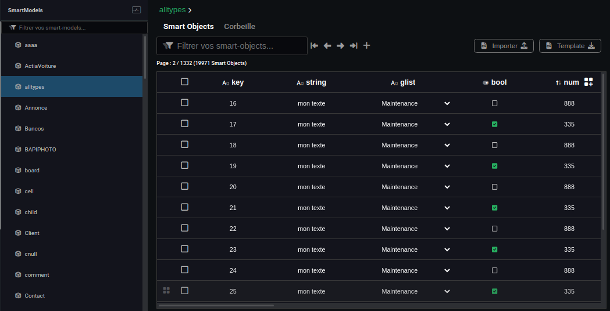

---
{}
---
   
#  Les Smart Objects   
   
Les [Smart Objects](../_glossaire/Glossaire.md) sont des instances d'objets créés à partir d'un [Smart Model](../_glossaire/Glossaire.md) particulier qui possèdent l'ensemble des champs définis par ce [Smart Model](../_glossaire/Glossaire.md).   
   
Les [Smart Objects](../_glossaire/Glossaire.md) sont l'ensemble des données manipulées sur Vision.    
   
<iframe width="560" height="315" src="https://www.youtube.com/embed/gUC5OodN-8o" title="YouTube video player" frameborder="0" allow="accelerometer; autoplay; clipboard-write; encrypted-media; gyroscope; picture-in-picture; web-share" allowfullscreen></iframe>   
   
# Utilisation / Manipulation   
   
## La base de données   
   
Accessible depuis la section *Data*, dans l'onglet *Base de données*, la base de données permet de gérer tous les [Smart Objects](../_glossaire/Glossaire.md) présents dans la base de Vision.   
   
Elle répertorie tous les [Smart Models](../_glossaire/Glossaire.md) créés et permet d'afficher pour chaque [Smart Model](../_glossaire/Glossaire.md) un tableau paginé listant les données associées.   
   
   
   
Le tableau de données peut être filtré globalement grâce à la barre de recherche ou plus spécifiquement en filtrant par champ du modèle en sélectionnant le titre du champ depuis l'en-tête du tableau.   
   
Il est possible d'éditer les objets directement depuis les cellules du tableau et aussi d'ajouter directement un objet en base grâce au bouton *+*.   
   
Il est aussi possible de supprimer un objet (définitivement ou pas).   
Supprimer simplement un [Smart Object](../_glossaire/Glossaire.md) signifie qu'il sera encore en base de données mais marqué comme supprimé, les utilisateurs finaux ne pourront plus accéder à cet objet alors que supprimer définitivement retire complètement l'objet de la base de données.   
   
## Importer des Smart Objects   
   
L'import de données permet de peupler la base de données Vision avec vos données en les transformant en [Smart Objects](../_glossaire/Glossaire.md).   
   
Pour importer des données, il faut au préalable avoir construit et publié un [Smart Model](../_glossaire/Glossaire.md) correspondant aux données que l'on souhaite importer. Un template CSV représentant le modèle peut ensuite être téléchargé depuis la base de données ou directement depuis l'onglet *Import*.   
   
Ce template contient une ligne composée des clés des propriétés du [Smart Model](../_glossaire/Glossaire.md) séparées par le symbole virgule. Pour remplir ce fichier CSV, il suffit donc de suivre l'ordre du template, une ligne représentant un objet.   
   
Une fois le fichier rempli, il faut l'importer dans Vision.   
   
Vous pouvez choisir le mapping des colonnes, définir le format des dates et également préciser si les objets détectés comme dupliqués (grâce aux clés uniques) devront être remplacés ou ignorés.    
   
## Workflows, Smartflows   
   
Les [Smart Objects](../_glossaire/Glossaire.md) seront par la suite manipulés dans les tâches de [workflows](../_glossaire/Glossaire.md) ou de [smartflows](../_glossaire/Glossaire.md):   
   
   
- Créer un Smart Object   
- Éditer un Smart Object   
- Supprimer un Smart Object   
- Recherche   
- ...   
   
## Applications   
   
Le but étant de transcrire ces données dans les applications finales grâce aux [sources de données](../04%20-%20Cr%C3%A9er%20votre%20UI/2%20-%20Les%20pages.md#sources-de-données).   
   
Il existe également des widgets pour afficher les [Smart Objects](../_glossaire/Glossaire.md) sous forme de liste:   
   
   
- [Widget Tableau](../04%20-%20Cr%C3%A9er%20votre%20UI/La%20liste%20des%20widgets/Widget%20Tableau.md)   
- [Widget Liste](../04%20-%20Cr%C3%A9er%20votre%20UI/La%20liste%20des%20widgets/Widget%20Liste.md)   
- [Widget Board](../04%20-%20Cr%C3%A9er%20votre%20UI/La%20liste%20des%20widgets/Widget%20Board.md)