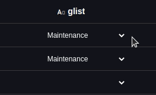

---
{}
---
   
# Les listes génériques   
   
Les [liste génériques](../_glossaire/Glossaire.md#liste-générique), les *glists*, sont des listes de chaînes de caractères que l'on peut définir sur Vision et ensuite utiliser sur les propriétés string des [Smart Objects](../_glossaire/Glossaire.md) pour limiter les valeurs à une liste de choix spécifiques.    
   
# Créer une liste générique   
   
Pour accéder aux listes génériques, il faut se rendre sur l'onglet *Liste* de la section *Data*. C'est ici que sont listées les différentes listes et qu'il est possible d'en créer des nouvelles.   
   
Une [liste générique](../_glossaire/Glossaire.md#liste-générique) est nommée, identifiée par une clé et composée d'une liste d’éléments que l'on définit.   
   
Ces éléments sont identifiés par une clé et peuvent être traduits dans toutes les langues configurées sur Vision.   
   
# Utilisation / Manipulation   
   
Lorsqu'on lie la valeur d'un champ à une [liste générique](../_glossaire/Glossaire.md#liste-générique), ce champ se limitera à une des valeurs de cette liste.   
   
Voici un exemple du comportement des champs de valeur glist sur l'outil base de données :   
   
