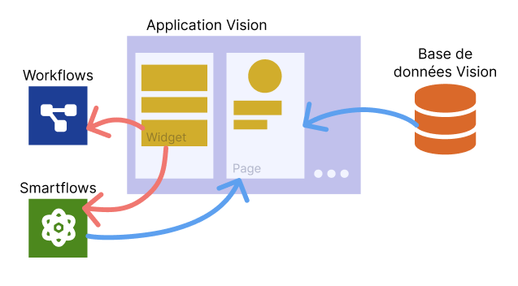

---
{}
---
   
# L'UI Composer   
   
L'[UI Composer](../_glossaire/Glossaire.md) est l'outil de Vision qui permet de concevoir les applications web et mobiles.   
   
Une application est composée de pages qui sont elles-mêmes composées de widgets.   
   
   
   
Les widgets peuvent déclencher des [workflows](../_glossaire/Glossaire.md) et des [smartflows](../_glossaire/Glossaire.md).   
   
Les pages peuvent récupérer des données depuis la base de données ainsi que depuis des [smartflows](../_glossaire/Glossaire.md).   
   
Toutes les données disponibles sur une page sont aussi disponibles pour les widgets de la page.