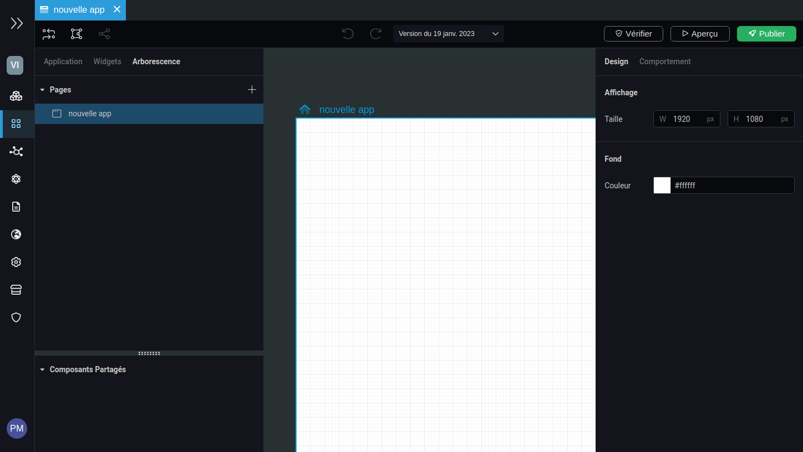
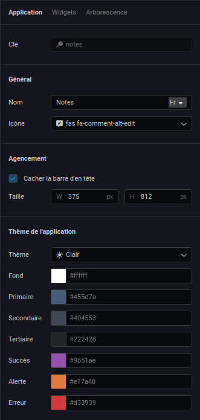
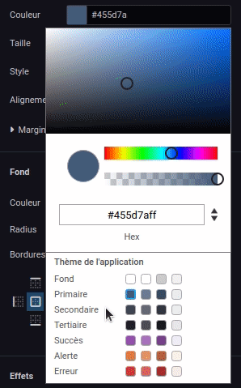
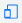
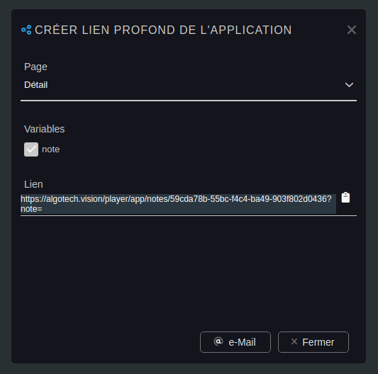

---
{}
---
   
# Créer une application   
   
Pour créer une nouvelle application, il suffit de faire un clic droit sur l'onglet **[UI Composer](../_glossaire/Glossaire.md)** situé dans l'onglet **Applications** de l'explorateur du Studio et choisir l'option *Ajouter une application web* ou *Ajouter une application mobile*.   
   
Il faut ensuite nommer l'application et l'interface de design s'ouvre avec une page vierge nommée identiquement à l'application.    
   
   
   
# Paramètres   
   
C'est dans la [Toolbox](../_glossaire/Glossaire.md#toolbox) que se configurent les différents paramètres de l'application, dans l'onglet *Application*.   
   
   
   
Une clé est générée automatiquement pour identifier une application.   
   
## Général   
   
| Paramètre | Utilisation |   
| --------- | ----------- |   
| **Nom**   | Le nom de l'application configurable dans les langues disponibles            |   
| **Icône**          |   L'icône associée à l'application          |   
   
## Agencement   
   
| Paramètre                     | Utilisation |   
| ----------------------------- | ----------- |   
| **Cacher la barre d'en-tête** |  Une barre d'en-tête par défaut est ajoutée aux applications pour pouvoir accéder aux boutons de déconnexion, notifications et d'accès aux applications. Cette barre peut être donc cachée si on ne souhaite pas l'afficher tout simplement ou si l'on veut créer une barre personnalisée grâce aux widgets.          |   
| **Taille**                              |  Les dimensions minimales par défaut des pages de l'application           |   
   
## Thème de l'application   
   
Le thème de l'application correspond à la palette de couleurs de l'application. Il existe 3 thèmes : le clair, le sombre et le personnalisé.   
   
   
- Thème clair : comme son nom l'indique il s'agit d'un thème pour une application en mode light, les couleurs sont prédéfinis et ne peuvent pas être modifiées   
- Thème sombre : comme son nom l'indique il s'agit d'un thème pour une application en mode sombre, les couleurs sont prédéfinis et ne peuvent pas être modifiées   
- Thème personnalisé : ce thème permet de personnaliser chaque couleur   
   
Les couleurs définis par le thème vont ainsi être faciles d'accès depuis le sélecteur de couleur avec la section *Thème de l'application*.   
   
   
   
Chaque couleur défini est déclinée dans plusieurs nuances : la couleur originale, teinte (plus clair), ombre (plus foncée) et survole (beaucoup plus claire).   
   
# Aperçu d'une application   
   
Le bouton *Aperçu* est disponible depuis la [toolbar](../_glossaire/Glossaire.md#toolbar).   
   
L'aperçu de votre application se lance sur un nouvel onglet et vous permet de tester votre application sans avoir à la publier.   
   
Les [Smart Objects](../_glossaire/Glossaire.md) qui peuvent être créés depuis l'aperçu ne sont pas sauvegardés en base.   
   
> [!hint]    
>Pour l'aperçu d'une application mobile, inspecter la page (clic droit -> Inspecter (Ctrl + Shift + I)).   
>Sélectionnez le bouton  situé en haut de la console d'inspection pour basculer sur une vue mobile.   
   
# Publier une application   
   
Pour publier une application, il faut passer par le bouton *Publier* de la [toolbar](../_glossaire/Glossaire.md#toolbar).   
   
La publication d'une application permet de la rendre disponible aux utilisateurs. Mais pour cela il faut d'abord associer les groupes de sécurité qui pourront y accéder.   
   
Cette association se fait depuis l'onglet *Réglages* de l'explorateur toujours dans la section *Applications*.   
   
On y retrouve la liste des groupes de sécurité. Pour chaque groupe de sécurité on peut choisir l'application web et l'application mobile qui seront lancées par défaut sur le player Vision.   
   
On peut aussi configurer les différentes applications auxquelles le groupe de sécurité a accès.   
   
# Partager une application   
   
Il est possible de partager une application depuis un bouton de la [toolbar](../_glossaire/Glossaire.md#toolbar) qui permet de créer un lien profond vers l'application.   
   
Le lien profond est un lien vers une page d'une application. Si la page possède des variables il est possible de les ajouter au lien pour les renseigner directement depuis le lien.   
   
