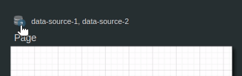
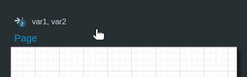
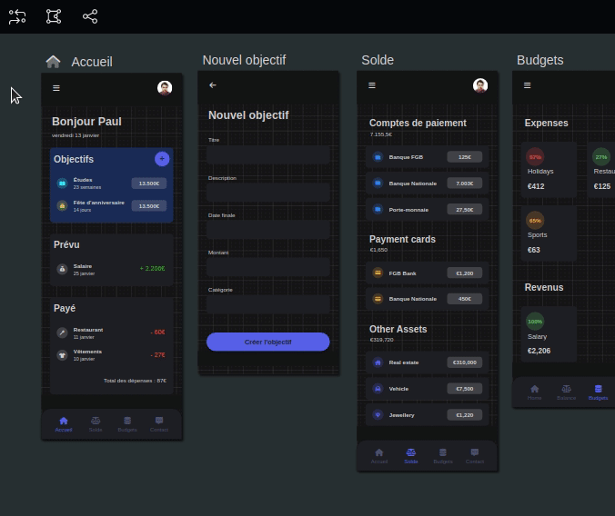

---
{}
---
   
# Ajouter une page   
   
En amont de la liste des widgets et pages dans l'arborescence, on retrouve un bouton *+* qui permet d'ajouter une nouvelle page à l'application.   
   
# Design   
   
# Comportement   
   
## Paramètres personnalisés   
   
| Paramètre          | Utilisation |   
| ------------------ | ----------- |   
| **Nom**            |   Le nom de la page dans les différentes langues disponibles          |   
| **Page d'accueil** |    Indique si cette page est la page d'accueil         |   
| **Activer le pan/zoom**                   | Active la fonctionnalité de pan/zoom : déplacement sur la page et zoom avec la souris            |   
   
## Sources de données   
   
Les sources de données permettent de récupérer des données afin de les rattacher aux widgets de la page.   
   
Ces données peuvent provenir de deux sources différentes :    
   
   
- directement depuis la base de données, il suffit de renseigner le nom du [Smart Model](../_glossaire/Glossaire.md), le résultat sera la liste d'objets correspondant à ce model   
- depuis un [smartflow](../_glossaire/Glossaire.md), le résultat dépendra du retour du [smartflow](../_glossaire/Glossaire.md)   
   
Chaque source de donnée est identifiée par une clé.   
   
   
   
Les différentes sources de données utilisées par une page sont aussi accessibles en amont de la page sur l'interface du designer.   
   
## Variables   
   
Les variables d'une page sont des paramètres d'entrée d'une page. Ils peuvent être de n'importe quel type et sont identifiés par une clé.   
   
Les variables sont un bon moyen pour faire passer des données entre chaque page, par exemple un [Smart Object](../_glossaire/Glossaire.md) depuis une page qui liste des objets à la page qui détaille l'objet.   
   
   
   
Les différentes variables d'une page sont aussi accessibles en amont de la page sur l'interface du designer.   
   
## Actions au chargement   
   
Cette section liste les différentes actions qui vont être lancées au chargement de la page.   
   
A la création d'une action, le type de l'action est demandé en premier et va conditionner le reste des paramètres de l'action.   
   
| Type d'action            | Utilisation         |   
| ---------------- | ------------------- |   
| **Workflow**     | Lance un [workflow](../_glossaire/Glossaire.md) **Workflow** : le worflow à lancer (doit être publié) **Profils** : les groupes de sécurité associés aux profils définis dans le [workflow](../_glossaire/Glossaire.md) (si pas de profils définis, les groupes de sécurités autorisés à lancer le [workflow](../_glossaire/Glossaire.md)) **Paramètres avancés** : <ul><li>le mode de sauvegarde du [workflow](../_glossaire/Glossaire.md): <ul><li><b>A la fin du processus (conseillé)</b></li><li>Le plus rapidement possible (sauvegarde permanente)</li></ul><li>l'option unique (impossible de lancer une deuxième instance de [workflow](../_glossaire/Glossaire.md) tant que la première n'est pas terminée</li></ul> |   
| **Smarflow**     | Lance un smartflow **Smartflow**: le smarflow à lancer (doit être publié) |   
| **Page**         |Ouvre une page de l'application **Page** : la page de l'application à ouvrir ainsi que ses variables d'entrée si elle en possède |   
| **URL**          | Ouvre un lien URL **Adresse** : l'adresse URL                    |    
   
# Afficher les transitions   
   
Il est possible d'afficher les transitions depuis un bouton de la [toolbar](../_glossaire/Glossaire.md#toolbar).   
   
Cette option permet d'afficher les différents liens de navigation entre les pages établies par les actions au clic des widgets. Elle est disponible depuis la [toolbar](../_glossaire/Glossaire.md#toolbar).   
   
