---
{}
---
   
# Les widgets   
   
Sous Vision, une application est composée de pages et d'éléments graphiques comme des boutons, du texte ou des images. Ces éléments graphiques sont les **widgets**.   
   
Il existe différents types de widgets divisés en plusieurs catégories.   
   
# Généralités   
   
## Le sélecteur de widgets   
   
C'est le sélecteur de widgets qui regroupe la liste des widgets disponibles. La majorité des widgets sont déclinés sous plusieurs styles prédéfinis pour simplifier le travail de design au concepteur.   
   
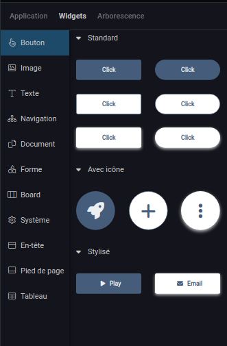   
   
## Ajouter un widget (et le supprimer)   
   
Pour ajouter un widget sur une page, il faut le glisser-déposer depuis le sélecteur de widgets vers la page.   
   
Un widget peut aussi être ajouté par un copié collé depuis un widget déjà déposé sur une page.   
   
Pour le supprimer, il suffit d'utiliser la touche **Suppr** ou l'option *Supprimer* depuis le [Le menu contextuel d'un widget ](#le-menu-contextuel-d-un-widget).   
   
## Le menu contextuel d'un widget   
   
On retrouve dans le [menu contextuel](../_glossaire/Glossaire.md#menu-contextuel) d'un widget toutes les actions génériques qu'on peut lui appliquer.   
   
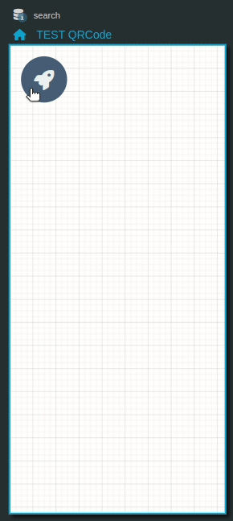   
   
   
- Transformer en liste : transforme le widget en une liste, explications [ici](../04%20-%20Cr%C3%A9er%20votre%20UI/La%20liste%20des%20widgets/Widget%20Liste.md)   
- Supprimer, Copier, Coller, Copier le style, Coller le style : simples manipulations du widget   
- Monter, Placer au-dessus, Descendre, Placer en-dessous : ordre des widgets sur la page,    
- Verrouiller, Masquer : explications verrouiller [Verrouiller un widget](#verrouiller-un-widget), et masquer [Masquer un widget](#masquer-un-widget)    
- Composants partagés : ajoute le widget aux composants partagés, explications [ici](../04%20-%20Cr%C3%A9er%20votre%20UI/3%20-%20Les%20widgets.md#les-composants-partagés)   
   
## Grouper un widget   
   
Il peut être utile dans votre conception de réunir des widgets en un seul groupe. Il suffit de sélectionner les widgets et choisir l'option *Grouper la sélection* (Ctrl + G) depuis le [menu contextuel](../_glossaire/Glossaire.md#menu-contextuel).   
   
Pour dissocier un groupe, choisir l'option *Dissocier la sélection* (Ctrl + U) depuis le [menu contextuel](../_glossaire/Glossaire.md#menu-contextuel).   
   
Un groupe se comporte de la même façon qu'un widget et peut également se composer de sous-groupes.   
   
## Arborescence de widgets   
   
L'arborescence de widgets permet d'afficher les différentes couches de widgets sur les pages de l'application.   
   
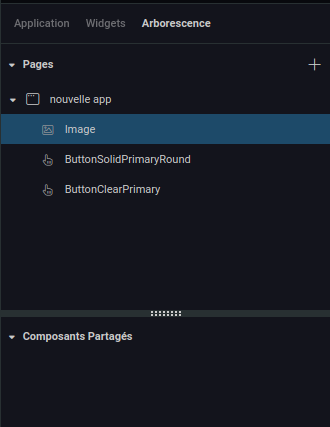   
   
## Modifier le nom d'un widget   
   
Chaque widget est nommé. Ce nom peut être modifié en double cliquant dessus depuis l'arborescence.   
   
## Modifier l'ordre d'empilement d'un widget   
   
Il est possible de modifier l'ordre d'empilement d'un widget (le passer au dessus ou en dessous d'un autre widget) grâce aux options du [menu contextuel](../_glossaire/Glossaire.md#menu-contextuel) mais aussi directement depuis l'arborescence en le glissant déposant.   
   
Un widget placé au dessus d'un autre widget dans l'arborescence sera également placé au dessus sur le rendu de la page.   
   
## Verrouiller un widget   
   
Il est possible de verrouiller un widget grâce au petit cadenas 🔒 affiché au survol d'un widget sur l'arborescence ou depuis le [menu contextuel](../_glossaire/Glossaire.md#menu-contextuel) (*Shift + L*).   
   
Lorsqu'un widget est verrouillé, celui-ci n'est plus sélectionnable depuis la page.   
Il reste tout de même sélectionnable depuis l'arborescence.   
Lorsqu'il est sélectionné, on ne pourra le déplacer que depuis l'[inspecteur](../_glossaire/Glossaire.md#inspecteur).   
   
Cette option est intéressante lors de la conception d'une page avec de nombreux widgets.   
   
## Masquer un widget   
   
Il est possible de masquer un widget grâce au petit œil 👁️ affiché au survol d'un widget sur l'arborescence ou depuis le [menu contextuel](../_glossaire/Glossaire.md#menu-contextuel).   
   
Lorsqu'un widget est masqué, il n'est plus visible sur l'application.   
   
# Design des widgets   
   
L'onglet **Design** de l'[inspecteur](../_glossaire/Glossaire.md#inspecteur) regroupe les différentes propriétés qui agissent sur la mise en forme du widget.   
   
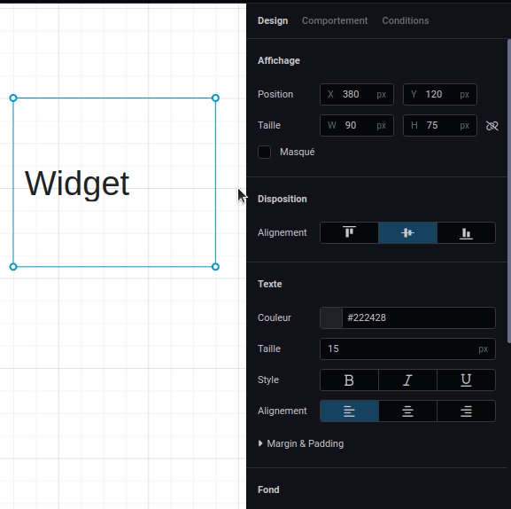   
   
Certaines de ces propriétés sont propres aux widgets et d'autres sont communes à plusieurs widgets.   
   
## Design commun   
   
Selon les widgets, il est possible qu'une des propriétés ne soit pas présente.   
   
### Affichage   
   
| Paramètre | Utilisation                                                                                                  |   
| --------- | ------------------------------------------------------------------- |   
| **Position**  | Les coordonnées XY en pixels du widget relative à l'orgine de la page ou relative à l'origine de son parent                             |   
| **Taille**    | La largeur et la hauteur du widget en pixels. Le bouton 🔗 (lien) permet de garder les proportions du widget |   
| **Masqué**    | L'option masqué permet de masquer un widget                                                                  |          |                                                                                                              |   
   
### Texte   
   
| Paramètre            | Utilisation                                             |   
| -------------------- | ------------------------------------------------------- |   
| **Couleur**          | La couleur du texte                                     |   
| **Taille**           | La taille du texte en pixels                            |   
| **Style**            | Style du texte : Gras et / ou Italique et / ou Souligné |   
| **Alignement**       | Alignement du texte : Gauche ou Centré ou Droite        |   
| **Margin & Padding** | Le margin et padding selon la box du widget             |   
   
### Icône   
   
| Paramètre            | Utilisation                                             |   
| -------------------- | ------------------------------------------------------- |   
| **Taille**           | La taille de l'icône en pixels                            |   
| **Couleur**            | La couleur de l'icône |   
| **Margin & Padding** | Le margin et padding selon la box du widget             |   
   
### Fond   
   
| Paramètre   | Utilisation                                              |   
| ----------- | -------------------------------------------------------- |   
| **Couleur** | La couleur de fond du widget                   |   
| **Radius**  | L'arrondissement en pixels des coins du widget |   
| **Bordure** | Le style de la bordure du widget : son épaisseur en pixels, sa couleur et le style du trait (continu ou tirets ou points)  |   
   
### Effets   
   
| Paramètre         | Utilisation                                                                                                                                                         |   
| ----------------- | ------------------------------------------------------------------------------------------------------------------------------------------------------------------- |   
| **Ombre externe** | Si elle est activée, cela permet d'ajouter une ombre externe au widget et d'ajuster sa position XY en pixels, son estompe en pixels, sa propagation en pixels ainsi que sa couleur |   
   
# Comportement des widgets   
   
L'onglet **Comportement** de l'[inspecteur](../_glossaire/Glossaire.md#inspecteur) de widget regroupe les différentes propriétés qui définissent le comportement du widget.   
   
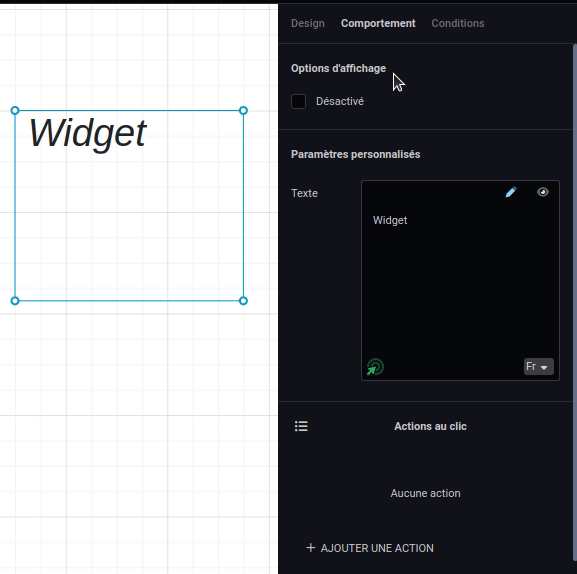   
   
Certaines de ces propriétés sont propres aux widgets et d'autres sont communes à plusieurs widgets.   
   
## Comportement commun   
   
### Options d'affichage   
   
| Paramère | Utilisation |   
| -------- | ----------- |   
| **Désactivé**         | Lorsque le widget est désactivé, il reste affiché avec une légère opacité mais ne peux plus être cliquable            |   
   
### Actions au clic   
   
La section *Actions au clic* liste les différentes actions qui vont être lancées au clic d'un utilisateur sur le widget depuis l'application.   
   
| Type d'action            | Utilisation         |   
| ---------------- | ------------------- |   
| **Rechargement** | Recharge un widget **Widget** : le widget à recharger |   
| **Workflow**     | Lance un [workflow](../_glossaire/Glossaire.md) **Workflow** : le worflow à lancer (doit être publié) **Profils** : les groupes de sécurité associés aux profils définis dans le [workflow](../_glossaire/Glossaire.md) (si pas de profils définis, les groupes de sécurités autorisés à lancer le [workflow](../_glossaire/Glossaire.md)) **Paramètres avancés** : <ul><li>le mode de sauvegarde du [workflow](../_glossaire/Glossaire.md): <ul><li><b>A la fin du processus (conseillé)</b></li><li>Le plus rapidement possible (sauvegarde permanente)</li></ul><li>l'option unique (impossible de lancer une deuxième instance de [workflow](../_glossaire/Glossaire.md) tant que la première n'est pas terminée</li></ul> |   
| **Smarflow**     | Lance un smartflow **Smartflow**: le smarflow à lancer (doit être publié) |   
| **Page**         |Ouvre une page de l'application **Page** : la page de l'application à ouvrir ainsi que ses variables d'entrée si elle en possède |   
| **URL**          | Ouvre un lien URL **Adresse** : l'adresse URL                    |   
| **Application**  | Ouvre une application Vision **Application** : l'application (doit être publiée) **Page** : la page de l'application à ouvrir ainsi que ses variables d'entrée si elle en possède |   
   
 Ces actions peuvent au choix s'enchaîner séquentiellement ou s'afficher sous forme d'une liste, auquel cas l'utilisateur peut choisir l'action qu'il souhaite déclencher. Pour activer l'affichage en liste, il suffit d'activer ce bouton 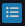 qui est présent en en-tête de la section.   
    
 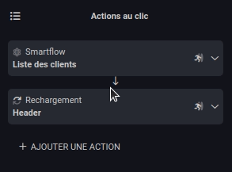   
   
## L'accès à la donnée   
   
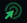 Ce bouton est présent dans les différents composants qui gèrent le comportement du widget.   
   
Il permet d'accéder aux ressources de la page :   
   
	- système   
	- sources de données   
	- variables   
	- ...   
   
Lorsque le type de la ressource est un [Smart Object](../_glossaire/Glossaire.md), il est possible d'accéder à ces propriétés. (exemple: `USER > NOM`).   
   
La ressource s'écrit sous cette forme `{{route_ressource.key_ressource}}`.   
Un exemple de son utilisation est la saisie de texte (ci-dessous).    
   
## La saisie de texte   
   
Le composant de saisie de texte se retrouve dans de très nombreux paramètres de widgets. Ce composant dans l'[inspecteur](../_glossaire/Glossaire.md#inspecteur) permet de saisir des textes qui peuvent être dynamiques.   
   
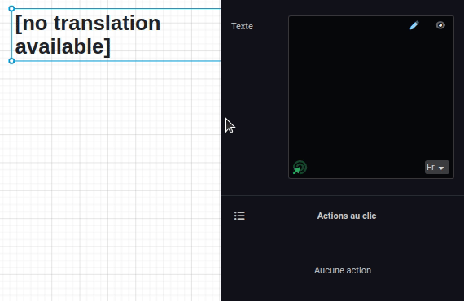   
   
### L'aperçu   
   
Le bouton œil permet de modifier l'aperçu du texte sur le widget. Cela peut être utile lorsque le contenu du texte est une variable pour avoir un rendu plus réaliste dans l'[UI Composer](../_glossaire/Glossaire.md).   
   
> [!warning]    
> Le texte renseigné dans l'aperçu est visible uniquement dans l'[UI Composer](../_glossaire/Glossaire.md) et pas sur les applications.   
   
### Les langues   
   
Un sélecteur de langue permet de renseigner du texte pour chacune des langues présentes, aussi bien dans l'édition du texte que dans l'aperçu. Le texte affiché dans l'application dépendra donc de la langue utilisée par le Player.   
   
# Conditions des widgets   
   
L'onglet **Conditions** de l'[inspecteur](../_glossaire/Glossaire.md#inspecteur) de widgets permet de personnalisé l'affichage et le comportement d'un widget selon des critères souhaités.   
   
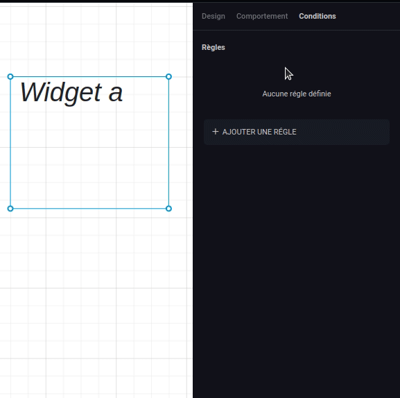   
   
Ces critères se définissent au travers d'une ou plusieurs règles.   
   
| Propriété de la règle | Utilisation |   
| --------------------- | ----------- |   
| **Nom**               |   Le nom de la règle          |   
| **Couleur**           |   Couleur d'identification de la règle         |   
| **Opérateur**         |   L'opérateur logique utilisée entre les différentes conditions de la règle : Et ou Ou        |   
| **Conditions**   |  Les conditions qui vont définir la règle **Route** : La donnée à comparer pour la condition **Critère** : Le critère de comparaison **Valeur** : La valeur comparée          |   
   
Lorsqu'un widget possède une liste de règles, une nouvelle section **État** est ajouté en en-tête de l'[inspecteur](../_glossaire/Glossaire.md#inspecteur) de widget.   
   
L'état sélectionné par défaut se nomme *État par défaut*, les autres états disponibles correspondent aux différentes règles qui ont été définies dans l'onglet **Conditions**.   
   
Pour activer une règle, on peut sélectionner le bouton *Activer la règle*, depuis une règle ou bien sélectionner la règle depuis l'en-tête de l'[inspecteur](../_glossaire/Glossaire.md#inspecteur).   
   
Lorsqu’un état est sélectionné, toutes les modifications de design et comportement seront uniquement associées à cet état.   
   
# Les composants partagés   
   
Les composants partagés sont des widgets (un widget seul ou un groupe de widgets) qui peuvent être réutilisés plusieurs fois sur une application. La liste des composants partagés se situe à la suite de l'arborescence des widgets.   
   
> [!tip]    
> Cette fonctionnalité est très utile dans le cas des en-têtes et des pieds de page qui vont devoir être répétés au fil des pages, mais également dans le cas de cartes d'affichage dont le modèle pourra être facilement réutilisé.   
   
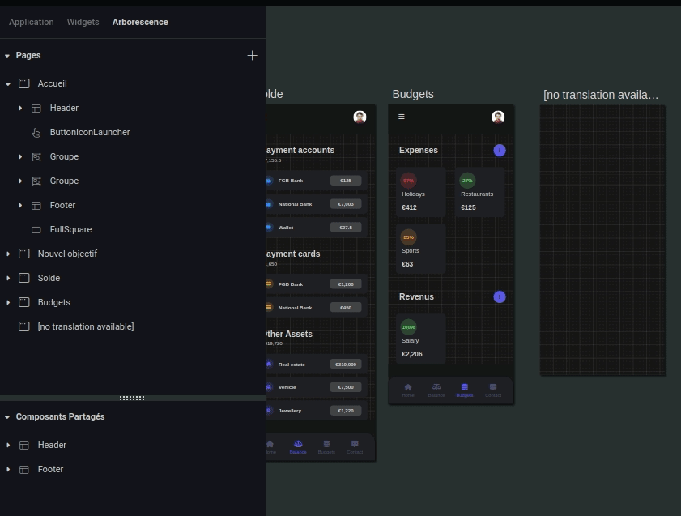   
   
## Créer un composant partagé   
   
Pour créer un composant partagé, il suffit de sélectionner le widget ou le groupe de widgets que l'on souhaite et choisir l'option *Composants Partagés* depuis le [menu contextuel](../_glossaire/Glossaire.md#menu-contextuel) (raccourci clavier *Shift + S*). Il sera ajouté à la liste des composants partagés.   
   
## Utiliser un composant partagé   
   
Pour ajouter un composant partagé sur une page, il suffit de le glisser-déposer depuis la liste des composants partagés directement sur la page.   
   
Il est aussi possible d’utiliser l'option *Ajouter à toutes les pages* du [menu contextuel](../_glossaire/Glossaire.md#menu-contextuel) (raccourci clavier *Shift + A*). Le composant sera alors ajouté à chaque page de l'application sur laquelle il n'existe pas.   
   
### Modifier une référence d'un composant partagé   
   
Une fois le widget ajouté à la section des composants partagés, il peut être modifié à tout moment, ces modifications ne seront pas associées automatiquement aux autres références.   
   
Pour mettre à jour les références d'un composant partagé, il existe deux options : le remplacement ou la mise à jour des références.   
   
#### Remplacer les références   
   
L'option *Remplacer les références*, disponible depuis le [menu contextuel](../_glossaire/Glossaire.md#menu-contextuel) d'une référence (raccourci clavier *Shift + H*) va venir écraser toutes les références par celle sélectionnée.   
   
#### Mettre à jour les références   
   
L'option *Mettre à jour les références*, disponible depuis le [menu contextuel](../_glossaire/Glossaire.md#menu-contextuel) d'une référence (raccourci clavier *Shift + M*), permet une mise à jour plus smart.   
   
Une petite explication s'impose.   
   
Lors de la sélection d'un widget partagé, un nouvel élément apparaît dans l'[inspecteur](../_glossaire/Glossaire.md#inspecteur), un cadenas placé à côté du titre de chaque section et à côté de l'en-tête de navigation de l'[inspecteur](../_glossaire/Glossaire.md#inspecteur).   
   
Par défaut ce cadenas est déverrouillé. Lorsqu'il est verrouillé, cela signifie que cette information ne devra pas être modifiée lors de la mise à jour des références.   
   
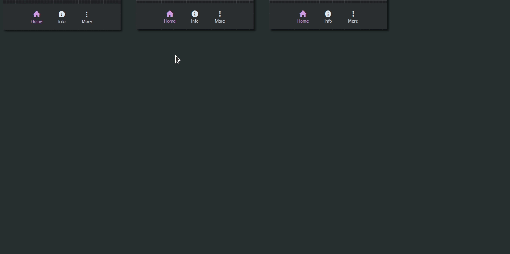