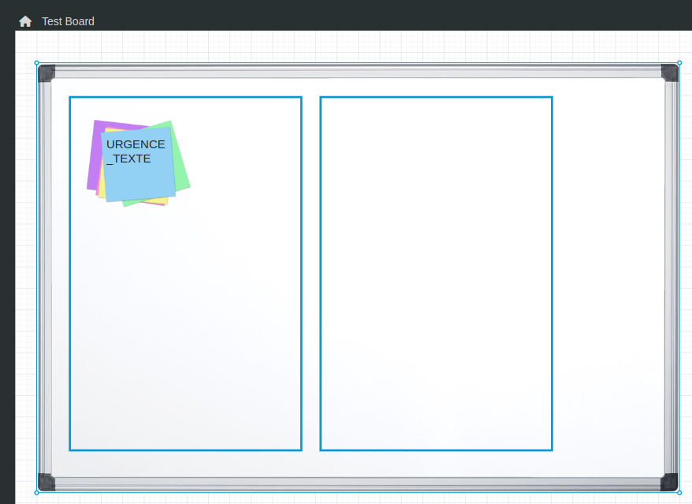
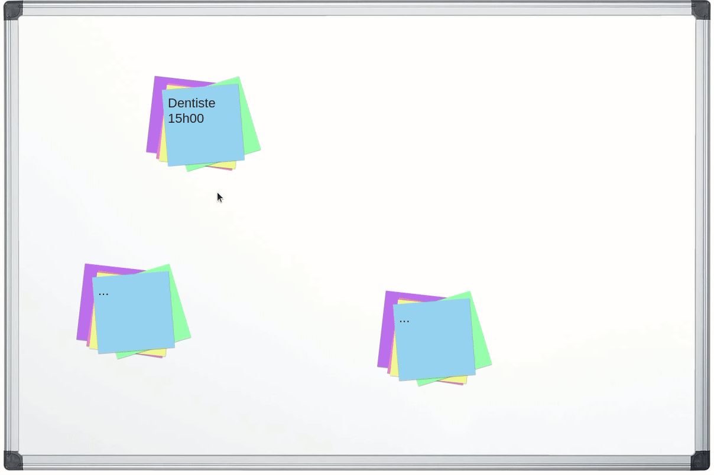
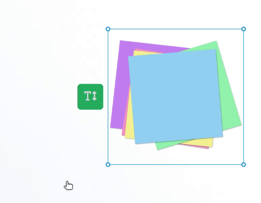

---
{}
---
   
Le widget board est un widget qui permet de créer un outil de type tableau blanc.    
Ce tableau blanc peut être utilisé de très nombreuses façons, d'un simple moyen de visualisation à un outil pour la méthode Kanban.   
   
Il est composé de plusieurs catégories de sous-widgets : les [Sous-widget Magnet](#sous-widget-magnet) et les [Sous-widget Zone](#sous-widget-zone).   
Un magnet est un [Smart Object](../../_glossaire/Glossaire.md) qui implémente l'aptitude magnet.   
Les magnets seront à terme chargés dans des zones du tableau.   
   
Tout est personnalisable, du fond d'écran du board, de la définition des zones jusqu'à la représentation du magnet et de son détail.   
   
Les étapes de modélisation du board sont les suivantes:   
   
- Création du board   
	- Chargement d'une image de fond   
	- Création et attachement des actions de création de magnets   
- Création des différentes zones du board   
- Création de l'ensemble des différents templates de magnets   
	- Chargement d'une image de fond   
	- Précision du [Smart Model](../../_glossaire/Glossaire.md) correspondant au template   
	- Attachement des propriétés du [Smart Model](../../_glossaire/Glossaire.md) au template   
   
Ci-dessous , un exemple de représentation d'un board dans le Studio, celui-ci contient la modélisation du board, la définition des zones et le template des différents magnets.   
   
   
   
Ci-dessous , la représentation du même board dans le Player, avec le chargement des différentes instances de magnets dans leurs zones respectives.    
   
   
   
## Comportement   
   
### Paramètres personnalisés   
   
| Paramètre   | Utilisation |   
| ----------- | ----------- |   
| **Fichier** |    L'image de fond du board         |   
| **Instance**            |  Facultative, permet la création de plusieurs contextes.  _Un exemple typique serait un calendrier hebdomadaire, le board représenterai les semaines, il serait défini dans une seule application mais les magnets quand à eux dépenderait de la semaine choisie   Les magnets seront donc localisés à la fois sur un board (du lundi au dimanche), une zone du board (le lundi), et sur une instance de board (la deuxième semaine de Mai)._        |   
   
### Actions à l'ajout d'un magnet   
   
Ces [actions](../../04%20-%20Cr%C3%A9er%20votre%20UI/3%20-%20Les%20widgets.md#actions-au-clic) sont déclenchées lorsque l'utilisateur ajoute un magnet.   
Lorsque cet événement est renseigné, un bouton + s'affiche en bas de chaque zone et permet de déclencher les actions.   
   
[Créer un magnet](../../05%20-%20Workflows%2C%20cr%C3%A9er%20votre%20logique%20m%C3%A9tier/Workflows%20typiques/Cr%C3%A9er%20un%20magnet.md)   
   
La source de données `zone-selected` est injectée dans l'appel des [workflows](../../_glossaire/Glossaire.md) ou [smartflows](../../_glossaire/Glossaire.md).   
   
### Actions sur l'action d'un magnet   
   
Ces [actions](../../04%20-%20Cr%C3%A9er%20votre%20UI/3%20-%20Les%20widgets.md#actions-au-clic) sont déclenchées lorsque l'utilisateur déclenche le bouton d'actions du magnet.   
Lorsque cet événement est renseigné, un bouton d'action s'affiche au centre du magnet lors du survol sur celui-ci.   
   
Les sources de données `smart-object-selected` et `magnet-zone` sont injectées dans l'appel des [workflows](../../_glossaire/Glossaire.md) ou [smartflows](../../_glossaire/Glossaire.md).   
   
### Actions au déplacement d'un magnet   
   
Ces [actions](../../04%20-%20Cr%C3%A9er%20votre%20UI/3%20-%20Les%20widgets.md#actions-au-clic) sont déclenchées lorsque l'utilisateur déplace un magnet.   
   
Les sources de données `smart-object-selected`, `magnet-zone` et `old-magnet-zone` sont injectées dans l'appel des [workflows](../../_glossaire/Glossaire.md) ou [smartflows](../../_glossaire/Glossaire.md).   
   
> [!info]    
> *smart-object-selected* correspond au [Smart Object](../../_glossaire/Glossaire.md) du magnet.   
> *magnet-zone* et *old-magnet-zone* contiennent les informations de l'emplacement du magnet, l'application où se trouve le board, la zone où est situé le magnet, ses coordonnées x et y relative à l'orgine de la zone (si le magnet est positionné) et de l'instance du board (si il y en a une).   
   
## Design   
   
### Commun   
   
[Affichage](../../04%20-%20Cr%C3%A9er%20votre%20UI/3%20-%20Les%20widgets.md#affichage), [Fond](../../04%20-%20Cr%C3%A9er%20votre%20UI/3%20-%20Les%20widgets.md#fond)   
   
# Widget Zone   
   
Pour ajouter une zone au widget board, faire un clic droit sur le widget et sélectionner l'option *Dessiner une zone*.   
Le curseur se transforme alors en croix et le dessin peut commencer.   
Pour finaliser la zone, il faudra attacher le dernier point au niveau du premier point.   
Pour la supprimer, il suffit de faire comme pour les autres widgets.   
   
## Comportement   
   
### Paramètres personnalisés   
   
| Paramètre | Utilisation               |   
| --------- | ------------------------- |   
| **Clé**   | La clé associée à la zone |   
   
### Type d'affichage   
   
| Paramètre         | Utilisation               |   
| ----------------- | ------------------------- |   
| **Superposition** | Autorise la superposition de magnets dans le board |   
| **Aligner les magnets sur la grille**                  |    Aligne automatiquement les magnets sur une grille invisible dans le board  Par défaut, le déplacement s'effectuera par pas de 50 (hauteur, largeur), il est possible de modifier ces valeurs                     |   
   
## Design   
   
### Commun   
[Affichage](../../04%20-%20Cr%C3%A9er%20votre%20UI/3%20-%20Les%20widgets.md#affichage), [Fond](../../04%20-%20Cr%C3%A9er%20votre%20UI/3%20-%20Les%20widgets.md#fond)   
   
# Widget Magnet   
   
Pour ajouter un template de magnet au widget board, faire un clic droit sur le widget et sélectionner l'option *Ajouter un template de magnet*.   
Pour le supprimer, il suffit de faire comme pour les autres widgets.   
   
## Comportement   
   
### Paramètres personnalisés   
   
| Paramètre       | Utilisation                                                        |   
| --------------- | ------------------------------------------------------------------ |   
| **Fichier**     | L'image de fond du magnet                                          |   
| **Smart Model** | Le [Smart Model](../../_glossaire/Glossaire.md) associé au magnet (doit posséder l'aptitude Magnet) |   
| **Filtre**            | Permet de mettre en place un filtre sur le [Smart Model](../../_glossaire/Glossaire.md) renseigné                       |                |                                                                    |   
   
### Permissions   
   
| Paramètre   | Utilisation               |   
| ----------- | ------------------------- |   
| **Déplacer** | Les groupes de sécurité autorisés à déplacer ce type de magnet |   
   
### Actions sur l'action d'un magnet   
   
Par défaut, ces actions hérites de celles définies dans le board, il est cependant possible de les personnaliser pour un magnet en particulier.   
   
### Actions au déplacement d'un magnet    
   
Par défaut, ces actions hérites de celles définies dans le board, il est cependant possible de les personnaliser pour un magnet en particulier.   
   
# Widget Propriété du Magnet   
   
Pour ajouter une propriété au template de magnet, il faut au préalable avoir sélectionner le [Smart Model](../../_glossaire/Glossaire.md) correspondant.   
   
Ensuite il suffit de cliquer sur le petit bouton vert à la gauche du magnet et d'y glisser les propriétés.   
   
   
## Design   
   
### Commun   
   
[Affichage](../../04%20-%20Cr%C3%A9er%20votre%20UI/3%20-%20Les%20widgets.md#affichage), [Texte](../../04%20-%20Cr%C3%A9er%20votre%20UI/3%20-%20Les%20widgets.md#texte), [Fond](../../04%20-%20Cr%C3%A9er%20votre%20UI/3%20-%20Les%20widgets.md#fond), [Effets](../../04%20-%20Cr%C3%A9er%20votre%20UI/3%20-%20Les%20widgets.md#effets)   
   
### Disposition   
   
| Paramètre       | Utilisation                                                                                                                                                                                                                                                                                                                                                                                                                |   
| --------------- | -------------------------------------------------------------------------------------------------------------------------------------------------------------------------------------------------------------------------------------------------------------------------------------------------------------------------------------------------------------------------------------------------------------------------- |   
| **Alignement**   | Défini l'alignement horizontal du texte : **Début** : texte placé en haut de la box **Centre** : texte placé au centre de la box **Fin** : texte placé en bas de la box