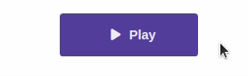

---
{}
---
   
Le widget bouton permet de créer un élément cliquable permettant le lancement d'une action. Il peut être composé par du texte et / ou une icône et peut se décliner dans de nombreux styles grâce aux options de design.   
   
   
   
## Comportement   
   
### Commun   
   
[Actions au clic](../../04%20-%20Cr%C3%A9er%20votre%20UI/3%20-%20Les%20widgets.md#actions-au-clic), [Options d'affichage](../../04%20-%20Cr%C3%A9er%20votre%20UI/3%20-%20Les%20widgets.md#options-d'affichage)   
   
### Paramètres personnalisés   
   
| Paramètre | Utilisation                    |   
| --------- | ------------------------------ |   
| **Texte**     | Le texte affiché par le bouton |   
| **Icône**          |          L'icône affichée par le bouton                      |   
   
## Design   
   
### Commun   
   
[Affichage](../../04%20-%20Cr%C3%A9er%20votre%20UI/3%20-%20Les%20widgets.md#affichage), [Texte](../../04%20-%20Cr%C3%A9er%20votre%20UI/3%20-%20Les%20widgets.md#texte), [Icône](../../04%20-%20Cr%C3%A9er%20votre%20UI/3%20-%20Les%20widgets.md#icône), [Fond](../../04%20-%20Cr%C3%A9er%20votre%20UI/3%20-%20Les%20widgets.md#fond), [Effets](../../04%20-%20Cr%C3%A9er%20votre%20UI/3%20-%20Les%20widgets.md#effets)   
   
### Disposition   
   
| Paramètre       | Utilisation                                                                                                                                                                                                                                                                                                                                                                                                                |   
| --------------- | -------------------------------------------------------------------------------------------------------------------------------------------------------------------------------------------------------------------------------------------------------------------------------------------------------------------------------------------------------------------------------------------------------------------------- |   
| **Direction**   | Défini l'ordre ainsi que la direction du texte et de l'icône du bouton :  **Ligne** : icône puis texte en ligne **Colonne** : icône puis texte en colonne **Ligne inverse** : texte puis icône en ligne **Colonne inverse** : texte puis icône en colonne                                                                                                                    |   
| **Répartition** | Défini la répartition de l'espace entre le texte et l'icône du bouton : **Début** : icône et texte groupés au début **Centre** : icône et texte groupés au centre **Fin** : icône et texte groupés à la fin **Espace entre** : icône et texte à chaque extrémité espacés au maximum **Espace autour** : icône et texte espacés équitablement entre eux et les extrémités |