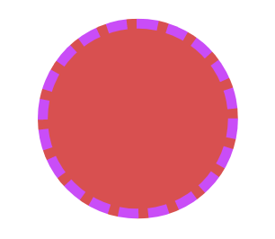

---
{}
---
   
Le widget cercle permet de créer un élément circulaire.   
   
   
   
## Design   
   
### Commun   
   
[Affichage](../../04%20-%20Cr%C3%A9er%20votre%20UI/3%20-%20Les%20widgets.md#affichage), [Fond](../../04%20-%20Cr%C3%A9er%20votre%20UI/3%20-%20Les%20widgets.md#fond), [Effets](../../04%20-%20Cr%C3%A9er%20votre%20UI/3%20-%20Les%20widgets.md#effets)