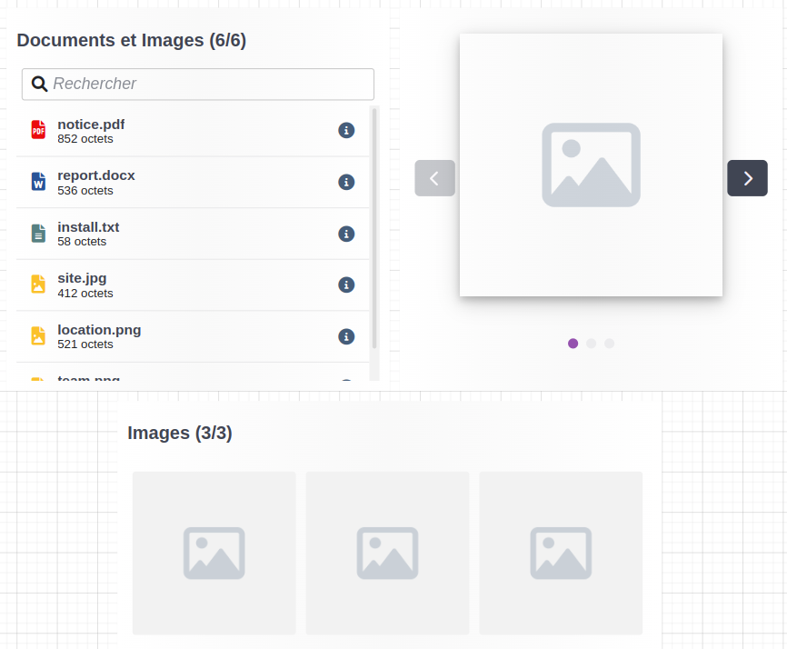

---
{}
---
   
Le widget documents et images permet d'afficher une liste de documents et d’interagir avec eux.   
   
Cette liste peut prendre plusieurs formes d'affichage et peut être filtrée selon le type de documents que l'on souhaite afficher.   
   
À la sélection d'un document, celui-ci sera téléchargé sur l'appareil de l'utilisateur.   
   
   
   
## Comportement   
   
### Données   
   
| Paramètre             | Utilisation                                                                                                                                         |   
| --------------------- | --------------------------------------------------------------------------------------------------------------------------------------------------- |   
| **Source de données** | La source de données qui va alimenter la liste des documents Liste de [Smart Object](../../_glossaire/Glossaire.md) possédant l'aptitude documents ou liste de fichiers |   
   
### Affichage   
   
| Paramètre      | Utilisation                                                                                                                                                                                                                                        |   
| -------------- | ---------------------------------------------------------------------------------------------------------------------------------------------------------------------------------------------------------------------------------------------- |   
| **Mode**       | Le mode d'affichage de la liste **Liste** : une liste simple des documents qui convient pour tous types de documents **Grille** : mode destiné aux images qui génère une grille d'aperçu **Carrousel** : mode destiné aux images, le carrousel permet d'afficher les images une par une |   
| **Pagination** | _Paramètre disponible pour le mode liste et grille_ L'option permet de paginer les documents affichés et de choisir le nombre de documents affichés par page                                                                                                                                                                                                                                             |     |   
   
### Filtres   
   
| Paramètre     | Utilisation                                                                                                            |   
| ------------- | ---------------------------------------------------------------------------------------------------------------------- |   
| **Données**   | Filtre par Documents et / ou Images |   
| **Recherche** | _Paramètre disponible pour le mode liste et grille_ Ajout d'une barre de recherche dans le widget                                                                                                                       |   
| **Filtre par tags**              | _Paramètre disponible pour le mode liste et grille_ Active la fonctionnalité de filtre par tags représenté par un bouton placé en amont de la liste de documents dans le widget                                                                                                                       |   
   
### Bouton d'information    
   
_Paramètre disponible pour le mode liste et grille._   
Le bouton d'information ℹ️ permet d'accéder à des informations sur un des documents de la liste.   
   
| Paramètre    | Utilisation             |   
| ------------ | ----------------------- |   
| **Metadata** | Permet de consulter les metada du document |   
| **Anciennes versions**             | Permet de consulter les anciennes versions d'un document, nécessite d'indiquer les groupes de sécurité qui pourront y avoir accès                      |   
   
### Liste d'actions d'un document   
   
Cette section permet de lier les documents à des actions. Si des actions sont ajoutées à cette section, un bouton permettant de les déclencher est ajouté au widget.   
   
Le fonctionnement des actions est identique à celui des [Actions au clic](../../04%20-%20Cr%C3%A9er%20votre%20UI/3%20-%20Les%20widgets.md#actions-au-clic) commun à une multitude de widgets.   
   
Les sources de données `document-selected` et `documents-selected` sont injectées dans l'appel des [workflows](../../_glossaire/Glossaire.md) ou [smartflows](../../_glossaire/Glossaire.md).   
   
> [!info]    
> *document-selected* correspond au document sélectionné.   
> *documents-selected-zone* correspond aux documents sélectionnés.   
   
## Design   
   
### Commun   
   
[Affichage](../../04%20-%20Cr%C3%A9er%20votre%20UI/3%20-%20Les%20widgets.md#affichage)