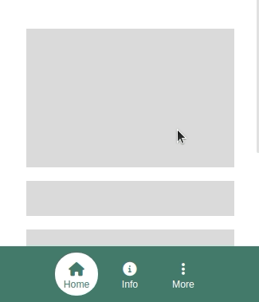
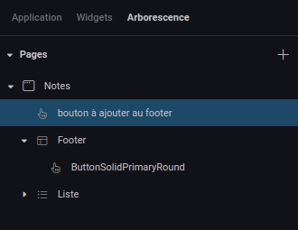

---
{}
---
   
Le widget footer permet de créer un élément ancré en pied de page de l'application qui peut être composé d'autres widgets (un [widget navigation](../../04%20-%20Cr%C3%A9er%20votre%20UI/La%20liste%20des%20widgets/Widget%20Navigation.md) par exemple).   
   
Lorsqu'on ajoute ce widget à une page depuis le sélecteur de widgets, il se placera automatiquement en bas de page et il sera impossible pour le concepteur de le déplacer.   
   
   
   
Pour ajouter un widget au footer, il faut utiliser l'arborescence de widgets et glisser le widget dans le footer.   
De même pour le retirer, il suffit de le glisser déposer hors du footer via l'arborescence.   
   
   
   
> [!tip]    
> Le widget footer est souvent réutilisé plusieurs fois au travers des pages d'une application et est un bon candidat pour devenir un composant partagé !   
> La document sur les composants partagés [ici](../../04%20-%20Cr%C3%A9er%20votre%20UI/3%20-%20Les%20widgets.md#les-composants-partagés).   
   
## Design   
   
### Commun   
   
[Affichage](../../04%20-%20Cr%C3%A9er%20votre%20UI/3%20-%20Les%20widgets.md#affichage), [Fond](../../04%20-%20Cr%C3%A9er%20votre%20UI/3%20-%20Les%20widgets.md#fond), [Effets](../../04%20-%20Cr%C3%A9er%20votre%20UI/3%20-%20Les%20widgets.md#effets)