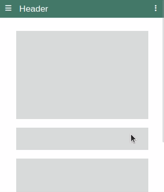
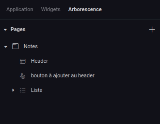

---
{}
---
   
Le widget header permet de créer un élément ancré en en-tête de l'application qui peut être composé d'autres widgets (un [widget texte](../../04%20-%20Cr%C3%A9er%20votre%20UI/La%20liste%20des%20widgets/Widget%20Texte.md) ou un [widget bouton](../../04%20-%20Cr%C3%A9er%20votre%20UI/La%20liste%20des%20widgets/Widget%20Bouton.md) par exemple).   
   
Lorsqu'on ajoute ce widget à une page depuis le sélecteur de widgets, il se placera automatiquement en haut de page et il sera impossible pour le concepteur de le déplacer.   
   
   
   
Pour ajouter un widget au header, il faut utiliser l'arborescence de widgets et glisser le widget dans le header. De même pour le retirer, il suffit de le glisser déposer hors du header via l'arborescence.   
   
   
   
> [!tip]    
> Le widget header est souvent réutilisé plusieurs fois au travers des pages d'une application et est un bon candidat pour devenir un composant partagé !   
> La document sur les composants partagés [ici](../../04%20-%20Cr%C3%A9er%20votre%20UI/3%20-%20Les%20widgets.md#les-composants-partagés).   
   
## Comportement   
   
### Propriétés personnalisés   
   
| Propriété | Utilisation |   
| --------- | ----------- |   
| **Effet cacher/révéler**          |     Permet de cacher le header au scroll vers le bas d'une page et de le réafficher au scroll vers le haut        |   
   
## Design   
   
### Commun   
[Affichage](../../04%20-%20Cr%C3%A9er%20votre%20UI/3%20-%20Les%20widgets.md#affichage), [Fond](../../04%20-%20Cr%C3%A9er%20votre%20UI/3%20-%20Les%20widgets.md#fond), [Effets](../../04%20-%20Cr%C3%A9er%20votre%20UI/3%20-%20Les%20widgets.md#effets)