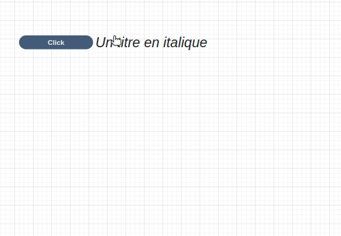
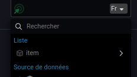

---
{}
---
   
Le widget liste permet d'afficher une liste d'éléments pouvant contenir différents types de widgets. Il est utile pour la représentation de tableaux d'objets.   
   
Pour créer une liste, il faut sélectionner le ou les widgets que l'on souhaite transformer et sélectionner l'option *Transformer en liste* depuis le [menu contextuel](../../_glossaire/Glossaire.md#menu-contextuel) (Ctrl + L).   
   
   
   
## La ressource item   
   
Tous les widgets qui composent une liste ont accès à la ressource item. Celle-ci représente une itération d'un objet de la liste.   
   
L'accès à cette ressource est essentiel pour l’interaction avec les widgets qui composent la liste comme afficher une propriété ou lancer un [workflow](../../_glossaire/Glossaire.md) qui demande en entrée l'item de la liste par exemple.   
   
   
   
## Comportement   
   
### Commun   
   
[Options d'affichage](../../04%20-%20Cr%C3%A9er%20votre%20UI/3%20-%20Les%20widgets.md#options-d'affichage)   
   
### Liste   
   
| Propriété | Utilisation |   
| --------- | ----------- |   
| **Collection**          | Le tableau d'objets sur lequel va itérer la liste            |   
   
### Affichage   
   
| Propriété                       | Utilisation                              |   
| ------------------------------- | ---------------------------------------- |   
| **Barre de défilement interne** | Activée, la taille de la liste se limitera à la taille de la box du widget et une barre de défilement sera ajoutée au widget pour consulter tous les éléments  Désactivée, la liste ne prendra pas en compte la taille de la box du widget et agira sur la barre de défilement de la page  |   
| **Direction** | La direction de la liste : Ligne ou Colonne |   
   
### Filtres   
   
| Propriété              | Utilisation                              |   
| ---------------------- | ---------------------------------------- |   
| **Résultats affichés** | Permet de paginer la liste en indiquant le nombre de résultats affichés |   
| **Recherche**          |      Ajoute une barre de recherche en amont de la liste                                    |   
   
## Design   
   
### Commun   
   
[Affichage](../../04%20-%20Cr%C3%A9er%20votre%20UI/3%20-%20Les%20widgets.md#affichage), [Fond](../../04%20-%20Cr%C3%A9er%20votre%20UI/3%20-%20Les%20widgets.md#fond)   
   
### Disposition   
   
| Propriété | Utilisation |   
| --------- | ----------- |   
| **Écart**          | L'écart en pixels entre chaque élément de la liste            |