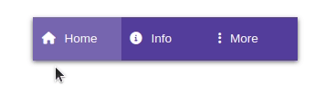

---
{}
---
   
Le widget navigation permet principalement de naviguer entre différentes pages d'une application. Le widget est composé de sous-widgets, les [Sous-widget Onglet](#sous-widget-onglet) auxquels une action sera associée.   
   
   
> [!tip]    
> Le widget navigation est réutilisé plusieurs fois au travers des pages d'une application et est donc un bon candidat pour devenir un composant partagé !   
> La document sur les composants partagés [ici](../../04%20-%20Cr%C3%A9er%20votre%20UI/3%20-%20Les%20widgets.md#les-composants-partagés).   
   
## Comportement   
   
### Onglet sélectionné   
   
| Paramètre | Utilisation                    |   
| --------- | ------------------------------ |   
| **Onglet**     | L'onglet sélectionné par défaut |   
   
## Design   
   
### Commun   
   
[Affichage](../../04%20-%20Cr%C3%A9er%20votre%20UI/3%20-%20Les%20widgets.md#affichage), [Fond](../../04%20-%20Cr%C3%A9er%20votre%20UI/3%20-%20Les%20widgets.md#fond), [Effets](../../04%20-%20Cr%C3%A9er%20votre%20UI/3%20-%20Les%20widgets.md#effets)   
   
### Disposition   
   
| Paramètre       | Utilisation                                                                                                                                                                                                                                                                                                                                                  |   
| --------------- | ------------------------------------------------------------------------------------------------------------------------------------------------------------------------------------------------------------------------------------------------------------------------------------------------------------------------------------------------------------ |   
| **Direction**   | Défini l'ordre et la direction des onglets :  **Ligne** : onglets en ligne **Colonne** : onglets en colonne **Ligne inverse** : onglets inversés en ligne **Colonne inverse** : onglets inversés en colonne                                                                                                       |   
| **Répartition** | Défini la répartition de l'espace entre les onglets : **Début** : onglets groupés au début **Centre** : onglets groupés au centre **Fin** : onglets groupés à la fin **Espace entre** : onglets à chaque extrémité et espacés **Espace autour** :onglets espacés équitablement entre eux et les extrémités |   
|         **Écart**        |       L'écart entre chaque onglet en pixels                                                                                                                                                                                                                                                                                                                                                       |   
   
# Widget Onglet   
   
Pour ajouter un onglet au widget navigation, sélectionner l'option *Ajouter un onglet* depuis le [menu contextuel](../../_glossaire/Glossaire.md#menu-contextuel) du widget navigation. Pour le supprimer, il suffit de faire comme pour les autres widgets.   
   
## Comportement et design   
   
Le comportement et le design d'un onglet sont identiques à celui du [widget bouton](../../04%20-%20Cr%C3%A9er%20votre%20UI/La%20liste%20des%20widgets/Widget%20Bouton.md).   
   
> [!note]    
> Lorsqu'on modifie le design de l'onglet sélectionné, on modifie en fait le design du **template** de l'onglet sélectionné.   
>    
De même, lorsqu'on fait des modifications de design sur un onglet non sélectionné, c'est le **template** des onglets non sélectionnés que l'on modifie.