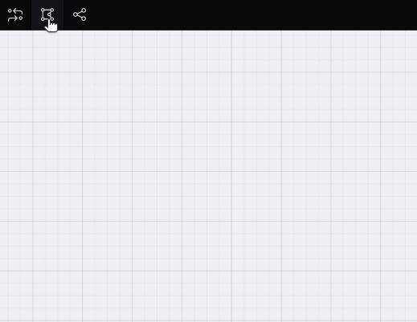

---
{}
---
   
Le widget polyligne permet de créer une ligne ou une polyligne : une suite de segments de ligne reliés entre eux.   
Contrairement aux autres widgets, la polyligne se créé depuis un bouton de la [toolbar](../../_glossaire/Glossaire.md#toolbar).   
   
   
   
Lorsqu'on sélectionne ce bouton, le curseur se transforme en croix et nous permet de tracer directement les différents segments de la polyligne.   
   
Le premier segment se créé avec un glissé déposé, les autres se forment avec des clics.   
   
Un clic droit ou un l'appuie sur la touche entrée permettent de terminer la polyligne et de sortir du mode de création.   
   
Il est par la suite possible de modifier la polyligne.   
   
## Design   
   
### Communs   
   
[Affichage](../../04%20-%20Cr%C3%A9er%20votre%20UI/3%20-%20Les%20widgets.md#affichage)   
   
### Trait   
   
| Paramètre     | Utilisation |   
| ------------- | ----------- |   
| **Largeur**   |    La largeur du trait en pixels         |   
| **Extrémité** |  La forme de fin de la ligne : Coupé ou Carré (prolongé par un rectange) ou Rond (prolongé d'un demi-cercle)         |   
| **Tiret**     |     Pour un effet pointillé, indique la longueur des traits en pixels       |   
| **Écart**     |      Pour un effet pointillé, indique l'espacement entre les traits en pixels       |   
| **Couleur**              |    La couleur de la polyligne         |