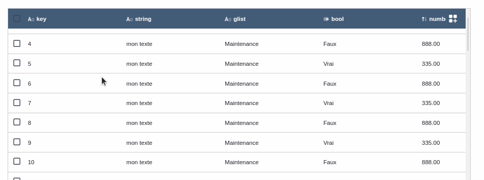

---
{}
---
   
Le widget tableau permet d'afficher une liste de [Smart Objects](../../_glossaire/Glossaire.md).   
Cette liste peut être triée, filtrée et ordonnée selon les différents champs du [Smart Model](../../_glossaire/Glossaire.md).   
   
Le widget tableau est composé de [Widget Colonne](#widget-colonne) qui représentent les différentes colonnes affichées.   
   
   
   
## Comportement   
   
### Données   
   
| Paramètre             | Utilisation                                                                                                                                         |   
| --------------------- | --------------------------------------------------------------------------------------------------------------------------------------------------- |   
| **Source de données** | La source de données de type [Smart Objects](../../_glossaire/Glossaire.md) qui va alimenter le tableau |   
| **Colonnes**                      |  Les différents champs du [Smart Model](../../_glossaire/Glossaire.md) qui correspondent aux colonnes à afficher                                                                                                                                                   |   
   
### Filtres   
   
| Paramètre              | Utilisation |   
| ---------------------- | ----------- |   
| **Sélection multiple** |  Permet de sélectionner plusieurs lignes du tableau pour le déclenchement d'actions          |   
| **Tri**                | Permet d'activer le tri sur les colonnes      |   
| **Filtres**            | Permet d'activer le filtre sur les colonnes            |   
| **Recherche**          | Ajoute une barre de recherche en amont du tableau            |   
| **Pagination**                       |   Ajoute une pagination au tableau en précisant le nombre d'éléments par page ainsi que le mode de pagination         |   
   
### Interactions   
   
| Paramètre              | Utilisation |   
| ---------------------- | ----------- |   
| **Colonnes éditables**                       |  Cette option permet à l'utilisateur d'intéragir avec les colonnes du tableau. Il pourra masquer des colonnes, les redimensionner et les réorganiser (glisser-déposer pour changer l'ordre des colonnes) si les options sont cochées.           |   
   
### Actions au clic sur la ligne   
   
Ces [actions](../../04%20-%20Cr%C3%A9er%20votre%20UI/3%20-%20Les%20widgets.md#actions-au-clic) sont déclenchées lorsque l'utilisateur cliquera sur une ligne du tableau.   
   
### Actions au double-clic sur la ligne   
   
Ces [actions](../../04%20-%20Cr%C3%A9er%20votre%20UI/3%20-%20Les%20widgets.md#actions-au-clic) sont déclenchées lorsque l'utilisateur double-cliquera sur une ligne du tableau.   
   
### Actions sur les lignes sélectionnées   
   
Ces [actions](../../04%20-%20Cr%C3%A9er%20votre%20UI/3%20-%20Les%20widgets.md#actions-au-clic) sont déclenchées lorsque l'utilisateur déclenche le bouton d'actions (depuis une ligne ou depuis le header du tableau, sur l'ensemble des lignes sélectionnées).   
   
Les sources de données `smart-object-selected` et `smart-objects-selected` sont injectées dans l'appel des [workflows](../../_glossaire/Glossaire.md) ou [smartflows](../../_glossaire/Glossaire.md).   
   
> [!info]    
> _smart-object-selected_ correspond au [Smart Object](../../_glossaire/Glossaire.md) de la ligne sélectionnée ou de la ligne où le bouton d'action a été déclenché.   
> _smart-objects-selected_ correspond au [Smart Object](../../_glossaire/Glossaire.md) des lignes sélectionnées.   
   
## Design   
   
### Commun   
   
[Affichage](../../04%20-%20Cr%C3%A9er%20votre%20UI/3%20-%20Les%20widgets.md#affichage), [Fond](../../04%20-%20Cr%C3%A9er%20votre%20UI/3%20-%20Les%20widgets.md#fond)   
   
### Lignes   
   
| Paramètre   | Utilisation                              |   
| ----------- | ---------------------------------------- |   
| **Hauteur** | Hauteur des lignes du tableau en pixels |   
| **Bordures lignes**            | L'option permet d'ajouter des bordures entre chaque ligne et d'en personnaliser la couleur et l'épaisseur                                         |   
   
### Colonnes   
   
| Paramètre   | Utilisation                              |   
| ----------- | ---------------------------------------- |   
| **Largeur** | Largeur des colonnes du tableau en pixels |   
| **Bordures colonnes**            | L'option permet d'ajouter des bordures entre chaque colonne et d'en personnaliser la couleur et l'épaisseur                                         |   
   
### Titres en-têtes   
   
Design du texte des en-têtes du tableau dont le paramétrage est identique au [design de texte](../../04%20-%20Cr%C3%A9er%20votre%20UI/La%20liste%20des%20widgets/Widget%20Texte.md#design).   
   
### Fond en-têtes   
   
| Paramètre   | Utilisation                              |   
| ----------- | ---------------------------------------- |   
| **Couleur** | La couleur de fond de l'en-tête du tableau |   
| **Bordure en bas**            | L'option permet d'ajouter une bordure entre l'en-tête et les lignes du tableau et d'en personnaliser la couleur et l'épaisseur                                         |   
   
### Textes cellules   
   
Design du texte des cellules dont le paramétrage est identique au [design de texte](../../04%20-%20Cr%C3%A9er%20votre%20UI/La%20liste%20des%20widgets/Widget%20Texte.md#design).   
   
# Widget Colonne   
   
Le widget colonne va permettre de personnaliser l'affichage des cellules du tableau pour chaque colonne.   
   
## Comportement   
   
### Affichage   
   
| Paramètre              | Utilisation                                                             |   
| ---------------------- | ----------------------------------------------------------------------- |   
| **Afficher la valeur** | Affiche la valeur de la propriété dans la cellule                       |   
| **Format**             | Le choix du format d'affichage de la valeur selon le type de la colonne |   
| **Icône**                       |   Affiche une icône dans la cellule                                                                        |   
   
### Filtres   
   
Cette section permet de surcharger (pour la colonne) les [Filtres](#filtres) (l'activation du tri et des filtres).   
Par défaut les options sont donc identiques à celle du tableau.   
   
### Interactions   
   
Cette section permet de surcharger (pour la colonne) les [Intéractions](#interactions) (l'activation du redimensionnement).   
Par défaut les options sont donc identiques à celle du tableau.   
   
### Actions au clic sur la cellule   
   
Ces [actions](../../04%20-%20Cr%C3%A9er%20votre%20UI/3%20-%20Les%20widgets.md#actions-au-clic) sont déclenchées lorsque l'utilisateur cliquera sur une cellule du tableau.   
   
### Actions au double-clic sur la cellule   
   
Ces [actions](../../04%20-%20Cr%C3%A9er%20votre%20UI/3%20-%20Les%20widgets.md#actions-au-clic) sont déclenchées lorsque l'utilisateur double-cliquera sur une cellule du tableau.   
   
## Design   
   
### Commun   
   
[Affichage](../../04%20-%20Cr%C3%A9er%20votre%20UI/3%20-%20Les%20widgets.md#affichage), [Fond](../../04%20-%20Cr%C3%A9er%20votre%20UI/3%20-%20Les%20widgets.md#fond)   
   
### Cellules   
   
Cette section permet de surcharger (pour la colonne) le [Textes cellules](#textes-cellules).   
Par défaut les options sont donc identiques à celle du tableau.