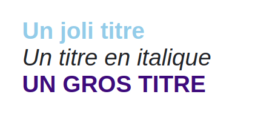

---
{}
---
   
Le widget permet d'afficher du texte dans de nombreuses mises en forme.   
   
   
   
## Comportement   
   
### Commun   
   
[Actions au clic](../../04%20-%20Cr%C3%A9er%20votre%20UI/3%20-%20Les%20widgets.md#actions-au-clic), [Options d'affichage](../../04%20-%20Cr%C3%A9er%20votre%20UI/3%20-%20Les%20widgets.md#options-d'affichage)   
   
### Paramètres personnalisés   
   
| Paramètre | Utilisation                    |   
| --------- | ------------------------------ |   
| **Texte**     | Le texte à afficher |   
   
## Design   
   
### Commun   
   
[Affichage](../../04%20-%20Cr%C3%A9er%20votre%20UI/3%20-%20Les%20widgets.md#affichage), [Texte](../../04%20-%20Cr%C3%A9er%20votre%20UI/3%20-%20Les%20widgets.md#texte), [Fond](../../04%20-%20Cr%C3%A9er%20votre%20UI/3%20-%20Les%20widgets.md#fond), [Effets](../../04%20-%20Cr%C3%A9er%20votre%20UI/3%20-%20Les%20widgets.md#effets)   
   
### Disposition   
   
| Paramètre       | Utilisation                                                                                                                                                                                                                                                                                                                                                                                                                |   
| --------------- | -------------------------------------------------------------------------------------------------------------------------------------------------------------------------------------------------------------------------------------------------------------------------------------------------------------------------------------------------------------------------------------------------------------------------- |   
| **Alignement**   | Défini l'alignement horizontal du texte : **Début** : texte placé en haut de la box **Centre** : texte placé au centre de la box **Fin** : texte placé en bas de la box