---
{}
---
   
# 🌟 Créer une petite application   
   
Ce guide va vous présenter pas à pas la conception d'une première application avec l'[UI Composer](../_glossaire/Glossaire.md). Nous allons concevoir ensemble une application mobile toute simple de prise de notes.   
   
> [!info]    
> Pour réaliser cette application, nous utiliserons les notions de [Smart Model](../_glossaire/Glossaire.md), de [workflow](../_glossaire/Glossaire.md) et de [smartflow](../_glossaire/Glossaire.md).   
   
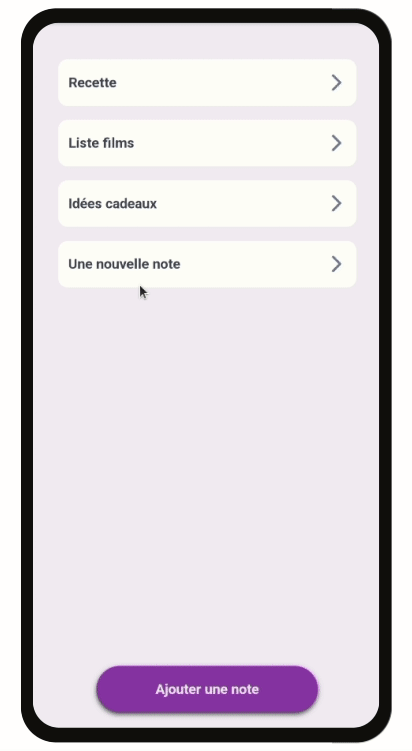   
   
Le [Smart Model](../_glossaire/Glossaire.md) utilisé sera vraiment très simple et les worflows utilisés vous seront montrés mais ne seront pas détaillés ici car nous nous focalisons sur les fonctionnalités de l'[UI Composer](../_glossaire/Glossaire.md).   
   
⌛ *Durée estimée : 20 minutes*   
   
# L'application   
   
Tout d'abord, nous allons créer une nouvelle application mobile que nous allons appeler *Notes*.    
   
Première étape à ne pas oublier : l'association d'une icône à notre application. On en profite aussi pour cacher la barre d'en-tête.   
   
Cette application va nous proposer 6 fonctionnalités :   
   
   
- lister des notes   
- créer une note   
- lire une note   
- éditer une note   
- supprimer une note   
- ajouter une note aux favoris   
   
> [!note]    
> Pour l'exemple, nous avons choisi de créer une application mobile mais ce guide s'applique tout aussi bien pour les applications web !   
   
# Utiliser les widgets   
   
Commençons par créer le "squelette" de notre application en ajoutant des widgets et des pages sans implémenter de logique de fonctionnement pour le moment.   
   
> [!important]    
> Utilisez uniquement des couleurs issues du thème de l'application pour jouer avec dans la suite du guide.   
   
> [!help]    
> La documentation sur les widgets [ici](../04%20-%20Cr%C3%A9er%20votre%20UI/3%20-%20Les%20widgets.md)   
   
## Créer une liste   
   
Attaquons-nous en premier à la liste de notes qui sera placée sur la page *Notes*. Cette liste affichera seulement le titre de la note et permettra d'accéder au détail d'une note sélectionnée. Pour la réaliser, nous allons utiliser un seul widget : le widget bouton.   
   
On va ajouter du texte et une icône à ce bouton et modifier son design (couleurs, texte, disposition) pour arriver à ce genre de résultat.   
   
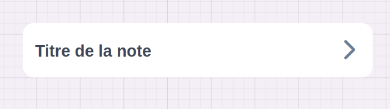   
   
Ensuite, pour créer la liste nous allons juste transformer notre widget bouton en liste. Nous allons retirer la barre de défilement interne à la liste et augmenter l'espace d'écart entre chaque élément.   
   
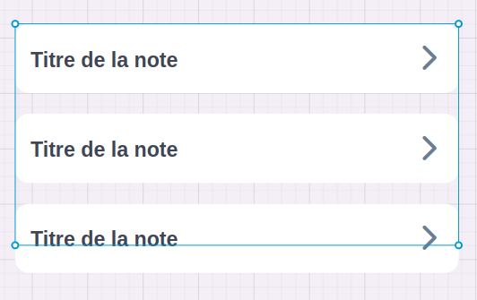   
   
> [!help]    
> - La document sur le widget bouton [ici](../04%20-%20Cr%C3%A9er%20votre%20UI/La%20liste%20des%20widgets/Widget%20Bouton.md)   
> - La documentation sur les listes [ici](../04%20-%20Cr%C3%A9er%20votre%20UI/La%20liste%20des%20widgets/Widget%20Liste.md)   
   
## Utiliser le widget footer   
   
Passons maintenant au bouton pour créer une nouvelle note. Celui-ci sera toujours visible en bas de l'écran, et pour cela, nous allons tout naturellement utiliser le widget footer.   
   
On ajoute à l’intérieur du widget footer, un widget bouton, et on paramètre le tout pour avoir notre joli bouton d'ajout de note.   
   
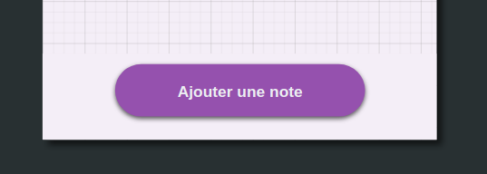   
   
> [!help]    
> La documentation sur le widget footer [ici](../04%20-%20Cr%C3%A9er%20votre%20UI/La%20liste%20des%20widgets/Widget%20Footer.md).   
   
## Utiliser le widget header   
   
Ajoutons maintenant directement la seconde page de notre application, la page de détail de la note et nommons-la *Détail*.   
   
Cette page va devoir afficher le titre et le contenu de la note. Mais elle va aussi nous permettre d'éditer la note, de la supprimer, de l'ajouter en favoris et de repartir sur la page précédente qui liste les notes.   
   
Ces actions vont être groupées dans une barre d'en-tête :   
   
   
- 1 widget bouton pour retourner sur la liste   
- 1 widget bouton pour ajouter le widget aux favoris ou le retirer des favoris   
- 1 widget bouton pour lancer l'édition ou la suppression   
   
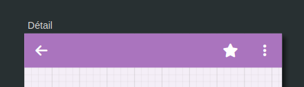   
   
> [!help]    
> La documentation sur le widget header [ici](../04%20-%20Cr%C3%A9er%20votre%20UI/La%20liste%20des%20widgets/Widget%20Header.md)   
   
## Créer un groupe de widgets   
   
Il ne reste plus qu'à créer le groupe de widgets qui va permettre d'afficher le titre et le contenu de la note dans la page *Détail*.   
   
Ce groupe est composé de :   
   
   
- 1 widget rectangle pour le fond de la carte   
- 1 widget texte pour le titre de la note   
- 1 widget texte pour le détail de la note   
   
Voici à quoi devrait ressembler l'application pour le moment :   
   
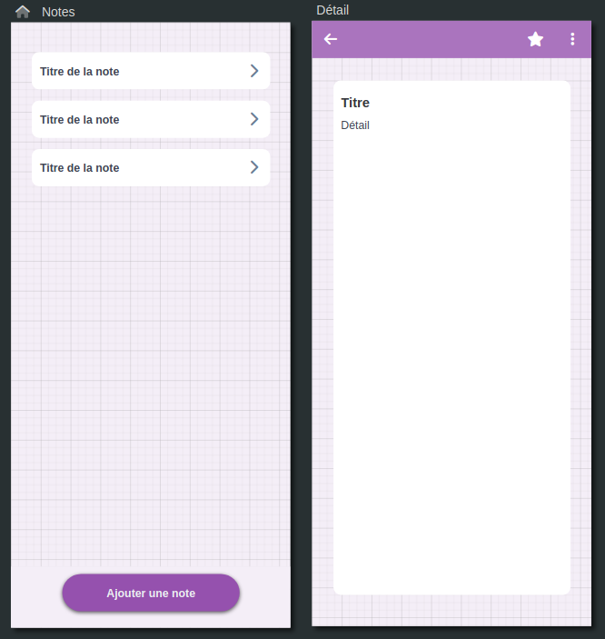   
   
# Lier des événements   
   
Ça y est, tous nos widgets sont posés 🥳 !   
Faisons un petit test, lançons l'aperçu de notre application ! ...   
   
Le résultat est un peu décevant ? C'est normal 🙃 ! Nous n'avons toujours pas lié de source de données à notre liste ni d'actions à nos boutons ! C'est ce que nous allons faire maintenant.    
   
## Les sources de données   
   
Avant de pouvoir lier notre liste à une source de données, il faut que cette source existe !   
   
Pour cela, créons le [Smart Model](../_glossaire/Glossaire.md) *Note* dans le [Data Modeler](../_glossaire/Glossaire.md#data-modeler) comme montré ci-dessous.   
   
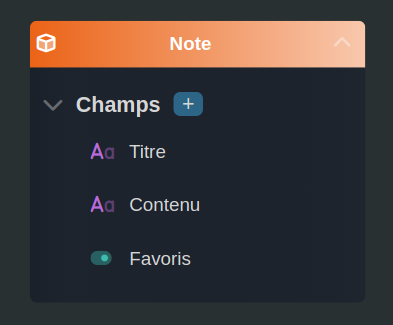   
   
Une fois publié, revenons sur l'application et ajoutons en source de données de la page *Notes*, notre [Smart Model](../_glossaire/Glossaire.md) *Note*.   
   
On peut maintenant ajouter cette source de donnée à la collection d'entrée de notre liste d'aperçu de notes.   
   
Une fois la collection renseignée, nous pouvons accéder à la ressource item de la liste depuis le widget bouton. On peut donc modifier le texte pour afficher directement le titre de la note.    
   
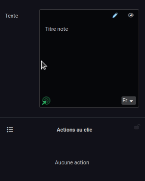   
   
Voici à quoi devrait ressembler notre première page *Notes*.    
   
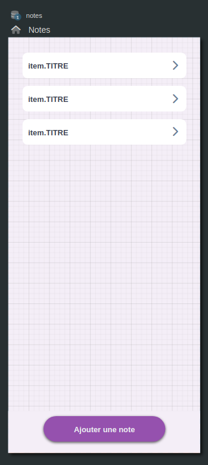   
   
> [!help]    
> - La documentation sur les sources de données [ici](../04%20-%20Cr%C3%A9er%20votre%20UI/2%20-%20Les%20pages.md#sources-de-données)   
> - La documentation sur les Smart Models [ici](../03%20-%20Mod%C3%A9liser%20vos%20donn%C3%A9es/1%20-%20Les%20Smart%20Models.md)   
   
## Les variables   
   
L'utilisation de variables va nous permettre de passer des données d'une page à une autre. Ici nous allons passer comme variable la note sélectionnée dans la liste pour pouvoir l'afficher sur la page de détail.   
   
On ajoute donc à la page *Détail* une variable de type Note.   
   
On peut maintenant modifier le texte des widgets de titre et du détail de la note en utilisant cette variable !   
   
   
   
> [!help]    
> La documentation sur les variables [ici](../04%20-%20Cr%C3%A9er%20votre%20UI/2%20-%20Les%20pages.md#variables)   
   
## Ajouter des actions aux boutons   
   
Nous avons configuré les sources de données et les variables, il ne nous reste plus qu'à configurer les boutons pour pouvoir utiliser l'application !   
   
### Lancer une page   
   
Pour lancer la page de détail depuis un élément de la liste sur la page *Notes*, nous allons tout simplement sélectionner le widget bouton et lui ajouter une action au clic. Cette action de type *Page* va ouvrir la page *Détail* et lui passer en entrée l'item de la liste.   
   
Sur la page *Détail*, nous ajoutons aussi une action pour lancer une page au widget bouton avec l'icône flèche. Cette fois on lance la page *Notes* qui n'a pas besoin de variables d'entrées.   
   
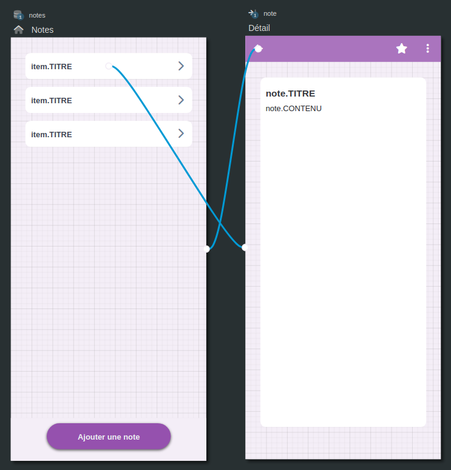   
   
On peut afficher les transitions pour vérifier que les liens entre les pages sont bien construits.   
   
### Lancer un workflow   
   
Implémentons maintenant le bouton pour créer une nouvelle note !   
   
Voici le [workflow](../_glossaire/Glossaire.md) utilisé que nous appelerons *Créer note* et qui permettra à l'utilisateur de l'application d'insérer un titre et un contenu à la note.   
   
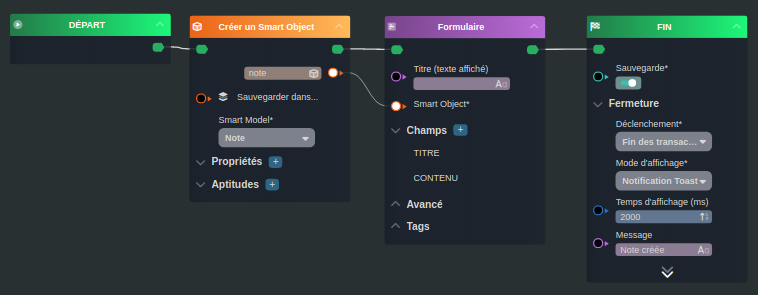   
   
Une fois le [workflow](../_glossaire/Glossaire.md) publié, on peut l'utiliser pour ajouter une action au clic du bouton qui permet d'ajouter une nouvelle note depuis la page *Notes*. Veillez à renseigner votre groupe de sécurité aux profils autorisés à lancer le [workflow](../_glossaire/Glossaire.md).   
   
### Lancer un smartflow   
   
C'est au tour du bouton pour ajouter / retirer une note des favoris d'être implémenté. Cette fois, pas besoin d'interface graphique et on va donc utiliser un [smartflow](../_glossaire/Glossaire.md) pour faire ça.   
   
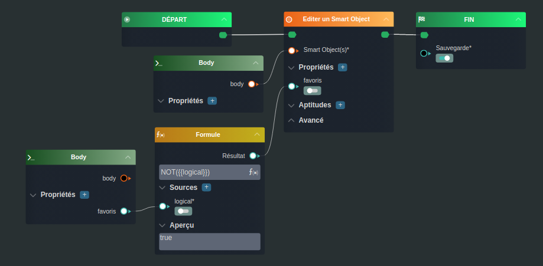   
   
Le [smartflow](../_glossaire/Glossaire.md) devra prendre en entrée la variable Note pour fonctionner.   
   
### Afficher une liste de workflows   
   
On arrive enfin au dernier bouton ! Celui-ci devra présentera une liste de 2 [workflows](../_glossaire/Glossaire.md) différents : l'édition et la suppression de la note.   
   
Pour faire cela nous allons activer l'affichage en liste des actions au clic pour le bouton et ajouter les deux actions.   
   
> [!help]    
> La documentation sur les actions [ici](../04%20-%20Cr%C3%A9er%20votre%20UI/3%20-%20Les%20widgets.md#actions-au-clic)   
   
# Ajouter des conditions d'affichage   
   
Nous pouvons maintenant relancer l'aperçu de notre application et la tester !   
   
Les boutons fonctionnent, on peut créer une note, la sélectionner dans la liste et l'afficher dans la page de détail. Par contre nous ne pouvons pas utiliser les boutons d'actions sur cette page (favoris / édition / suppression) car nous sommes sur l'aperçu et que les objets créés en aperçu n'existent pas vraiment.   
   
On va donc publier l'application et gérer son accès pour pouvoir la tester au maximum.   
Et si tout se passe bien, on va vite remarquer quelques petites améliorations ergonomiques que l'on peut faire :   
   
   
- Indiquer qu'une note est ajoutée ou non aux favoris   
- Afficher un message pour indiquer que la liste est vide lorsque aucune note n'est créée   
   
> [!help]    
> La documentation sur l'aperçu [ici](../04%20-%20Cr%C3%A9er%20votre%20UI/1%20-%20Les%20applications.md#aperçu-d'une-application)   
   
## Conditionner une couleur   
   
Nous allons modifier la couleur de 2 widgets différents en fonction de si la note est dans les favoris ou pas :   
   
   
- Le fond du widget bouton de la liste des notes   
- L'icône du bouton pour ajouter / retirer une note des favoris   
   
Il va donc falloir ajouter à ces 2 widgets la même règle : la règle favoris qui s'actionne quand la propriété favoris de la note est égal à vraie.   
   
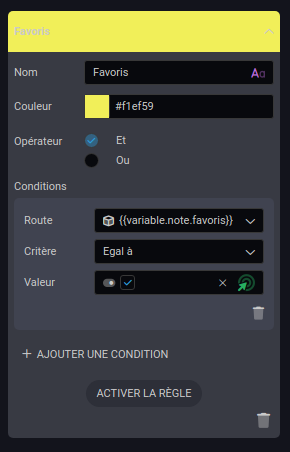   
   
Pour implémenter la règle, il nous suffit d'activer l'état *Favoris* sur le widget et de modifier la couleur pour cet état (cette fois je vous autorise à ne pas utiliser une couleur du thème car la couleur jaune est universelle pour les favoris 😉).   
   
## Conditionner l'affichage   
   
Il nous reste maintenant plus qu'à afficher un texte quand il n'y a pas de notes en base de données.   
   
Pour celle-ci il faut ajouter un dernier widget à la page, un widget texte que l'on place au niveau de la liste. On va paramétrer le texte pour annoncer qu'aucune note n'est présente pour le moment et le masquer.   
   
Pour le moment il n'existe pas de règle pour vérifier si un tableau est vide donc nous allons contourner ce problème est utiliser un [smartflow](../_glossaire/Glossaire.md) qui va nous renvoyer un booléen : vrai si il existe des éléments dans les notes et sinon faux. On va ajouter ce [smartflow](../_glossaire/Glossaire.md) dans les sources de données de la page *Notes*.   
   
On va enfin pouvoir ajouter la règle 0 note qui s'actionne quand il n'y a pas de notes créées au widget texte que l'on vient de poser. On active cette règle pour décocher la case *Masquer*, ce widget sera donc bien affiché quand aucune note ne se trouvera en base de données.    
   
> [!help]    
> La documentation sur les conditions [ici](../04%20-%20Cr%C3%A9er%20votre%20UI/3%20-%20Les%20widgets.md#conditions-des-widgets)   
   
# Jouer avec le thème de l'application   
   
Ça y est nous avons terminé 🎉 ! On peut republier l'application et la tester !   
   
Si vous avez bien utilisé les couleurs du thème de l'application vous devez voir qu'il est facile de passer du thème clair au sombre à un thème personnalisé très facilement et rapidement pour choisir les couleurs qui correspondent le mieux à ce que vous souhaitez !   
   
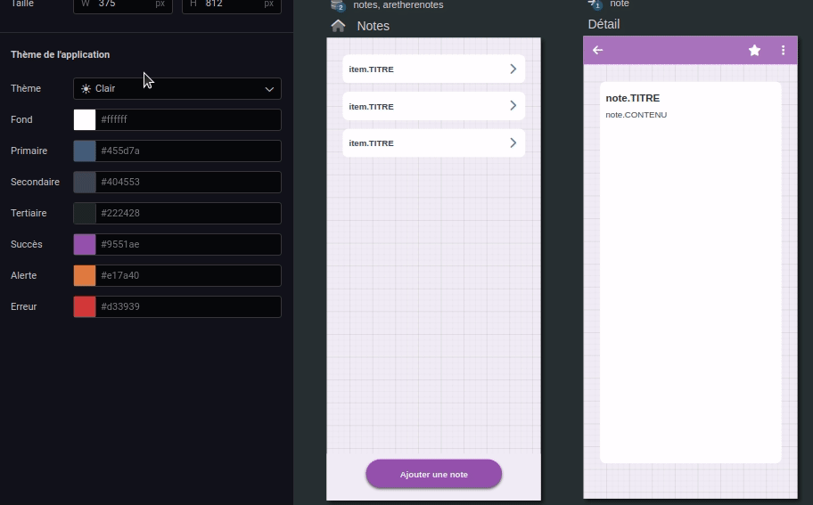   
   
# Aller plus loin avec les composants partagés   
   
Imaginons par exemple que vous aimeriez qu'en plus de prendre des notes, notre application nous permette de créer une "to-do list".   
   
Pour faire cela rien de plus simple, il nous suffit d'ajouter une troisième page, décaler notre widget liste pour ajouter un widget navigation qui va nous permettre de naviguer facilement entre chaque page.   
   
Plus qu'à ajouter le widget navigation en tant que composant partagé et déposer une référence sur la nouvelle page.   
   
Dès que des modifications sont faites, elles sont ainsi facilement reportées sur l'autre page grâce à la mise à jour des références.   
   
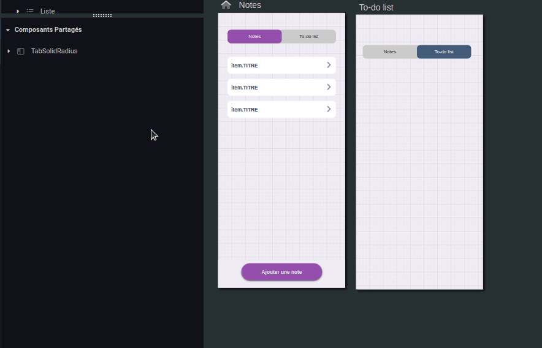   
   
   
---   
   
Félicitations vous maîtrisez à présent l'UI Designer 👏 !