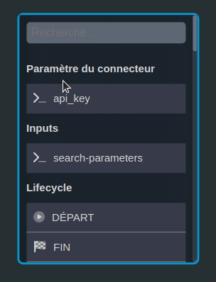

---
{}
---
   
# Le système de nœuds   
   
<iframe width="560" height="315" src="https://www.youtube.com/embed/a5jKVan6_fc" title="YouTube video player" frameborder="0" allow="accelerometer; autoplay; clipboard-write; encrypted-media; gyroscope; picture-in-picture; web-share" allowfullscreen></iframe>   
   
Le système de nœuds est le procédé qui va nous permettre de réaliser de la programmation visuelle sur Vision pour créer des [workflows](../_glossaire/Glossaire.md) et des [smartflows](../_glossaire/Glossaire.md).   
   
Un [workflow](../_glossaire/Glossaire.md) a pour vocation d'être graphique et d'être joué depuis le Player.   
L'utilisateur du [workflow](../_glossaire/Glossaire.md) doit interagir (remplir des formulaires, sélectionner des éléments...) avec le [workflow](../_glossaire/Glossaire.md) pour le terminer.   
   
Un [smartflow](../_glossaire/Glossaire.md) est l'équivalent d'un [workflow](../_glossaire/Glossaire.md) non graphique joué côté serveur.   
C'est un outil de gestion de flux de données. Il peut se connecter à des bases de données externes ainsi qu'à des API, il permet également de construire sa propre api.   
   
# Les nœuds   
   
Sur Vision, les instructions sont représentées par des nœuds qui correspondent aux différentes fonctionnalités ou tâches disponibles (_Formulaire, Prise de photo, Choix Multiple, ...).   
   
   
   
Ils sont classés par groupes de fonctionnalité (_Lifecycle, Forms, Données, ..._).   
Chaque groupe étant représenté par une [couleur](../05%20-%20Workflows%2C%20cr%C3%A9er%20votre%20logique%20m%C3%A9tier/3%20-%20La%20signification%20des%20couleurs.md).   
   
L'assemblage de nœuds permet donc de créer le cheminement que l'utilisateur final devra effectué pour valider le processus.   
   
Les nœuds sont liés entre eux de deux manières différentes :    
   
- [des liaisons flows](../05%20-%20Workflows%2C%20cr%C3%A9er%20votre%20logique%20m%C3%A9tier/4%20-%20Les%20liaisons%20de%20type%20flow.md) qui permettent de passer d'une étape à une autre.   
- [des liaisons data](../05%20-%20Workflows%2C%20cr%C3%A9er%20votre%20logique%20m%C3%A9tier/5%20-%20Les%20liaisons%20de%20type%20data.md) qui permettent de faire naviguer la donnée.   
   
   
   
Le branchement est réalisé de façon totalement graphique via un système de drag&drop.   
Un assistant d'intégration éteindra les entrées/sorties non valides pour faciliter la conception.   
   
   
   
Le flux doit commencé par un nœud Départ et se terminer par un ou plusieurs nœuds Fin.   
   
Le nœud *Départ* indique le point d'entrée du processus et le nœud *Fin* marque son achèvement, il peut être présent plusieurs fois car différents chemins peuvent être empruntés et amener à la fin processus.   
   
Une fois joué, le flux se terminera quand l'ensemble du parcours sera réalisé (du noeud Départ jusqu'au noeud Fin).   
   
## Les groupes et boxes   
   
Les groupes et les boxes sont des conteneurs de nœuds qui permettent de classer les différentes étapes. Ces éléments peuvent être ajoutés depuis la [toolbar](../_glossaire/Glossaire.md#toolbar) ou depuis le [menu contextuel](../_glossaire/Glossaire.md#menu-contextuel).   
   
Un groupe peut être nommé et identifié par une couleur. Il peut être composé de nœuds et de boxes. Une box peut simplement être nommé et contenir des nœuds.   
   
