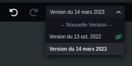
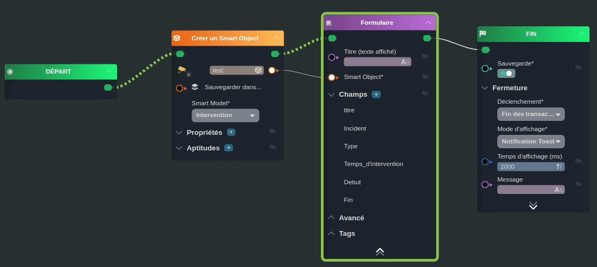
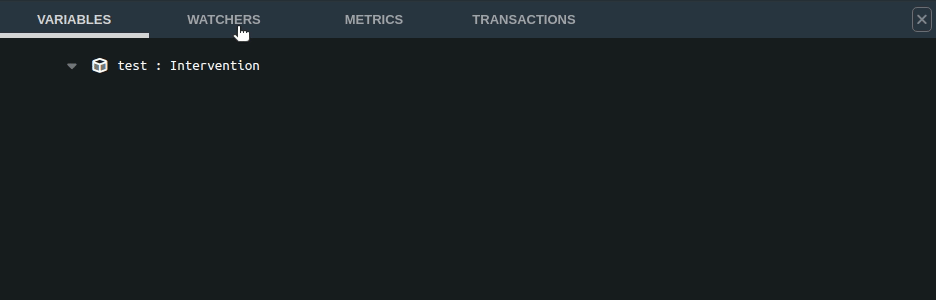
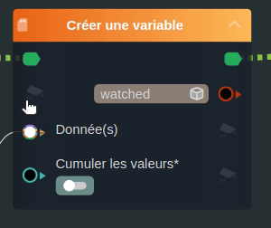

---
{}
---
   
# Les workflows   
   
Un [workflow](../_glossaire/Glossaire.md) est un flux opérationnel constitué d'une suite de tâches.    
   
Un [workflow](../_glossaire/Glossaire.md) a pour vocation d'être graphique et d'être joué depuis le Player.   
L'utilisateur du [workflow](../_glossaire/Glossaire.md) doit interagir (remplir des formulaires, sélectionner des éléments...) avec le [workflow](../_glossaire/Glossaire.md) pour le terminer.   
   
Un [workflow](../_glossaire/Glossaire.md) peut être appelé depuis une [Application](../04%20-%20Cr%C3%A9er%20votre%20UI/1%20-%20Les%20applications.md).   
Il peut aussi être joué indépendamment sur le navigateur grâce au [SmartLink](../05%20-%20Workflows%2C%20cr%C3%A9er%20votre%20logique%20m%C3%A9tier/6%20-%20Cr%C3%A9er%20un%20SmartLink%20-%20Exporter%20son%20Workflow.md).   
   
# Les variables   
   
Les variables sont les données d'entrée du [workflow](../_glossaire/Glossaire.md).   
   
Une variable est identifiée par une clé, elle est typée et peut être multiple (pour contenir des listes par exemple).   
   
Les variables sont accessibles depuis le [workflow](../_glossaire/Glossaire.md) par le système de nœuds : elles sont disponibles dans la section *Inputs*.   
   
# Les profils   
   
Différents profils peuvent être définis sur un [workflow](../_glossaire/Glossaire.md).   
Les profils permettent à une instance de [workflow](../_glossaire/Glossaire.md) d'être jouée par plusieurs utilisateurs.   
   
> [!example]   
>Un exemple typique serait un [workflow](../_glossaire/Glossaire.md) avec validation par un responsable métier.   
>Le [workflow](../_glossaire/Glossaire.md) serait créé par un technicien, celui-ci enverrait une notification ou un email, une fois sa partie complétée, l'instance de [workflow](../_glossaire/Glossaire.md) serait reprise par le responsable.   
   
Les profils sont mappés vers des groupes de sécurités dans les [applications](../04%20-%20Cr%C3%A9er%20votre%20UI/1%20-%20Les%20applications.md).   
   
# Structurer un workflow   
   
<iframe width="560" height="315" src="https://www.youtube.com/embed/xQB5VxitbI8" title="YouTube video player" frameborder="0" allow="accelerometer; autoplay; clipboard-write; encrypted-media; gyroscope; picture-in-picture; web-share" allowfullscreen></iframe>   
   
Un [workflow](../_glossaire/Glossaire.md) peut facilement et rapidement se complexifier avec la présence de nombreux nœuds. Il existe des solutions pour les structurer.   
   
## Les sous-workflows   
   
Un [workflow](../_glossaire/Glossaire.md) à la possibilité de faire appel à un ou plusieurs sous-worklows ([Appeler un workflow](../R%C3%A9f%C3%A9rences%20des%20noeuds/Appeler%20un%20workflow.md)), ce qui permet d'éviter la duplication, d'alléger le [workflow](../_glossaire/Glossaire.md) et le rendre plus lisible.   
   
_Ce mécanisme existe aussi pour les [smartflows](../_glossaire/Glossaire.md) ([Appeler un smartflow](../R%C3%A9f%C3%A9rences%20des%20noeuds/Appeler%20un%20smartflow.md))._   
   
## Les versions   
   
Il est possible de créer plusieurs versions depuis le sélecteur de versions dans la [toolbar](../_glossaire/Glossaire.md#toolbar).   
Ceci permet de travailler sur des versions "brouillons" et de conserver des historiques.   
   
   
   
# Le débogueur   
   
<iframe width="560" height="315" src="https://www.youtube.com/embed/jo2zvzdmxAw" title="YouTube video player" frameborder="0" allow="accelerometer; autoplay; clipboard-write; encrypted-media; gyroscope; picture-in-picture; web-share" allowfullscreen></iframe>   
   
Le débogueur permet au concepteur de lancer son [workflow](../_glossaire/Glossaire.md) pour tester son travail sans avoir à publier le [workflow](../_glossaire/Glossaire.md), celui-ci est alors lancé en lecture seule, aucune transaction n'est effectuée.   
   
Le débogueur est lancé depuis la [toolbar](../_glossaire/Glossaire.md#toolbar).   
Une console de débogage apparaît en bas de l'interface ainsi qu'une fenêtre d'aperçu sur le côté droit.   
   
## Le suivi du processus   
   
   
   
Lors de l'aperçu d'un [workflow](../_glossaire/Glossaire.md), les étapes s'enchaînent, une ligne pointillée verte montre le chemin parcouru et un encadré vert indique le nœud sur lequel on se trouve lorsque le processus est à l'arrêt.   
   
## La console de débogage   
   
La console permet de fournir des informations détaillées sur le déroulement du [workflow](../_glossaire/Glossaire.md) et de détecter les potentielles erreurs.   
   
   
   
La console est divisée en 4 onglets qui présentent différentes données.   
   
### Les variables   
   
L'onglet variables liste les différentes variables créées lors du processus et indique leurs valeurs.   
   
### Les watchers   
   
On appelle watchers les paramètres d'entrées / sorties qui sont "sous surveillance". Il est possible de marquer n'importe quel paramètre en tant que watcher grâce à l'icône de caméra de surveillance directement depuis un nœud ou depuis l'onglet _Variables_.   
   
   
   
### Les metrics   
   
L'onglet _Metrics_ permet d'analyser le temps passé par tâche ou processus du [workflow](../_glossaire/Glossaire.md).    
   
### Les transactions   
   
L'onglet _Transactions_ résume toutes les transactions qui seront réalisées sur la base de données Vision lorsque le processus s'effectuera en réel.