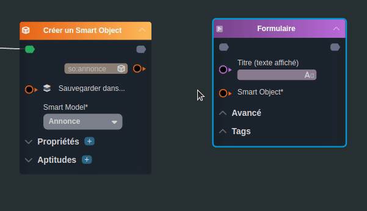
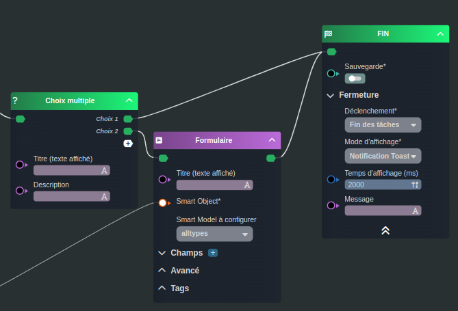

---
{}
---
   
# Les liaisons de type flow   
   
Ces liaisons permettent de passer d'une étape à une autre.   
   
Une liaison de type flow se fait entre deux nœuds :   
   
- un nœud qui possède au moins un flux de sortie   
- un nœud qui possède un flux d'entrée   
   
   
   
Un flux d'entrée peut être branché sur plusieurs flux de sorties.   
Un flux de sortie ne peut être branché qu'une seule fois.   
   
   
   
Les associations de nœuds qui possèdent ce genre d'entrée et de sortie représentent donc les différentes tâches du [workflow](../_glossaire/Glossaire.md) ou du [smartflow](../_glossaire/Glossaire.md).   
   
> [!info]    
> Les [workflows](../_glossaire/Glossaire.md) et [smartflows](../_glossaire/Glossaire.md) sont tous composées par les nœuds **Début** et **Fin** qui indiquent le point d'entrée et de sortie du processus.