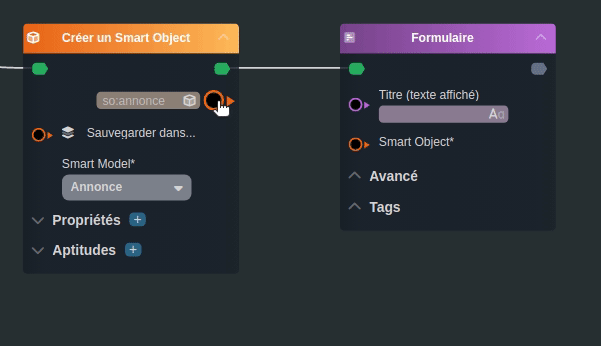
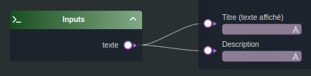
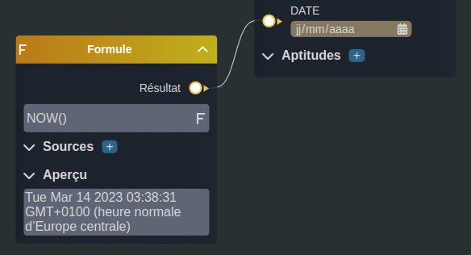
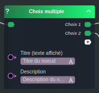
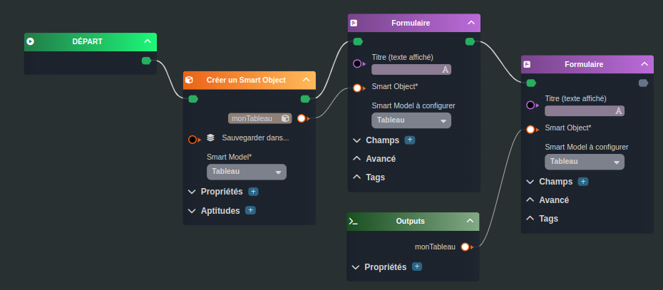

---
{}
---
   
# Les liaisons de type data   
   
Ces liaisons permettent de faire naviguer la donnée.   
   
Une liaison de type data se fait entre deux nœuds, entre un paramètre d'entrée et un paramètre de sortie.   
   
Chaque tâche possèdent plusieurs paramètres d'entrées, ce qui va permet de charger son contexte.   
La liaison va donc transférer la donnée d'une tâche dans une autre.   
   
> [!example]   
>Comme illustré ci-dessous, la tâche [Créer un Smart Object](../R%C3%A9f%C3%A9rences%20des%20noeuds/Cr%C3%A9er%20un%20Smart%20Object.md) va créer l'instance d'un [Smart Object](../_glossaire/Glossaire.md), celui-ci sera transféré dans la tâche [Formulaire](../R%C3%A9f%C3%A9rences%20des%20noeuds/Formulaire.md), ce qui permettra à l'utilisateur de saisir ces propriétés.   
   
   
   
Les paramètres peuvent être obligatoire, il se termineront alors avec le symbole \* et devront obligatoirement être renseignés pour valider l'intégrité du [workflow](../_glossaire/Glossaire.md).   
   
Un paramètre de sortie peut être branché sur plusieurs paramètre d'entrées.   
Un paramètre d'entrée ne peut être branché qu'une seule fois.   
   
   
   
Les liaisons de type data dépendent du type des paramètres. Par exemple, un paramètre d'entrée de type *string* ne peut pas accepter une liaison avec un paramètre d'un autre type.    
   
Chaque type de paramètre est représenté par une [couleur](../05%20-%20Workflows%2C%20cr%C3%A9er%20votre%20logique%20m%C3%A9tier/3%20-%20La%20signification%20des%20couleurs.md) précises.   
   
## Noeud de donnée   
   
Certain nœuds ne possèdent pas de flux.   
Ils permettent uniquement de retourner une donnée, ils ne représentent pas une tâche du [workflow](../_glossaire/Glossaire.md).   
Ils sont branchés directement via leurs paramètre de sortie.   
   
   
   
## Saisie rapide   
   
Le paramètre peut être renseigné par une liaison ou par une saisie rapide, directement dans le nœud, quand celui-ci est proposé (dépend du type de paramètre).   
   
   
   
> [!note]   
>Si le paramètre est branché via une liaison, celle-ci sera prise en priorité par rapport à la saisie rapide.   
   
## Répétition   
   
Il est possible de nommer le paramètre de sortie pour le réutiliser plus loin dans le [workflow](../_glossaire/Glossaire.md) grâce aux _Noeud Output_.   
   
