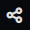
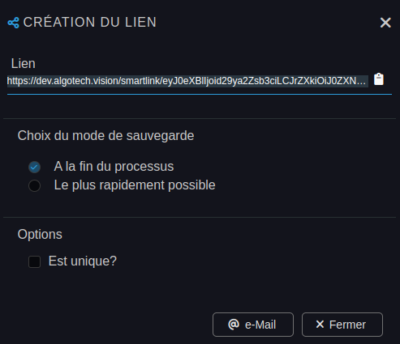

---
{}
---
   
# Créer un SmartLink - Exporter son Workflow   
   
La manière la plus courante de lancer un [workflow](../_glossaire/Glossaire.md) est faîtes via un événement dans le [widget](../04%20-%20Cr%C3%A9er%20votre%20UI/3%20-%20Les%20widgets.md) d'une [application](../04%20-%20Cr%C3%A9er%20votre%20UI/1%20-%20Les%20applications.md).   
   
Il existe cependant un moyen de lancer le [workflow](../_glossaire/Glossaire.md) indépendamment de tout module de Vision, ceci grâce à l'export d'une URL, **le SmartLink**.   
   
Le SmartLink est un lien qui va permettre de jouer le [workflow](../_glossaire/Glossaire.md) dans un player.   
   
Le [workflow](../_glossaire/Glossaire.md) doit préalablement être publié avant de pouvoir être partagé depuis le bouton d'action de création de liens dans la [toolbar](../_glossaire/Glossaire.md#toolbar).   
   
    
    
    
   
Plusieurs sections de configurations sont présentes dans la fenêtre de création du SmartLink (en plus du lien généré).   
   
Dés lors qu'une valeurs de ces sections est modifiées, le lien généré se met à jour.   
   
   
- Le choix des sources d'entrées permet de renseigner les différentes valeurs des variables du [workflow](../_glossaire/Glossaire.md).   
   
   
- Le choix du mode de sauvegarde :   
   -   **A la fin du processus (conseillé)** (toutes les transactions seront réalisées après la dernière tâche du [workflow](../_glossaire/Glossaire.md))   
   -   Le plus rapidement possible (sauvegarde permanente)   
   
   
- L'option unique (impossible de lancer une deuxième instance de [workflow](../_glossaire/Glossaire.md) tant que la première n'est pas terminée).   
   
Pour partager le [workflow](../_glossaire/Glossaire.md), il suffit d'utiliser le lien généré qui est directement copié dans le presse-papier lorsqu'on clic dessus.   
Il est également possible d'utiliser le bouton *E-Mail* qui permet de partager le lien directement par email.