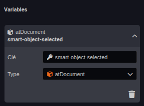
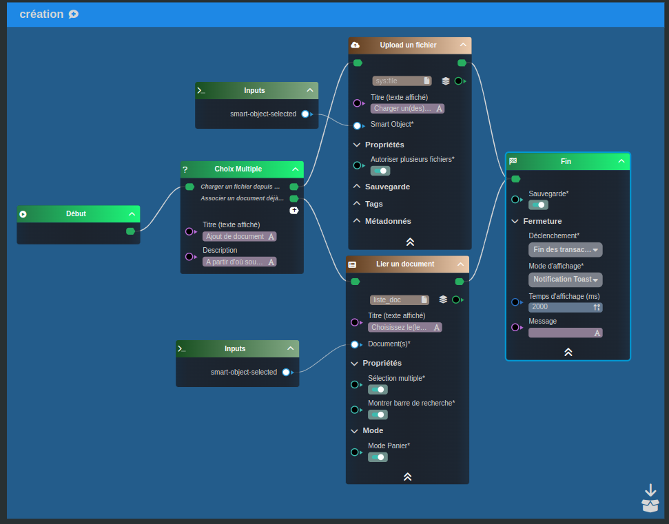

---
{}
---
   
# Ajouter un document   
   
Nous allons concevoir ensemble un [workflow](../../_glossaire/Glossaire.md) permettant d'ajouter un document et de l'attacher à un [Smart Object](../../_glossaire/Glossaire.md).   
   
L'ajout du document se fera par un choix de l'utilisateur:   
   
- Upload d'un nouveau fichier   
- Attachement via un document existant   
   
# Ajout de la variable   
   
La première étape est la déclaration de la variable, le but du [workflow](../../_glossaire/Glossaire.md) étant d'attacher un document à un [Smart Object](../../_glossaire/Glossaire.md), celui-ci sera déclaré comme valeur entrante du worflow.   
   
Ajouter une variable en choisissant la source _Smart Object Sélectionné_ présente dans la liste de choix proposé au clic.   
   
Définir le type en tant que atDocument, cela permettra de prendre en compte tout type de [Smart Object](../../_glossaire/Glossaire.md) ayant l'aptitude document.    
   
   
   
# Le workflow   
   
   
   
La première tâche [Choix multiple](../../R%C3%A9f%C3%A9rences%20des%20noeuds/Choix%20multiple.md) nous permet de donner le choix à l'utilisateur si celui-ci veut uploader un nouveau fichier ou utiliser un document existant.   
   
Dans le choix de l'upload, la tâche [Uploader un fichier](../../R%C3%A9f%C3%A9rences%20des%20noeuds/Uploader%20un%20fichier.md) sera présente avec:   
   
- un lien vers le smart-object-selected (variable créée en amont)   
- l'option "Autoriser plusieurs fichiers" activé   
   
Dans le choix du lien avec un document existant, la tâche [Lier un document](../../R%C3%A9f%C3%A9rences%20des%20noeuds/Lier%20un%20document.md)   
   
- un lien vers le smart-object-selected (variable créée en amont)   
- l'option "Autoriser plusieurs fichiers" activée   
   
Pour finir, les deux noeuds sont reliés à un noeud Fin.