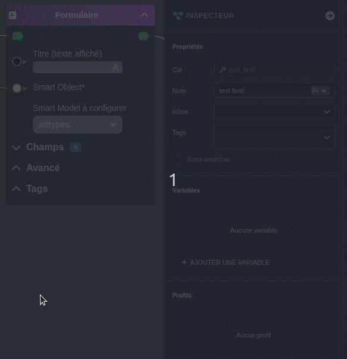
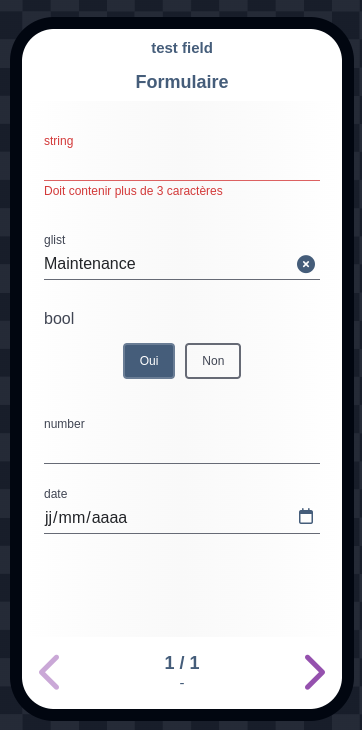
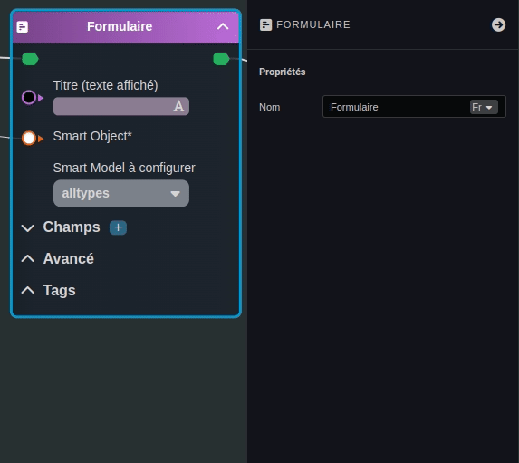
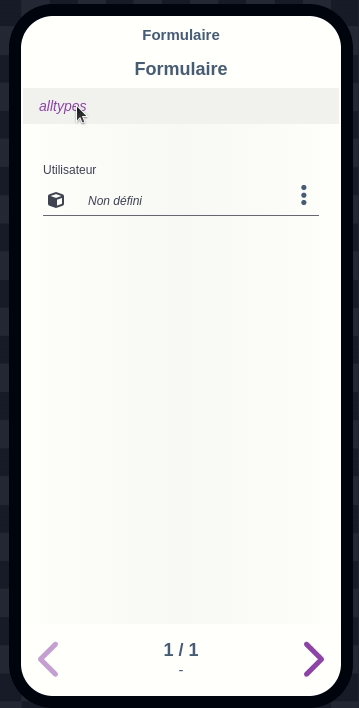
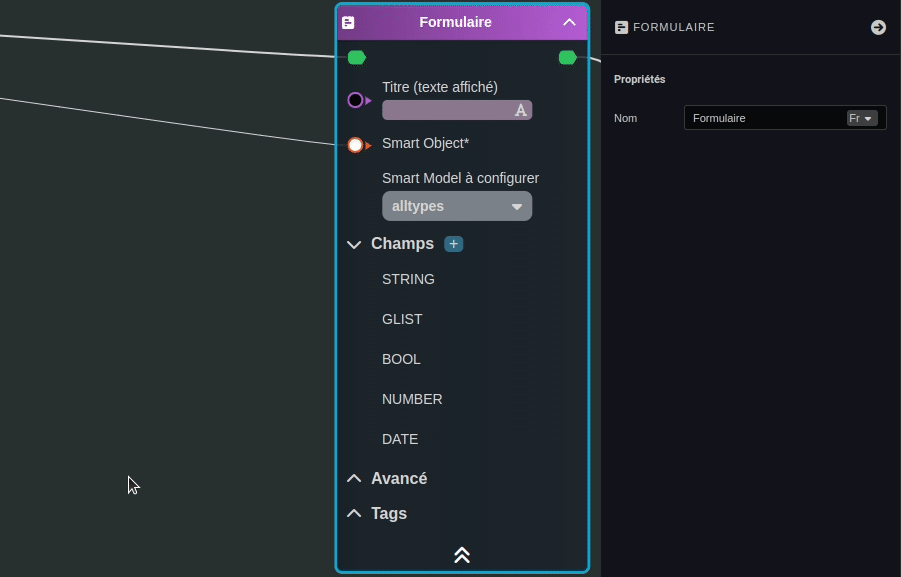
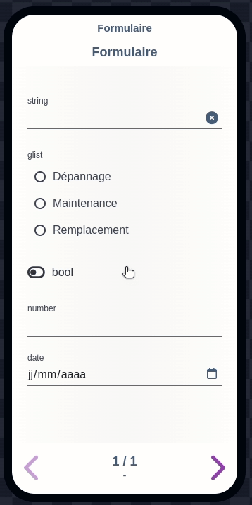
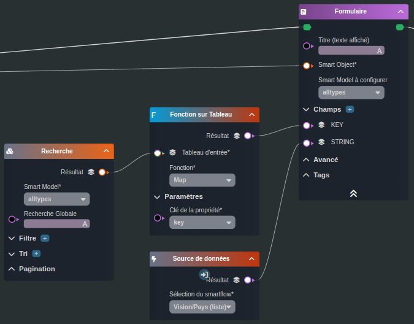
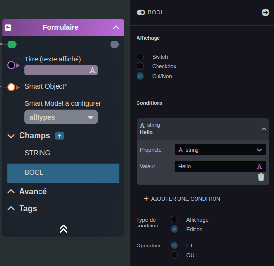
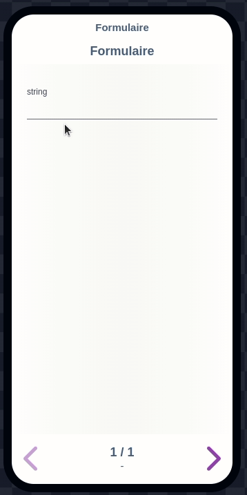

---
{}
---
   
# Créer un formulaire   
   
<iframe width="560" height="315" src="https://www.youtube.com/embed/MEQUSAopZdk" title="YouTube video player" frameborder="0" allow="accelerometer; autoplay; clipboard-write; encrypted-media; gyroscope; picture-in-picture; web-share" allowfullscreen></iframe>   
   
Il existe de nombreux cas de figure d'utilisation de la tâche [Formulaire](../../R%C3%A9f%C3%A9rences%20des%20noeuds/Formulaire.md), la fonction de cette  tâche étant le saisie des propriétés d'un [Smart Object](../../_glossaire/Glossaire.md) par l'utilisateur.    
   
Dans les différents cas de figure illustré ci-dessous, le [Smart Object](../../_glossaire/Glossaire.md) sera une variable d'entrée du [workflow](../../_glossaire/Glossaire.md).   
   
# Cas simple d'utilisation   
   
Le cas d'usage ci-dessous va permettre la saisie d'un objet avec les différents types (primitifs) de propriétés possible:   
   
 - string   
 - [glist](../../_glossaire/Glossaire.md#liste-générique)   
 - boolean   
 - number   
 - date   
   
## Workflow   
   
   
   
## Résultat   
   
   
   
# Sous Objets   
   
Le cas d'usage ci-dessous va permettre la saisie d'un objet et de son objet, en paramétrant les champs que l'on souhaite afficher pour ce sous objet.   
   
## Workflow   
   
   
   
## Résultat   
   
   
   
# Liste prédéfinie   
   
Le cas d'usage ci-dessous va permettre la saisie d'un texte via une liste prédéfinie.   
_Le comportement pour la liste prédictive est le même._   
   
## Workflow   
   
   
   
## Résultat   
   
   
   
>[!tip]   
>Il est possible d'utiliser une source de donnée en provenance d'une [recherche](../../R%C3%A9f%C3%A9rences%20des%20noeuds/Recherche.md) ou d'un [smartflow](../../R%C3%A9f%C3%A9rences%20des%20noeuds/Source%20de%20donn%C3%A9es.md). Le retour de cette source doit être multiple et de type string.   
>   
>   
   
# Condition   
   
Le cas d'usage ci-dessous va permettre de conditionner l'affichage d'un champ du formulaire.   
   
## Workflow   
   
   
   
## Résultat   
   
