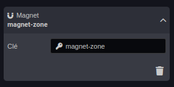
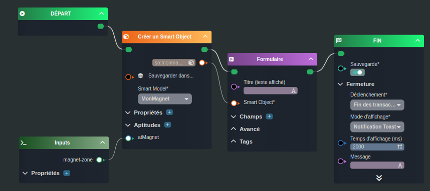
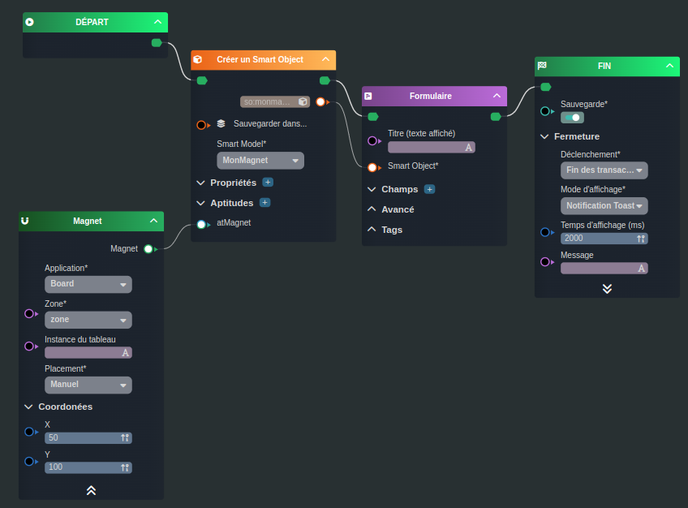

---
{}
---
   
# Créer un magnet   
   
>[!rappel]   
>Le magnet est un [Smart Object](../../_glossaire/Glossaire.md) avec l'aptitude magnet.   
   
Il existe deux cas de figure pour ajouter un magnet:   
   
- Le magnet est ajouté via l’événement du Board (_Actions à l'ajout d'un magnet_), l'application et la zone seront donc passés en variable (`zone-selected`) du [workflow](../../_glossaire/Glossaire.md)   
- Le magnet est ajouté indépendamment de tout événement du Board   
   
# Ajout par événement du Board   
   
## Ajout de la variable   
   
Ajouter une variable en choisissant la source _Zone_ présente dans la liste de choix proposée au clic.   
   
   
   
## Le workflow   
   
   
   
La première tâche [Créer un Smart Object](../../R%C3%A9f%C3%A9rences%20des%20noeuds/Cr%C3%A9er%20un%20Smart%20Object.md) nous permet de créer le [Smart Object](../../_glossaire/Glossaire.md) et de lui assigner les informations du magnet (via la variable créée en amont) dans son aptitude.   
   
La deuxième tâche [Formulaire](../../R%C3%A9f%C3%A9rences%20des%20noeuds/Formulaire.md) est optionnelle, elle permet à l'utilisateur de venir compléter les informations du magnet.   
   
Pour finir, le noeud Fin pour sauvegarder le [workflow](../../_glossaire/Glossaire.md).   
   
# Ajout indépendant   
   
## Le workflow   
   
   
   
Le mécanisme est le même que vu précédemment, la différence se situe au niveau du noeud [Magnet](../../R%C3%A9f%C3%A9rences%20des%20noeuds/Magnet.md).   
   
Dans cette exemple, il n'y a pas de variable injectée, les informations du board, de la zone et de la position du magnet doivent être renseignés directement dans le [workflow](../../_glossaire/Glossaire.md).