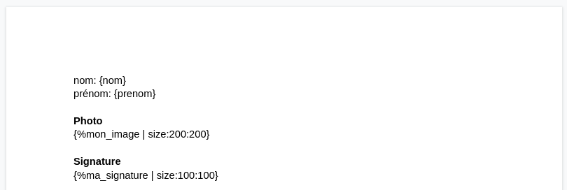
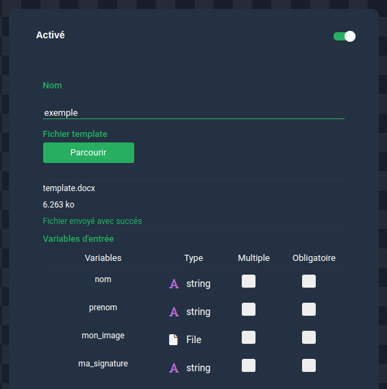
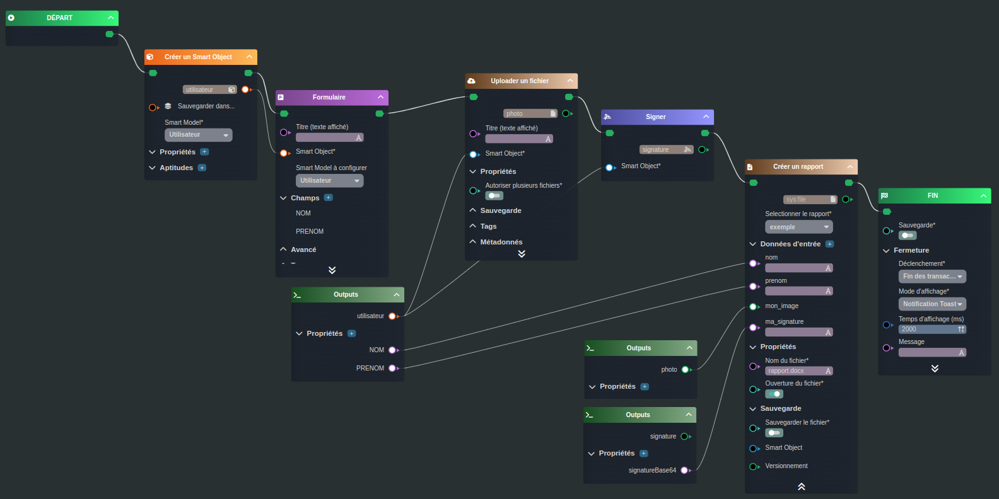
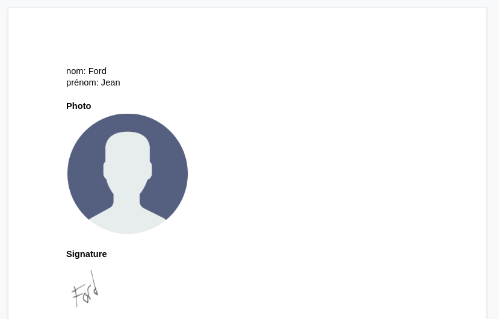

---
{}
---
   
# Générer un rapport   
   
Nous allons concevoir ensemble un [workflow](../../_glossaire/Glossaire.md) permettant de générer un rapport docx (très basique), avec le nom et le prénom d'un utilisateur, une photo associée et une signature.   
   
>[!rappel]   
>Cette exemple nécessite d'avoir des connaissances sur les [rapports](../../07%20-%20G%C3%A9n%C3%A9rer%20des%20rapports/0%20-%20Le%20syst%C3%A8me%20de%20template%20et%20markups.md).   
   
## Le template du rapport   
   
   
   
## La configuration du rapport   
   
   
   
## Le workflow   
   
   
   
La première tâche [Créer un Smart Object](../../R%C3%A9f%C3%A9rences%20des%20noeuds/Cr%C3%A9er%20un%20Smart%20Object.md) va créer un nouvel objet de type Utilisateur.   
Une fois l'objet créé, la tâche [Formulaire](../../R%C3%A9f%C3%A9rences%20des%20noeuds/Formulaire.md) va donner l'instruction de saisir le nom et le prénom de l'utilisateur.   
   
Les deux tâches qui suivent ([Uploader un fichier](../../R%C3%A9f%C3%A9rences%20des%20noeuds/Uploader%20un%20fichier.md) et [Signer](../../R%C3%A9f%C3%A9rences%20des%20noeuds/Signer.md)) vont permettre d'uploader la photo de l'utilisateur et sa signature, ces deux tâches associent le [Smart Object](../../_glossaire/Glossaire.md) créé en amont, ce qui va permettre de rattacher la photo et la signature à l'objet.   
   
Pour finir la tâche [Créer un rapport](../../R%C3%A9f%C3%A9rences%20des%20noeuds/Cr%C3%A9er%20un%20rapport.md) va venir brancher tout les paramètres nécessaires à la génération du rapport (nom, prénom, photo, signature), l'option Ouvrir le fichier est activé, ce qui permettra de tester la tâche facilement dans le débogueur.   
   
>[!rappel]   
>La signature doit être relié via sa base64 (avec une entrée de type string) contrairement à l'image qui est reliée directement via une entrée de type File.   
   
## Résultat   
   
