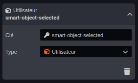
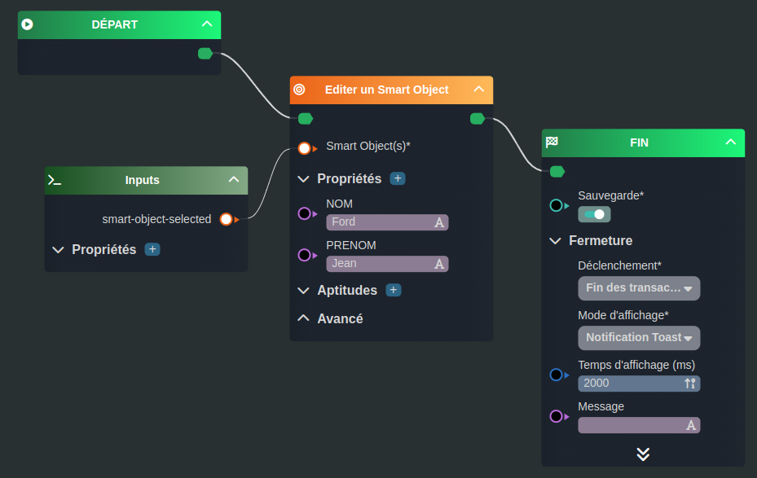
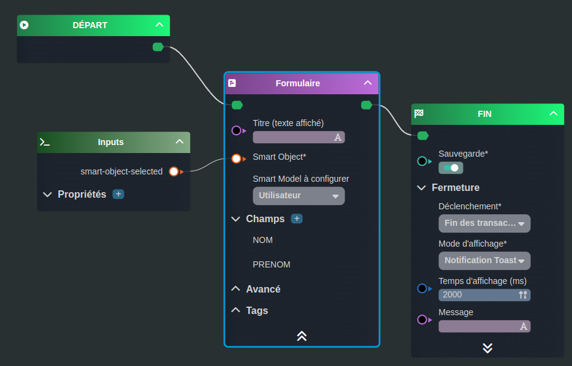

---
{}
---
   
# Modifier un Smart Object   
   
Il existe deux cas de figure pour modifier un [Smart Object](../../_glossaire/Glossaire.md):   
   
- La modification via une édition directe dans le [workflow](../../_glossaire/Glossaire.md)   
- La modification via un formulaire (action utilisateur)   
   
# Ajout de la variable   
   
La première étape est la déclaration de la variable, le but du [workflow](../../_glossaire/Glossaire.md) étant de supprimer un [Smart Object](../../_glossaire/Glossaire.md), celui-ci sera déclaré comme valeur entrante du worflow.   
   
Ajouter une variable en choisissant la source _Smart Object Sélectionné_ présente dans la liste de choix proposée au clic.   
   
Définir le type en tant que Utilisateur, vous devez au préalable avoir crée le [Smart Model](../../03%20-%20Mod%C3%A9liser%20vos%20donn%C3%A9es/1%20-%20Les%20Smart%20Models.md).    
   
   
   
# Ajout par édition directe   
   
## Le workflow   
   
   
   
La première tâche [Editer un document](../../R%C3%A9f%C3%A9rences%20des%20noeuds/Editer%20un%20document.md) nous permet d'éditer l'objet via assignation directe des propriétés.   
   
Dans ce [workflow](../../_glossaire/Glossaire.md), il n'y a aucune interaction avec l'utilisateur.   
   
# Ajout via Formulaire   
   
## Le workflow   
   
   
   
La première tâche [Formulaire](../../R%C3%A9f%C3%A9rences%20des%20noeuds/Formulaire.md) va permettre à l'utilisateur de remplir les informations des propriétés.   
   
[Créer un formulaire](../../05%20-%20Workflows%2C%20cr%C3%A9er%20votre%20logique%20m%C3%A9tier/Workflows%20typiques/Cr%C3%A9er%20un%20formulaire.md)