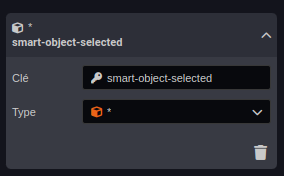
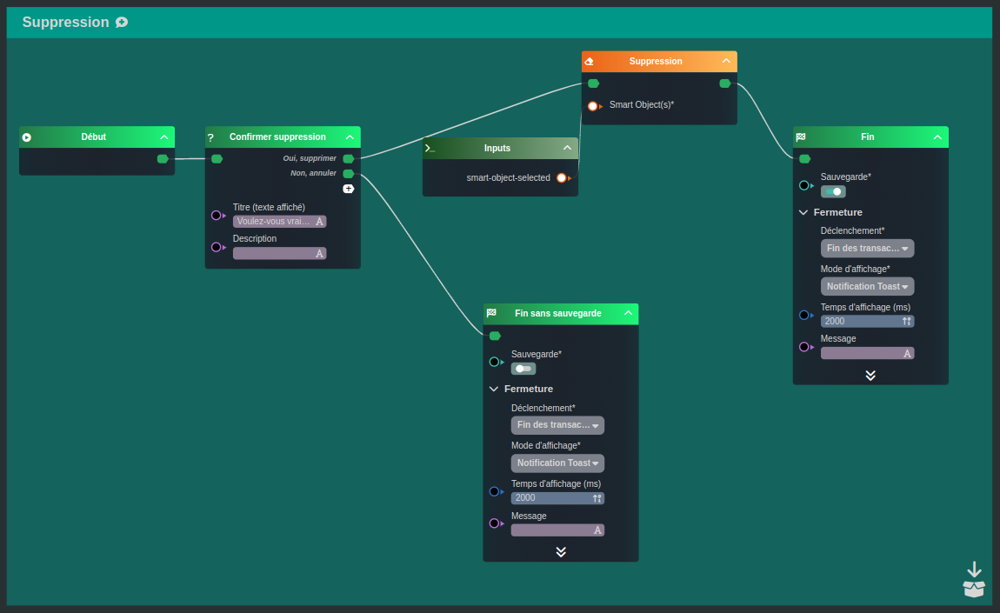

---
{}
---
   
# Supprimer un Smart Object   
   
Nous allons concevoir ensemble un [workflow](../../_glossaire/Glossaire.md) permettant de supprimer un [Smart Object](../../_glossaire/Glossaire.md).   
Dans l'exemple présenté, l'utilisateur devra confirmer la suppression.   
   
# Ajout de la variable   
   
La première étape est la déclaration de la variable, le but du [workflow](../../_glossaire/Glossaire.md) étant de supprimer un [Smart Object](../../_glossaire/Glossaire.md), celui-ci sera déclaré comme valeur entrante du worflow.   
   
Ajouter une variable en choisissant la source _Smart Object Sélectionné_ présente dans la liste de choix proposée au clic.   
   
Définir le type en tant que \*, cela permettra de prendre en compte tout type de [Smart Object](../../_glossaire/Glossaire.md).    
   
   
   
# Le workflow   
   
   
   
La première tâche [Choix multiple](../../R%C3%A9f%C3%A9rences%20des%20noeuds/Choix%20multiple.md) nous permet de donner le choix à l'utilisateur de la confirmation de la suppression.   
   
Dans le cas où l'utilisateur accepte, le flow se dirigera vers tâche [Studio/05 - Workflows, créer votre logique métier/Workflows typiques/Supprimer un Smart Object](/not_created.md) avec un lien vers le [Smart Object](../../_glossaire/Glossaire.md) (variable créée en amont)   
   
Dans le cas contraire, le [workflow](../../_glossaire/Glossaire.md) se terminera sans sauvegarde.