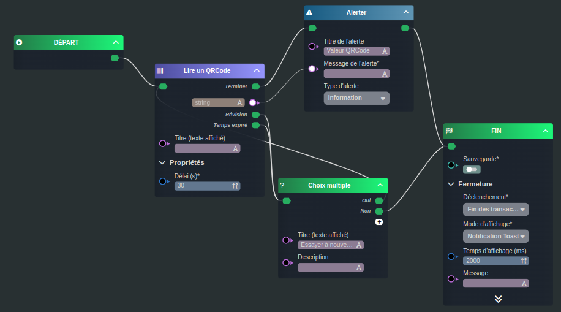

---
{}
---
   
# Utiliser un Qrcode   
   
Nous allons concevoir ensemble un [workflow](../../_glossaire/Glossaire.md) permettant de scanner un QRCode et d'afficher le résultat scanné dans une alerte.   
   
## Le workflow   
   
   
   
La première tâche [Lire un QRCode](../../R%C3%A9f%C3%A9rences%20des%20noeuds/Lire%20un%20QRCode.md) nous permet de lancer la caméra et d'attendre que le résultat du QRCode soit scanné.   
Le paramètre _Délai_ précisé à 30s, permettra à la tâche, si aucun QRCode n'a été scanné dans cet intervalle, de sortir par la transition _Temps expiré_.   
   
Une fois le QRCode scanné, une tâche [Alerter](../../R%C3%A9f%C3%A9rences%20des%20noeuds/Alerter.md) est déclenché permettant d'afficher la valeur scannée.   
   
Dans tout cas d'erreur (_Révision_, _Temps expiré_), le worklow proposera à l'utilisateur de réessayer via un [Choix multiple](../../R%C3%A9f%C3%A9rences%20des%20noeuds/Choix%20multiple.md).