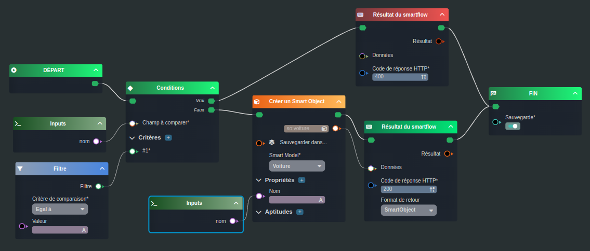
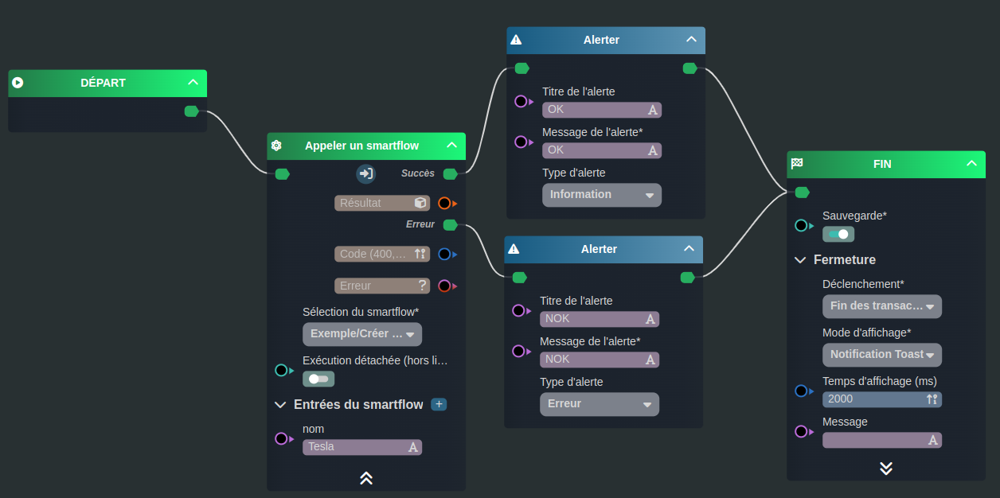
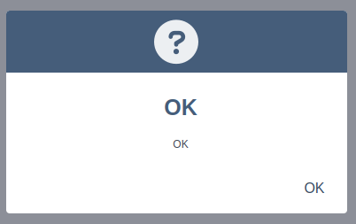
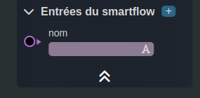
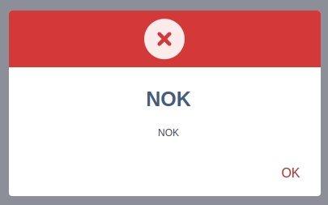

---
{}
---
   
# Utiliser un smartflow   
   
Nous allons concevoir ensemble un [workflow](../../_glossaire/Glossaire.md) permettant [d'appeler un smartflow](../../R%C3%A9f%C3%A9rences%20des%20noeuds/Appeler%20un%20smartflow.md).   
   
>[!rappel]   
>Cette exemple nécessite d'avoir des connaissances sur les [smartflows](../../06%20-%20Smartflows%2C%20connecter%20vos%20apps/0%20-%20Le%20concept%20de%20smartflow.md).   
   
## Le smartflow   
   
   
   
Le [smartflow](../../_glossaire/Glossaire.md) aura pour but de créer une Voiture, de lui assigner le nom passé en variable et de renvoyer cette voiture.   
Le [smartflow](../../_glossaire/Glossaire.md) prendra donc en variable le nom de voiture.   
   
Si le nom n'a pas été précisé, le [smartflow](../../_glossaire/Glossaire.md) renverra une erreur 400.   
   
## Le workflow   
   
   
   
Le [workflow](../../_glossaire/Glossaire.md) aura pour but d'appeler le [smartflow](../../_glossaire/Glossaire.md) et d'afficher une alerte "OK" si tout c'est bien passé ou "NOK" si une erreur est survenue.   
   
La première tâche [Appeler un smartflow](../../R%C3%A9f%C3%A9rences%20des%20noeuds/Appeler%20un%20smartflow.md) nous permet de lancer le [smartflow](../../_glossaire/Glossaire.md) décrit plus haut dans la page.   
Le nom de la voiture est renseigné.   
   
Le flow Succés sera dirigé vers une alerte qui affichera Ok.   
Le flow Erreur sera dirigé vers une alerte qui affichera Nok.   
   
Dans cette exemple là, le nom étant précisé, le flow Succés sera logiquement emprunté.   
   
   
   
En revanche, en supprimant le nom de la voiture dans les entrées du [smartflow](../../_glossaire/Glossaire.md), c'est le flow Erreur qui sera emprunté.   
   
   
   
