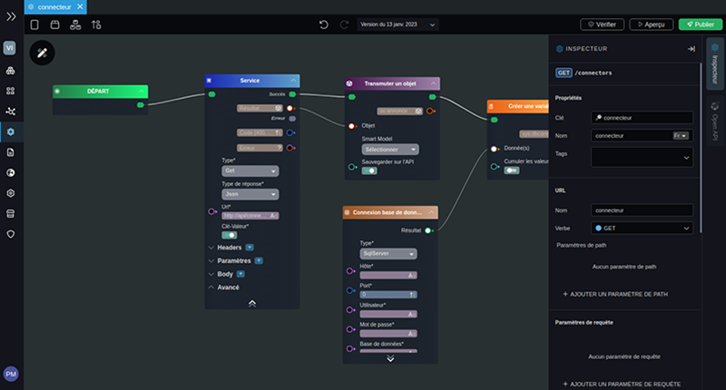

---
{}
---
   
# Le concept de smartflow   
   
Un [smartflow](../_glossaire/Glossaire.md) est un outil de gestion de flux de données. Ces données peuvent être issues d'une ou plusieurs sources externes (api, base de données...), ou directement créées dans vision en se basant sur les [Smart Models](../03%20-%20Mod%C3%A9liser%20vos%20donn%C3%A9es/1%20-%20Les%20Smart%20Models.md) modélisés dans le studio.   
   
   
   
Un [smartflow](../_glossaire/Glossaire.md) peut vous permettre aussi de construire une api de manière assez simple et d'exposer les routes de cette api pour pouvoir l'intégrer dans un outils tiers que vous utiliser dans votre processus de travail ([1 - Créer une API](../06%20-%20Smartflows%2C%20connecter%20vos%20apps/1%20-%20Cr%C3%A9er%20une%20API.md)).   
   
Les [smartflows](../_glossaire/Glossaire.md) sont des processus exécutés côté serveur, on parle ici bien sûr du serveur de la plateforme **Vision**. Dans le cas où on importe des données en utilisant un [smartflow](../_glossaire/Glossaire.md) il faut s'assurer que la source soit accessible depuis le serveur de la plateforme.    
   
Les [smartflows](../_glossaire/Glossaire.md) sont donc utilisés pour:   
   
- La création d'API   
- L'usage interne, utilisation dans les applications, les [workflows](../_glossaire/Glossaire.md) ou les [smartflows](../_glossaire/Glossaire.md) (appel récursif)   
   
# Différences et similitudes avec les workflows   
   
De la même manière que les [workflow](../_glossaire/Glossaire.md), l'outil se base sur le concept du [visual programming](../05%20-%20Workflows%2C%20cr%C3%A9er%20votre%20logique%20m%C3%A9tier/0%20-%20Le%20concept%20de%20visual%20programming.md).   
Les [smartflows](../_glossaire/Glossaire.md) se base sur un certain nombres de noeuds non graphique (cf. [3 - La signification des couleurs](../05%20-%20Workflows%2C%20cr%C3%A9er%20votre%20logique%20m%C3%A9tier/3%20-%20La%20signification%20des%20couleurs.md)), certains sont communs avec les [workflows](../_glossaire/Glossaire.md).   
   
La différence la plus notable entre un [workflow](../_glossaire/Glossaire.md) et un [smartflow](../_glossaire/Glossaire.md) est l’absence d'interface graphique. Tous les noeuds graphique comme par exemple le [formulaire](../05%20-%20Workflows%2C%20cr%C3%A9er%20votre%20logique%20m%C3%A9tier/Workflows%20typiques/Cr%C3%A9er%20un%20formulaire.md) ne sont pas accessibles dans les [smartflows](../_glossaire/Glossaire.md).