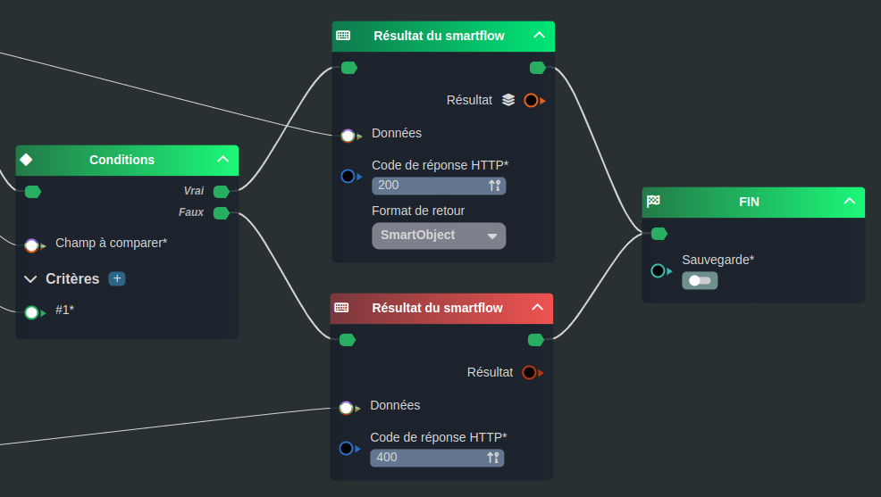
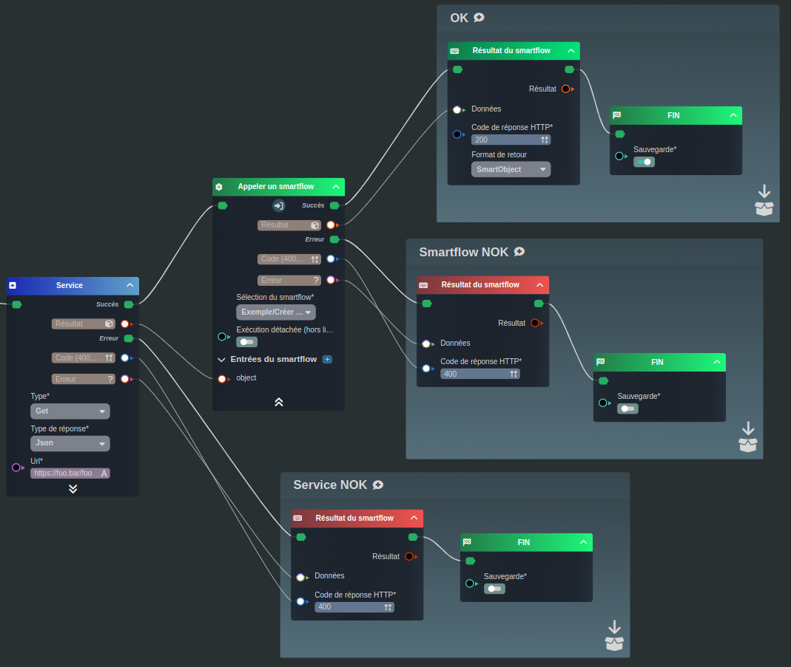

---
{}
---
   
# Gérer les retours et les erreurs   
   
Les [smartflows](../_glossaire/Glossaire.md) à la différence des [workflows](../_glossaire/Glossaire.md) constituent des endpoint d'API et renvoient donc un résultat.   
   
>[!rappel]   
>Les [smartflows](../_glossaire/Glossaire.md) sont utilisés pour:   
>- La création d'[API](../06%20-%20Smartflows%2C%20connecter%20vos%20apps/1%20-%20Cr%C3%A9er%20une%20API.md)   
>- L'usage interne, utilisation dans les applications, les [workflows](../_glossaire/Glossaire.md) ou les [smartflows](../_glossaire/Glossaire.md) (lors d'appel de sous [smartflows](../_glossaire/Glossaire.md))   
   
Le résultat du [smartflow](../_glossaire/Glossaire.md), peut être de type objet (JSON), primitif (texte, nombre, ...) ou de type [Smart Object](../_glossaire/Glossaire.md) (pour l'usage interne).   
   
Il est également possible de décrire le code de retour du [smartflow](../_glossaire/Glossaire.md) (notamment pour gérer les erreurs).   
   
# Décrire la réponse   
   
Pour décrire la réponse (résultat et code de retour), il faut utiliser le noeud [Résultat du smartflow](../R%C3%A9f%C3%A9rences%20des%20noeuds/R%C3%A9sultat%20du%20smartflow.md).   
   
Le paramètre "Données" permet d'attacher le résultat.   
Le paramètre "Code de réponse HTTP" permet de préciser le code [https://developer.mozilla.org/fr/docs/Web/HTTP/Status](https://developer.mozilla.org/fr/docs/Web/HTTP/Status)   
   
   
   
# Exploiter la réponse   
   
Lorsque l'on appelle un sous [smartflow](../_glossaire/Glossaire.md) (API interne) ou un service (API externe), deux flows sont représentés:   
   
   
- Le flow Succès qui sera emprunté si le code de réponse du endpoint ([smartflow](../_glossaire/Glossaire.md) ou service externe) est inférieur à 400 (avec comme sortie son résultat).   
- Le flow Erreur qui sera emprunté si le code est supérieur à 400 (avec comme sortie son code et son erreur).   
   
>[!example]   
>Dans l'exemple illustré ci-dessous, un service externe est appelé, le résultat de ce service est envoyé à un sous [smartflow](../_glossaire/Glossaire.md) qui va permettre de créer un [Smart Object](../_glossaire/Glossaire.md).   
>   
>Si le service échoue, le résultat renverra le code et l'erreur renvoyée par le service (__Service NOK__).   
>Si le sous [smartflow](../_glossaire/Glossaire.md) échoue, le résultat renverra le code et l'erreur renvoyée par le sous [smartflow](../_glossaire/Glossaire.md) (__Smartflow NOK__).   
>Si le service et le sous [smartflow](../_glossaire/Glossaire.md) se termine bien, le résultat renverra le [Smart Object](../_glossaire/Glossaire.md) créé avec un code 201 (__OK__).   
>   
>