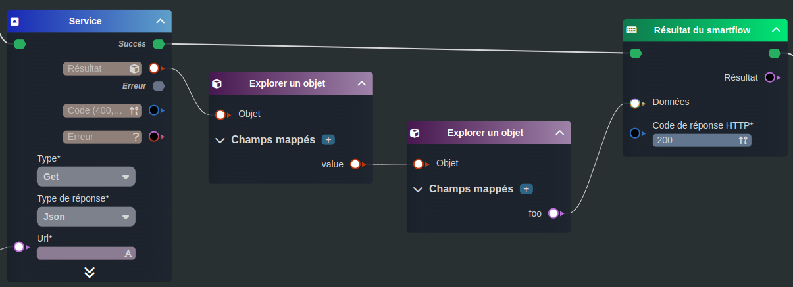
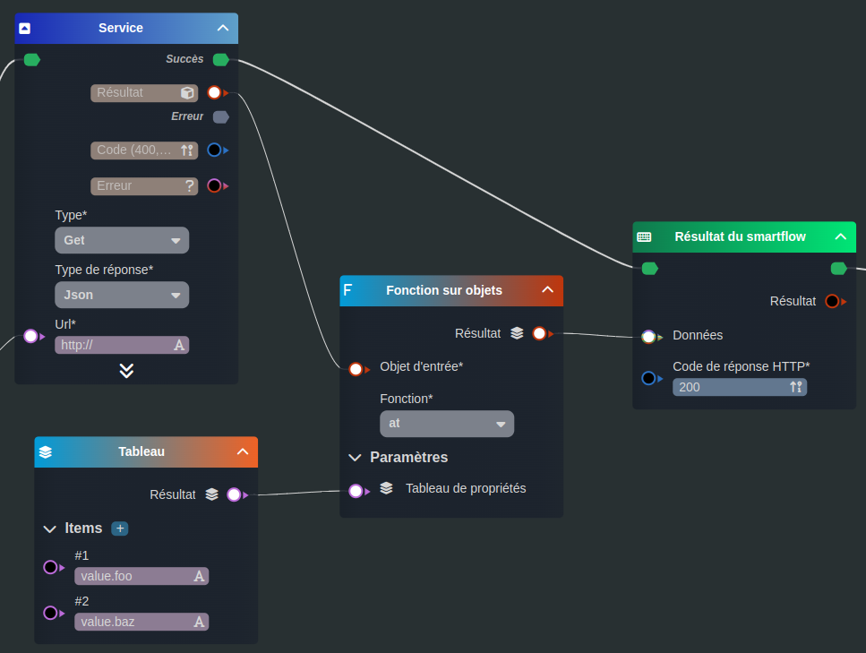
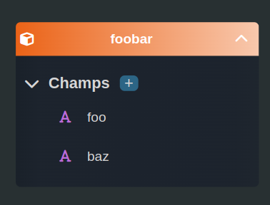
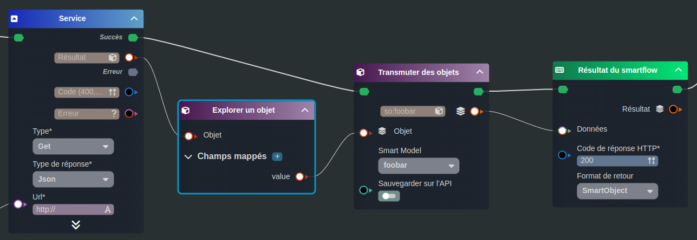
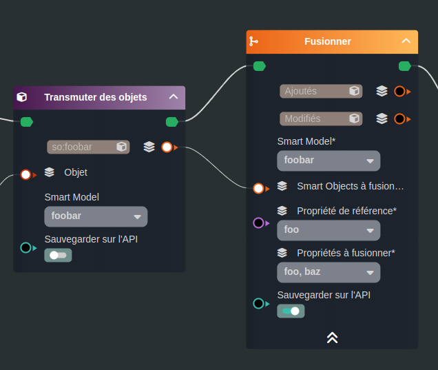

---
{}
---
   
# Explorer les résultats   
   
Lorsque l'on appelle un système externe, le résultat est renvoyé sous forme d'objet JSON, il existe plusieurs façons d'explorer le résultat de ces objets.   
   
Par exploration, cela va permettre d'y intercepter les informations essentielles pour :   
   
 - les exploiter à l'intérieur du [smartflow](../_glossaire/Glossaire.md)   
 - les attacher manuellement à des [Smart Objects](../_glossaire/Glossaire.md)   
    
Par mapping du résultat dans des [Smart Objects](../_glossaire/Glossaire.md).   
Seules les propriétés trouvées seront mappées.   
   
Si le but est de collecter les données dans des [Smart Objects](../_glossaire/Glossaire.md), il existe un noeud permettant de fusionner ces données avec la base Vision.   
   
Nous imaginerons un [Service](../R%C3%A9f%C3%A9rences%20des%20noeuds/Service.md) renvoyant l'objet suivant pour illustrer les différents exemples.   
```json
{
   "value": {
      "foo": "bar",
      "baz": "qux",
      "quux": "corge"
   }
}
```
   
   
   
# Explorer   
   
Il existe deux méthodes pour explorer et parcourir les objets dans les [smartflows](../_glossaire/Glossaire.md).   
   
Le noeud [Explorer un objet](../R%C3%A9f%C3%A9rences%20des%20noeuds/Explorer%20un%20objet.md) qui comme son nom l'indique va permettre de rentrer en profondeur dans l'objet et d'y extraire des propriétés.   
   
Dans l'exemple ci-dessous, le [smartflow](../_glossaire/Glossaire.md) renverra la valeur `"bar"`   
   
   
   
Le noeud [Fonction sur objets](../R%C3%A9f%C3%A9rences%20des%20noeuds/Fonction%20sur%20objets.md) qui possède plusieurs fonctions de manipulation d'un objet dont une qui permet de ressortir les valeurs de propriétés via un tableau de chemin.   
   
Dans l'exemple ci-dessous, le [smartflow](../_glossaire/Glossaire.md) renverra la valeur `["bar", "qux"]`   
   
   
   
# Mapper   
   
Il est possible d'effectuer un mapping automatique dans un ou plusieurs [Smart Object(s)](../_glossaire/Glossaire.md) via la tâche [Transmuter des objets](../R%C3%A9f%C3%A9rences%20des%20noeuds/Transmuter%20des%20objets.md).   
   
Avec cette méthode, le [Smart Model](../_glossaire/Glossaire.md) doit être créé en amont en symétrie avec le résultat attendu.   
   
   
   
Dans l'exemple ci-dessous, le [smartflow](../_glossaire/Glossaire.md) renverra un [Smart Object](../_glossaire/Glossaire.md) de type foobar avec les valeurs `foo` et `baz` renseignées (valeurs présentes dans le [Smart Model](../_glossaire/Glossaire.md)).   
   
   
   
>[!rappel]   
>Si le service renvoie un tableau, le résultat du noeud [Transmuter des objets](../R%C3%A9f%C3%A9rences%20des%20noeuds/Transmuter%20des%20objets.md) sera alors un tableau de [Smart Objects](../_glossaire/Glossaire.md).   
   
# Fusionner   
   
Pour mettre à jour les objets venant d'un système externe dans la base de données de Vision, le noeud [Fusionner](../R%C3%A9f%C3%A9rences%20des%20noeuds/Fusionner.md) permettra d'ajouter ou de modifier (existant) les [Smart Objects](../_glossaire/Glossaire.md) dans la base.   
   
Dans l'exemple ci-dessous, les objets seront mis à jour par rapport à la collection `foobar`.   
Les objets trouvés (la clé de référence pour rechercher l'existant sera `foo`) seront mis à jour.   
Les objets non trouvés seront ajoutés.   
Les propriétés `foo` et `baz` seront mis à jour dans les objets.   
   
Le noeud [Transmuter des objets](../R%C3%A9f%C3%A9rences%20des%20noeuds/Transmuter%20des%20objets.md) ne coche pas le sauvegarde dans l'API, ce qui permet de ne pas dupliquer les objets, c'est la tâche [Fusionner](../R%C3%A9f%C3%A9rences%20des%20noeuds/Fusionner.md) qui aura la responsabilité de la sauvegarde.   
   
