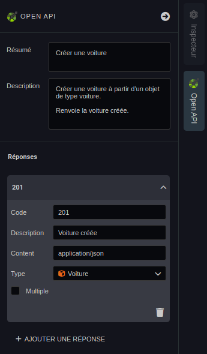
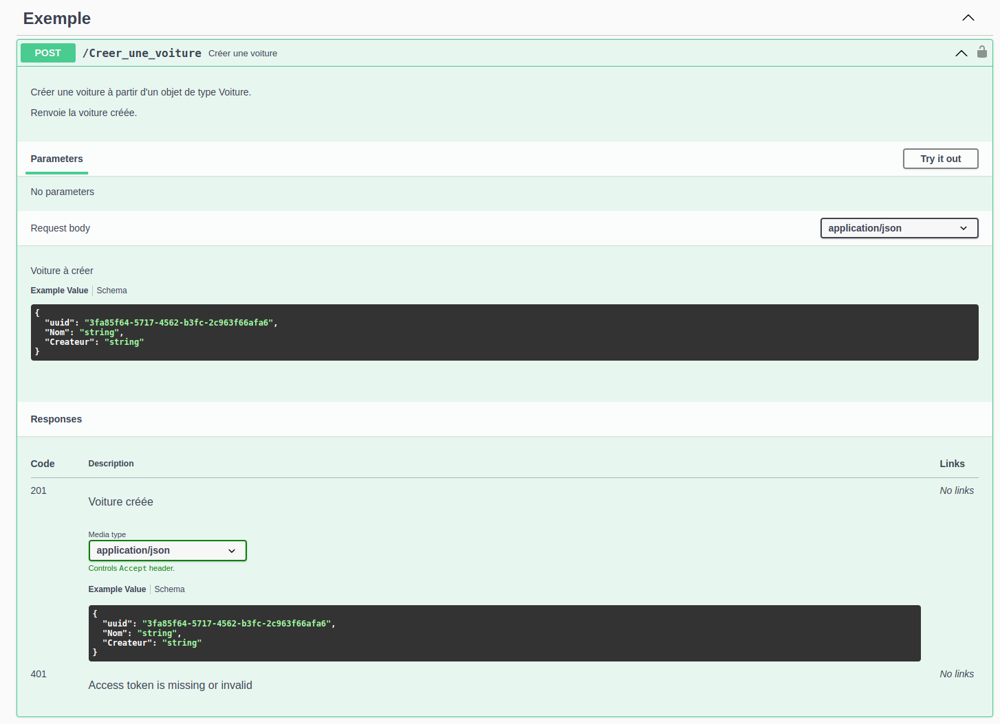

---
{}
---
   
# Générer et compléter la DOC OpenAPI   
   
Une fois votre [API créée](../06%20-%20Smartflows%2C%20connecter%20vos%20apps/1%20-%20Cr%C3%A9er%20une%20API.md), la documentation [OpenAPI](../_glossaire/Glossaire.md#openapi) sera générée de façon automatique.   
La génération utilise les entrées / sorties des [smartflows](../_glossaire/Glossaire.md), cependant, il restera quelques sections à remplir pour une documentation complète.   
   
# Compléter la documentation   
   
On retrouve dans l'[inspecteur](../_glossaire/Glossaire.md#inspecteur) de [smartflow](../_glossaire/Glossaire.md) le bouton *Open API* qui permet de compléter la documentation [OpenAPI](../_glossaire/Glossaire.md#openapi) concernant la description et les réponses pour le [smartflow](../_glossaire/Glossaire.md) concerné.    
   
>[!example]   
>   
>Voici un exemple d'une documentation **complétée** pour un [smartflow](../_glossaire/Glossaire.md) de création de Voiture.   
>   
>   
   
# Générer la documentation   
   
Pour générer la documentation, il suffit d'aller à l'adresse   
[https://nom-de-domaine/studio/doc](https://nom-de-domaine/studio/doc)   
   
>[!example]   
>   
>Voici un exemple d'une documentation **générée** pour un [smartflow](../_glossaire/Glossaire.md) de création de Voiture.   
>   
>