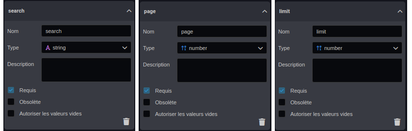

---
{}
---
   
# Paramètres de recherche et de pagination   
   
les [smartflows](../../06%20-%20Smartflows%2C%20connecter%20vos%20apps/0%20-%20Le%20concept%20de%20smartflow.md) permettent de traiter la data, la transformer et la récupérer pour pouvoir l'utiliser:   
   
- Dans les [workflows](../../_assets/images/workflows/workflow-appeler-smartflow.png) ou [smartflows](../../06%20-%20Smartflows%2C%20connecter%20vos%20apps/0%20-%20Le%20concept%20de%20smartflow.md)   
- Dans les [ widgets](../../04%20-%20Cr%C3%A9er%20votre%20UI/3%20-%20Les%20widgets.md) de l’application créé avec le [Designer](../../02%20-%20Cr%C3%A9er%20sa%20premi%C3%A8re%20application/%C3%89tape%203%20-%20Cr%C3%A9er%20ses%20interfaces.md).   
- Directement en tant que [API](../../06%20-%20Smartflows%2C%20connecter%20vos%20apps/1%20-%20Cr%C3%A9er%20une%20API.md)   
   
Sauf en cas d'export de données, quand on créé un flux de données à partir d'un base de donnée ou à travers un API, il ne faut absolument pas permettre de récupérer toute la données dans une seul requête mais plutôt de segmenter la données en petit paquets. Cela permet de limiter la taille de données transféré par requête et améliore nettement les performance de l'application ou l'API qu'on est entrain de modéliser.   
Il faut malgré tout laisser la possibilité de récupérer toutes les données à travers un système de pagination et recherche.   
Sur Vision, cette notion est importante quand on conçoit un [smartflow](../../06%20-%20Smartflows%2C%20connecter%20vos%20apps/0%20-%20Le%20concept%20de%20smartflow.md) qui récupère de la données soit directement dans la [base Vision](../../R%C3%A9f%C3%A9rences%20des%20noeuds/Recherche.md) ou en interrogeant une [API](../../06%20-%20Smartflows%2C%20connecter%20vos%20apps/2%20-%20Utilisation%20des%20noeuds%20API%2C%20BDD%2C%20FTP.md) externe ou en se connectant à une [ Base de données externe](../../06%20-%20Smartflows%2C%20connecter%20vos%20apps/2%20-%20Utilisation%20des%20noeuds%20API%2C%20BDD%2C%20FTP.md).   
   
Dans cette partie, nous allons voir ensemble comment utiliser la pagination dans un [smartflow](../../06%20-%20Smartflows%2C%20connecter%20vos%20apps/0%20-%20Le%20concept%20de%20smartflow.md) dans Vision.   
Dans les exemples présenté ici, nous allons de récupérer les données d'un modèle User:   
   
    
   
Il faut implémenter la database avec quelques User.   
   
   
   
   
## Créer une API avec recherche et pagination   
   
Dans cette exemple, nous allons créer une route Get Avec Vision qui va nous permettre de récupérer les données avec les querystring:   
   
- **search** : pour filtrer les données avec une recherche textuelle   
- **page**: paginer les données   
- **limit**: pour limiter le nombre de données récupéré   
### Etape 1    
Pour faire ça il faut tout d'abord [ créer une API](../../06%20-%20Smartflows%2C%20connecter%20vos%20apps/1%20-%20Cr%C3%A9er%20une%20API.md) en spécifiant les paramètres précédents dans l'inspecteur dans la section paramètre de requête :   
   
   
   
Quand on déclare des **paramètres de requêtes**, ces derniers deviennent accessible en tant que variable dans le [smartflow](../../06%20-%20Smartflows%2C%20connecter%20vos%20apps/0%20-%20Le%20concept%20de%20smartflow.md)   
   
   
   
On peut connecter ces paramètres sur le nœud recherche:   
   
   
   
une fois le [smartflow](../../06%20-%20Smartflows%2C%20connecter%20vos%20apps/0%20-%20Le%20concept%20de%20smartflow.md) est publié on peut appeler la route avec postman ou avec curl :   
```curl
curl https://votre-url-vision/api/connectors/dad_jokes?search=&page=&limit=
```
   
   
## Utiliser search-parameters