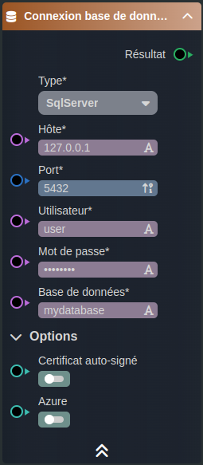

---
{}
---
   
# Connection SQL Server   
   
Pour pouvoir se connecter à une base de données de type SQL Server avec Vision, il faut suivre les étapes suivantes   
   
> [!tip]    
> Il faut impérativement que le serveur de base de données soit accessbile pour pouvoir s'y connecter avec Vision    
> le noeud connexion à une base de donnée est uniquement disponible dans les smartflow, c'est le serveur de vision qui lancer les requêtes Base de données   
## Etape 1    
   
Dans un [smartflow](app://obsidian.md/0%20-%20Le%20concept%20de%20smartflow) ajouter le noeud connexion à une base de donnée   
   
    
   
 Il faut renseigner les champs suits:   
   
 - Hôte: l'url ou l'adresse IP du serveur de base de données    
 - Port: le port ouvert pour accéder à la base de données   
 - Utilisateur: le nom d'utilisateur pour se connecter à la base de données   
 - Mot de passe: le mot de passe pour se connecter à la base de données   
 - Base de données: le nom de la base sur laquellese connecter   
   
le noeud connexion à une base de donnée à en output un objet de type db:connection   
## Etape 2    
   
Une fois la connexion établie, il faut créer le noeud Requête base de données qui va permmtre de lancer les requêtes base de données.   
   
