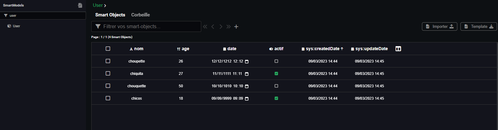

---
{}
---
   
# Générer un xlsx   
   
> [!info]    
> Cette fonctionnalité est uniquement disponbible sur la version payante de Vision, elle n'est implémentée ni sur la version Community  ni sur la version open source du code de vision   
   
> [!tip]    
> Pour reproduire la génération de rapport il faut créer un [Smart Model](../_glossaire/Glossaire.md) user   
> Savoir comment créer un [workflow](../_glossaire/Glossaire.md) ou un [smartflow](../_glossaire/Glossaire.md)   
> Avoir des [Smart Objects](../_glossaire/Glossaire.md) dans la base Vision.   
   
le modèle User utilisé dans ce document est le suivant:   
   
    
   
les données dans la database   
   
   
   
Pour générer un document au format xlsx dans Vision, il faut suivre les étapes suivantes:   
   
## Etape 1    
Créer un template au format .docx :    
[template.xlsx](https://doc.algotech.vision/_assets/docs/template.xlsx)   
   
## Etape 2   
Importer le template dans la section rapport et **l'activer** avec la coche en haut à gauche en face de activé   
   
    
    
> [!warning]    
> si le template n'est pas activé il sera pas accessible sur le nœud rapport.   
   
## Etape 3   
Créer un  [workflow](../_glossaire/Glossaire.md) ou un [smartflow](../_glossaire/Glossaire.md) et ajouter le nœud créer un rapport et lui attacher en input un tableau d'objet du [Smart Model](../_glossaire/Glossaire.md) User, en rattachant un nœud de recherche qui va injecter un tableau de [Smart Objects](../_glossaire/Glossaire.md) dans le nœud.    
   
    
   
## Etape 4   
Lancer le  [workflow](../_glossaire/Glossaire.md) ou [smartflow](../_glossaire/Glossaire.md) sur le **debugger** pour tester la génération:  [rapport.xlsx](https://doc.algotech.vision/_assets/docs/rapport.xlsx)   
   
> [!tip]    
> Dans le **debugger**, quand on coche Ouverture du fichier dans le nœud rapport, le document généré se télécharge dans votre dossier de téléchargement.   
> il ne faut pas oublier de remplir la section nom du fichier (sans l'extension) pour nommer le fichier qui sera téléchargé