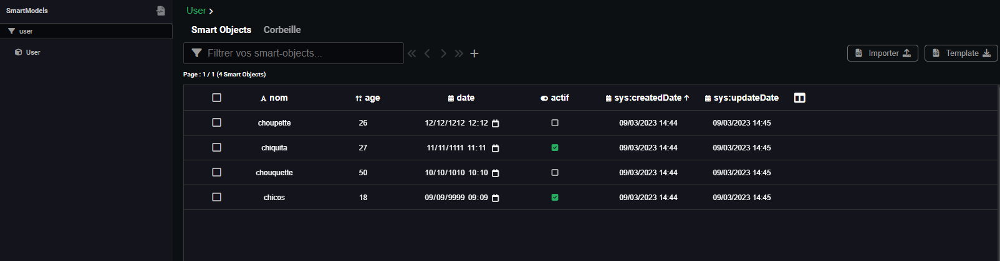

---
{}
---
   
# Convertir en pdf   
   
Pour convertir un rapport [docx](../07%20-%20G%C3%A9n%C3%A9rer%20des%20rapports/1%20-%20G%C3%A9n%C3%A9rer%20un%20docx.md) ou [xlsx](../07%20-%20G%C3%A9n%C3%A9rer%20des%20rapports/2%20-%20G%C3%A9n%C3%A9rer%20un%20xlsx.md) au format pdf il suffit de rajouter d'utiliser le nœud convertir un document en lui passant en input le document généré par le nœud rapport.   
   
   
   
En reprenant les même étapes décrites dans les [Générer un docx](../07%20-%20G%C3%A9n%C3%A9rer%20des%20rapports/1%20-%20G%C3%A9n%C3%A9rer%20un%20docx.md) et [Générer un xlsx](../07%20-%20G%C3%A9n%C3%A9rer%20des%20rapports/2%20-%20G%C3%A9n%C3%A9rer%20un%20xlsx.md), on peut générer un fichier pdf à la fin du [workflow](../_glossaire/Glossaire.md) ou [smartflow](../_glossaire/Glossaire.md) créé.   
   
le modèle User utilisé dans ce document est le suivant:   
   
    
   
les données dans la database   
   
   
   
Pour générer un document au format docx dans Vision, il faut suivre les étapes suivantes:   
   
## Etape 1    
Créer un template au format .docx :    
[template.docx](https://doc.algotech.vision/_assets/docs/template.docx)   
   
## Etape 2   
Importer le template dans la section rapport et **l'activer** avec la coche en haut à gauche en face de activé   
   
    
    
> [!warning]    
> si le template n'est pas activé il sera pas accessible sur le nœud rapport.   
   
## Etape 3   
Créer un [workflow](../_glossaire/Glossaire.md) ou un [smartflow](../_glossaire/Glossaire.md) et ajouter le neoud créer un rapport   
   
    
   
## Etape 4   
Lancer le [workflow](../_glossaire/Glossaire.md) ou [smartflow](../_glossaire/Glossaire.md) sur le **debugger** pour tester la génération:  [rapport.pdf](https://doc.algotech.vision/_assets/docs/rapport.pdf)   
   
> [!tip]    
> Dans le **debugger**, quand on coche Ouverture du fichier dans le nœud rapport, le document généré se télécharge dans votre dossier de téléchargement.   
> il ne faut pas oublier de remplir la section nom du fichier (.pdf en extension) pour nommer le fichier qui sera téléchargé