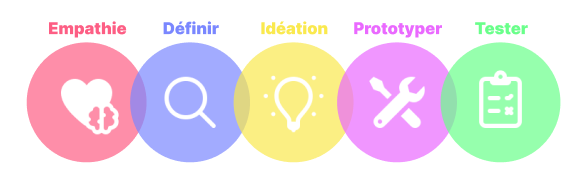

---
{}
---
   
# Le Design Thinking c'est quoi   
   
Le Design Thinking regroupe des méthodes et outils permettant de concevoir des solutions qui répondent à des problématiques utilisateurs. Cette méthode est applicable à de nombreux domaines dont la conception d'applications avec Vision 😉.   
   
La méthodologie est centrée sur l'humain, elle s'efforce à résoudre des besoins humains en observant, identifiant les problèmes et les résoudre en expérimentant différentes solutions de manière itérative.   
   
# Les étapes du Design Thinking   
   
Le Design Thinking peut être divisé en 5 étapes clés :   
   
   
   
Ces étapes s'effectuent dans un ordre précis mais pas forcément de manière linéaire : il est tout à fait possible de revenir en arrière et de procéder de manière itérative.    
   
## 1 - Empathie   
   
Cette première étape consiste à se mettre à la place de l'utilisateur avec empathie, c'est-à-dire sans jugement ni idées préconçues. Le but est de comprendre ses besoins, ses attentes en apprenant à le connaître.   
   
## 2 - Définir   
   
Une fois qu'on a découvert les besoins de l'utilisateur, on va définir la réelle problématique.   
   
## 3 - Idéation   
   
L'idéation a pour but de générer le plus d'idées possibles pour pouvoir résoudre la problématique définie. Le brainstorming est le meilleur moyen pour concevoir ces idées.   
   
## 4 - Prototyper   
   
Un prototype qui inclue les idées retenues. Il ne s’agit pas d'une application finale, le prototype doit être rapidement réalisé pour être rapidement testé.   
   
## 5 - Tester   
   
Le test du prototype avec les utilisateurs finaux.