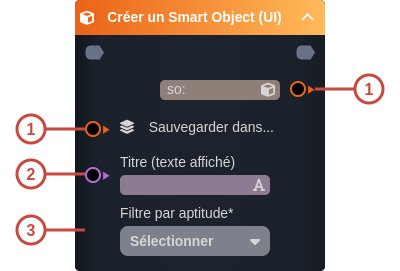
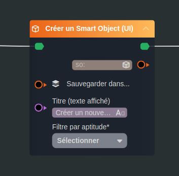

---
tags:
- workflow
---
   
# Créer un Smart Object (UI)   
   
`{_obsidian_pattern_tag_workflow}`   
   
## Description   
   
La tâche **Créer un Smart Object (UI)** permet de créer un nouveau [Smart Object](../_glossaire/Glossaire.md) avec choix de l'utilisateur sur le modèle de l'objet à créer filtré par aptitude.   
   
   
   
## Fonctionnement   
   
   
   
### Entrées   
   
| ID | Nom | Type | Description |   
|:-|:-|:-|:-|   
| 1 | Sauvegarder dans... | so: | Emplacecment où l'objet sera enregistré, permet d'associer le [Smart Object](../_glossaire/Glossaire.md) nouvellement crée à une propriété (association / composition) d'un [Smart Object](../_glossaire/Glossaire.md) éxistant.  Ce champ est facultatif, il n'empêche pas la sauvegarde du [Smart Object](../_glossaire/Glossaire.md). |   
| 2 | Titre (texte affiché) | string | Titre affiché dans la tâche |   
| 3 | Filtre par aptitude | string | Choix d'une Aptitude qui permettra de proposer la liste des modèles associés. |   
   
### Sorties   
   
| ID | Nom | Type | Description |   
|:-|:-|:-|:-|   
| 1 |  | so: | [Smart Object](../_glossaire/Glossaire.md) nouvellement créé |   
   
## Utilisation   
   
### Studio   
   
   
   
### Player   
   
