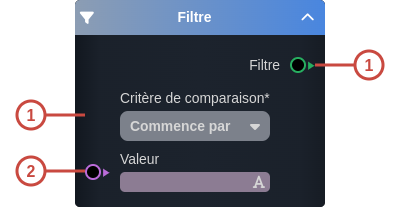
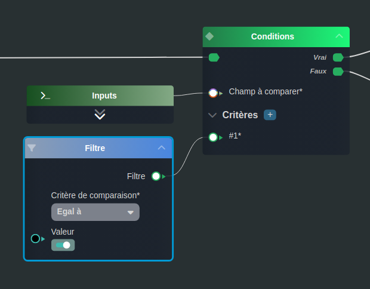

---
tags:
- smartflow
- workflow
---
   
# Filtre   
   
`{_obsidian_pattern_tag_smartflow}` `{_obsidian_pattern_tag_workflow}`   
   
## Description   
   
Le nœud **Filtre** permet de créer des filtres suivant des critères de comparaison.   
   
   
Il existe différents critères de comparaison, ceux-ci dépendent du type de la valeur à comparer sur lequel le résultat est branché :   
   
 - Pour tous les types : égal à, différent de, nulle, existe, contient au moins un élément   
	 - **égal à** : détermine si la valeur en entrée est égale à la valeur branchée au résultat   
	 - **différent de** : détermine si la valeur en entrée est différente de la valeur branchée au résultat   
	 - **nulle** : détermine si la valeur branchée au résultat est nulle   
	 - **existe** : détermine si la valeur branchée au résultat existe   
	 - **contient au moins un élément** : détermine si la valeur branchée au résultat contient au moins un élément de la valeur d'input    
   
   
 - Pour le type string : commence par, termine par, contient   
	 - **commence par** : détermine si la valeur branchée au résultat commence par la valeur en entrée   
	 - **termine par** : détermine si la valeur branchée au résultat termine par la valeur en entrée   
	 - **contient** : détermine si la valeur branchée au résultat contient la valeur en entrée    
   
   
 - Pour les types number, dates : supérieur à, inférieur à, supérieur ou égal à, inférieur ou égal à, compris entre   
	 - **supérieur à** : détermine si la valeur branchée au résultat est supérieure à la valeur en entrée   
	 - **inférieur à** : détermine si la valeur branchée au résultat est inférieure à la valeur en entrée   
	 - **supérieur ou égal à** : détermine si la valeur branchée au résultat est supérieure ou égale à la valeur en entrée   
	 - **inférieur ou égal à** : détermine si la valeur branchée au résultat est inférieure ou égale à la valeur en entrée   
	 - **compris entre** : détermine si la valeur branchée au résultat est comprise entre la première et la seconde valeur en entrée   
   
   
## Fonctionnement   
   
   
   
### Entrées   
   
| ID | Nom | Type | Description |   
|:-|:-|:-|:-|   
| 1 | Critère de comparaison | string | Choix du critère de comparaison |   
   
### Sorties   
   
| ID | Nom | Type | Description |   
|:-|:-|:-|:-|   
| 1 | Filtre | sys:filter | Le filtre créé à associer avec une valeur à comparer |   
   
## Utilisation   
   
### Studio   
   
