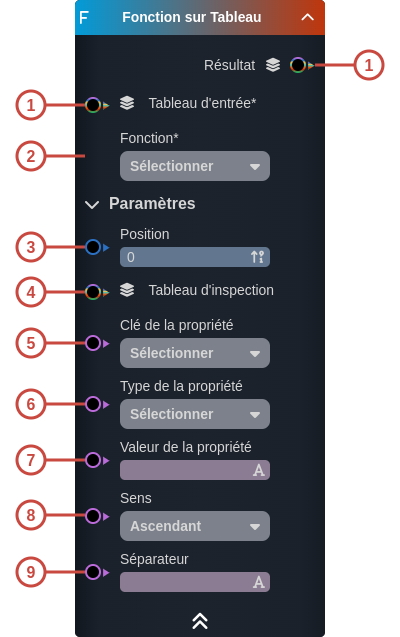
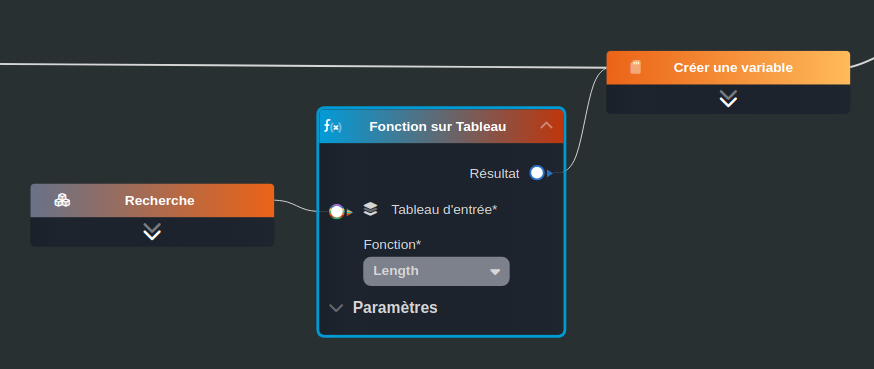

---
tags:
- smartflow
- workflow
---
   
# Fonction sur Tableau   
   
`{_obsidian_pattern_tag_smartflow}` `{_obsidian_pattern_tag_workflow}`   
   
## Description   
   
Le nœud **Fonction sur tableau** permet d'appliquer une fonction sur un tableau et générer un résultat.   
   
   
Il existe différentes fonctions disponibles suivant le type du tableau d'entrées :   
   
 - Pour tous les types : left, right, reverse, difference, concat, item, length   
	 - **left** : renvoie un tableau contenant le ou les premiers éléments du tableau d'entrée, en découpant le tableau à partir du nombre spécifié   
	 - **right** : renvoie un tableau contenant le ou les derniers éléments du tableau d'entrée, en découpant le tableau à partir du nombre spécifié   
	 - **reverse** : renvoie un tableau des éléments transposés du tableau d'entrée : le premier élément devient le dernier et le dernier devient le premier et ainsi de suite   
	 - **difference** : renvoie un tableau des éléments du tableau d'entrée non inclus dans le tableau d'inspection   
	 - **concat** : renvoie un tableau contenant la fusion des éléments du tableau d'entrée et du tableau d'inspection   
	 - **item** : renvoie l'élément du tableau d'entrée à l'index renseigné à l'input Position   
	 - **length** : renvoie la taille du tableau d'entrée   
    
   
   
 - Pour les les types [Smart Objects](../_glossaire/Glossaire.md), objets : uniqBy, orderBy, map, filter, every, some   
	 - **uniqBy** : renvoie un tableau des éléments du tableau d'entrée selon un critère d'unicité (une propriété du smart modèle) pour retirer les doublons   
	 - **orderBy** : renvoie un tableau des éléments du tableau d'entrée ordonné selon une propriété du [Smart Model](../_glossaire/Glossaire.md)   
	 - **map** : renvoie un tableau d'éléments pour une seule propriété du tableau d'entrée   
	 - **filter** : renvoie un tableau des éléments du tableau d'entrée filtré selon une propriété du [Smart Model](../_glossaire/Glossaire.md)   
	 - **every** : renvoie Vrai si la valeur de la propriété renseignée en input retourne vrai pour tous les éléments du tableau   
	 - **some** : renvoie Vrai si la valeur de la propriété renseignée en input retourne vrai pour au moins un élément du tableau   
    
   
   
 - Pour les types primitifs (string, number, date, boolean) : uniq, sort, join   
	 - **uniq** : renvoie un tableau des éléments du tableau d'entrée sans les doublons   
	 - **sort** : renvoie un tableau des éléments du tableau d'entrée triés part ordre ascendant   
	 - **join** : renvoie une chaîne de caractères qui correspond à tous les éléments du tableau d'entrée convertis en chaîne de caractères et séparés par un séparateur   
   
   
## Fonctionnement   
   
   
   
### Entrées   
   
| ID | Nom | Type | Description |   
|:-|:-|:-|:-|   
| 1 | Tableau d'entrée | string, number, date, time, datetime, boolean, so:, object, sys: | Le tableau d'entrée sur lequel appliquer la fonction |   
| 2 | Fonction | string | La fonction à appliquer sur le tableau d'entrée |   
| 3 | Position | number | - left : l'indice de fin  - right : l'indice de début  - item : l'index |   
| 4 | Tableau d'inspection | string, number, date, time, datetime, boolean, so:, object, sys: | - concat : le tableau avec lequel le tableau d'entrée sera concatené  - difference : le tableau à comparer pour récupérer la différence |   
| 5 | Clé de la propriété | string | - uniqBy : propriété utilisée pour calculer l'unicité  - orderBy : propriété utilisée pour trier  - map : propriété qui sera utilisée pour le nouveau tableau  - filter : propriété à filtrer  - every, some : propriété à comparer |   
| 6 | Type de la propriété | string | Le type de la propriété |   
| 7 | Valeur de la propriété | string | - every, some : valeur de la propriété à comparer  - filter : valeur de la propriété à filtrer |   
| 8 | Sens | string | - orderBy : sens du tri |   
| 9 | Séparateur | string | - join : le séparateur |   
   
### Sorties   
   
| ID | Nom | Type | Description |   
|:-|:-|:-|:-|   
| 1 | Résultat | string, number, date, time, datetime, boolean, so:, object, sys: | Le résultat de la fonction, le type dépendra de la fonction choisie |   
   
## Utilisation   
   
### Studio   
   
