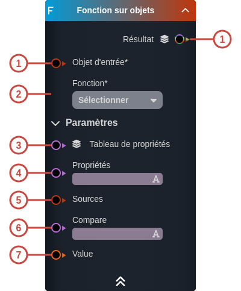
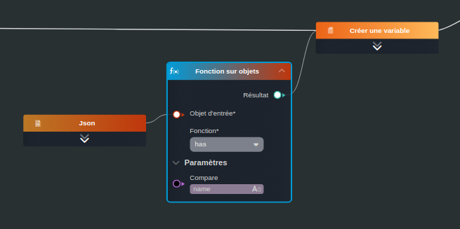

---
tags:
- smartflow
- workflow
---
   
# Fonction sur objets   
   
`{_obsidian_pattern_tag_smartflow}` `{_obsidian_pattern_tag_workflow}`   
   
## Description   
   
Le nœud **Fonction sur objets** permet d'appliquer une fonction de la [librairie Lodash](https://lodash.com/) sur un objet et générer un résultat.   
   
   
Il existe différentes fonctions disponibles :   
   
 - [at](https://lodash.com/docs/4.17.15#at) : renvoie un tableau d'objets correspondant aux propriétés renseignées   
 - [defaults](https://lodash.com/docs/4.17.15#defaults) : fusionne les propriétés de plusieurs objets dans un seul objet   
 - [defaultsDeep](https://lodash.com/docs/4.17.15#defaultsDeep) : fonctionne comme *defaults* mais en attribuant les propriétés en profondeur (premier niveau, second niveau, ...)   
 - [findKey](https://lodash.com/docs/4.17.15#findKey) : renvoie la clé de la première propriété d'un objet pour laquelle la valeur de la propriété correspond à la valeur donnée   
 - [findLastKey](https://lodash.com/docs/4.17.15#findLastKey) : fonctionne comme findKey mais renvoie la clé du dernier élément   
 - [get](https://lodash.com/docs/4.17.15#get) : renvoie l'objet par rapport à un chemin donnée (`utilisateur.groups[0]`), renvoie une valeur par défaut dans le cas où le chemin n'existe pas   
 - [has](https://lodash.com/docs/4.17.15#has) : renvoie Vrai si l'objet d'entrée possède la propriété ou le chemin demandé   
 - [hasIn](https://lodash.com/docs/4.17.15#hasIn) :   
 - [invert](https://lodash.com/docs/4.17.15#invert) : renvoie un objet composé des clés et des valeurs inversées de l'objet d'entrée   
 - [invertBy](https://lodash.com/docs/4.17.15#invertBy) :   
 - [keys](https://lodash.com/docs/4.17.15#keys) : renvoie un tableau des clés des propriétés de l'objet   
 - [merge](https://lodash.com/docs/4.17.15#merge) : fusionne deux objets   
 - [omit](https://lodash.com/docs/4.17.15#omit) : renvoie une copie de l'objet d'entrée composé des propriétés qui ne sont pas omises   
 - [pick](https://lodash.com/docs/4.17.15#pick) : renvoie une copie de l'objet d'entrée composé des propriétés sélectionnées   
 - [result](https://lodash.com/docs/4.17.15#result) :   
 - [set](https://lodash.com/docs/4.17.15#set) : renvoie l'objet d'entrée en assignant une nouvelle valeur pour une propriété donnée   
 - [unset](https://lodash.com/docs/4.17.15#unset) : retire une propriété de l'objet d'entrée et renvoie *Vrai* si la suppression s'est bien réalisée   
   
   
## Fonctionnement   
   
   
   
### Entrées   
   
| ID | Nom | Type | Description |   
|:-|:-|:-|:-|   
| 1 | Objet d'entrée | object | L'objet sur lequel on applique la fonction |   
| 2 | Fonction | string | La fonction à appliquer à l'objet d'entrée |   
| 3 | Tableau de propriétés | string | - at : les clés des propriétés que l'on souhaite obtenir  - get : le chemin de la propriété que l'on souhaite obtenir  - omit : les propriétés que l'on souhaite omettre  - pick : les propriétés que l'on souhaite sélectionnées  |   
| 4 | Propriétés | string | - has : la clé de la propriété |   
| 5 | Sources | object | - defaults, defaultsDeep : l'objet source  - merge : l'objet à fusionner |   
| 6 | Compare | string | - set, unset : la clé de la propriété |   
| 7 | Value | any | - set : la nouvelle valeur de la propriété |   
   
### Sorties   
   
| ID | Nom | Type | Description |   
|:-|:-|:-|:-|   
| 1 | Résultat | string, number, date, time, datetime, boolean, so:, object, sys: | Le résultat de la fonction, le type dépendra de la fonction choisie |   
   
## Utilisation   
   
### Studio   
   
