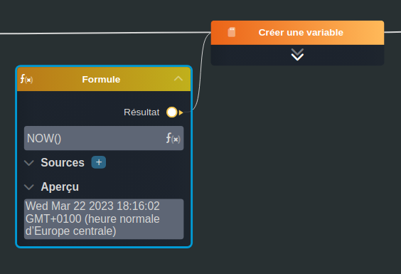

---
tags:
- smartflow
- workflow
---
   
# Formule   
   
`{_obsidian_pattern_tag_smartflow}` `{_obsidian_pattern_tag_workflow}`   
   
## Description   
   
Le nœud **Formule** permet d'utiliser les formules utilisés dans les spreadsheets (tableurs).   
   
   
Retrouvez la liste complète des formules : [https://formulajs.info/](https://formulajs.info/)   
   
Il est également possible de résoudre:   
   
 - des calculs (ex: `1+1`)   
 - des transformations (ex: `+"5"`)   
   
## Fonctionnement   
   
   
   
### Entrées   
   
| ID | Nom | Type | Description |   
|:-|:-|:-|:-|   
| 1 | Sources | section | La liste des sources qui seront utilisées dans la formule.    L'utilisation d'une source dans la formule doit être entourée par des moustaches: `SUM(1, {{source}})` |   
   
### Sorties   
   
| ID | Nom | Type | Description |   
|:-|:-|:-|:-|   
| 1 | Résultat | string, date, datetime, number, time, boolean | Le résultat de la formule, le type dépendra de la fonction choisie |   
   
## Utilisation   
   
### Studio   
   
