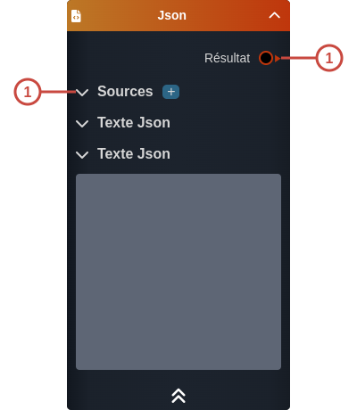
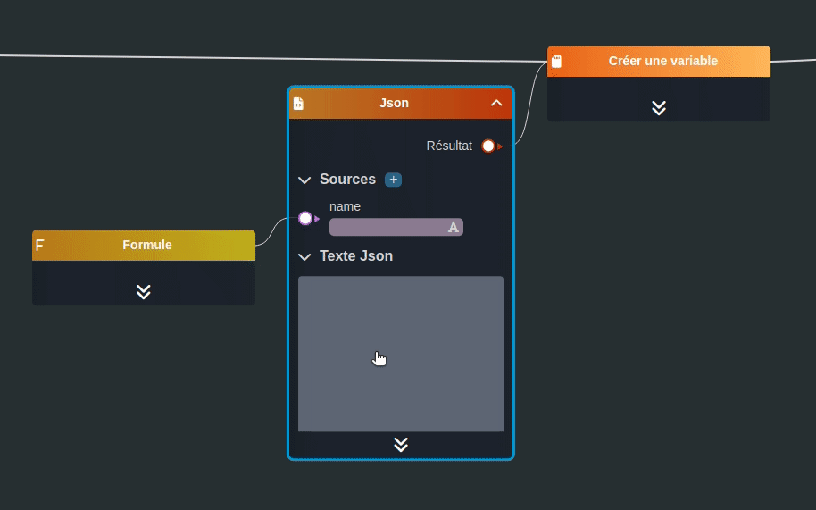

---
tags:
- smartflow
- workflow
---
   
# Json   
   
`{_obsidian_pattern_tag_smartflow}` `{_obsidian_pattern_tag_workflow}`   
   
## Description   
   
Le nœud **Json** permet de créer un objet JSON à partir d'un éditeur.   
   
   
   
## Fonctionnement   
   
   
   
### Entrées   
   
| ID | Nom | Type | Description |   
|:-|:-|:-|:-|   
| 1 | Sources | section | La liste des sources à utiliser dans le JSON   L'utilisation d'une source dans le JSON doit être entourée par des moustaches: `{ foo: "{{bar}}" }`.   Il est possible d'accéder aux sources dans l'éditeur via le raccourci clavier **ctrl + espace** |   
   
### Sorties   
   
| ID | Nom | Type | Description |   
|:-|:-|:-|:-|   
| 1 | Résultat | object | JSON créé |   
   
## Utilisation   
   
### Studio   
   
