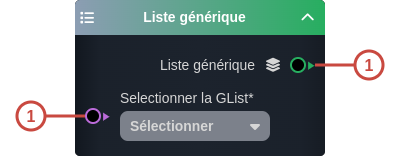
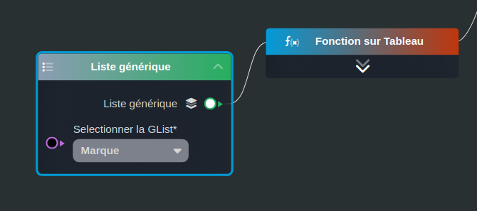

---
tags:
- smartflow
- workflow
---
   
# Liste générique   
   
`{_obsidian_pattern_tag_smartflow}` `{_obsidian_pattern_tag_workflow}`   
   
## Description   
   
Le nœud **Liste générique** permet de lister éléments d'une [liste générique](../_glossaire/Glossaire.md#liste-générique). Chaque élément de type sys:glistvalue est composé des propriétés key, value.   
   
   
Ce nœud peut être utilisé pour filtrer les éléments d'une liste sur une propriété de la [tâche Formulaire](../R%C3%A9f%C3%A9rences%20des%20noeuds/Formulaire.md).   
   
## Fonctionnement   
   
   
   
### Entrées   
   
| ID | Nom | Type | Description |   
|:-|:-|:-|:-|   
| 1 | Selectionner la GList | string | La [liste générique](../_glossaire/Glossaire.md) dont on veut lister les éléments |   
   
### Sorties   
   
| ID | Nom | Type | Description |   
|:-|:-|:-|:-|   
| 1 | Liste générique | sys:glistvalue | Liste des éléments de la [liste générique](../_glossaire/Glossaire.md) (index, key et value) |   
   
## Utilisation   
   
### Studio   
   
