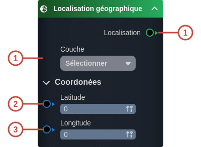
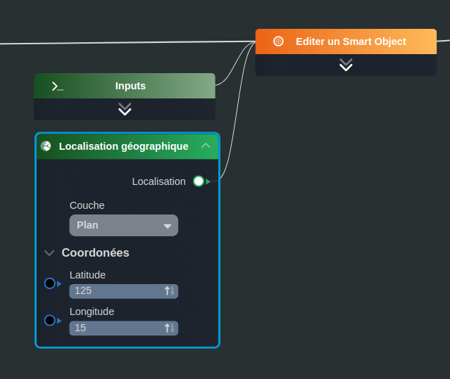

---
tags:
- smartflow
- workflow
---
   
# Localisation géographique   
   
`{_obsidian_pattern_tag_smartflow}` `{_obsidian_pattern_tag_workflow}`   
   
## Description   
   
Le nœud **Localisation géographique** permet de créer une aptitude [Localisation](../03%20-%20Mod%C3%A9liser%20vos%20donn%C3%A9es/1%20-%20Les%20Smart%20Models.md#les-aptitudes-du-modèle) à associer à un [Smart Object](../_glossaire/Glossaire.md).   
   
   
   
## Fonctionnement   
   
   
   
### Entrées   
   
| ID | Nom | Type | Description |   
|:-|:-|:-|:-|   
| 1 | Couche | string | Le layer associé à la localisation |   
| 2 | Latitude | number | La latitude de la localisation |   
| 3 | Longitude | number | La longitude de la localisation |   
   
### Sorties   
   
| ID | Nom | Type | Description |   
|:-|:-|:-|:-|   
| 1 | Localisation | sys:location | La localisation créée |   
   
## Utilisation   
   
### Studio   
   
