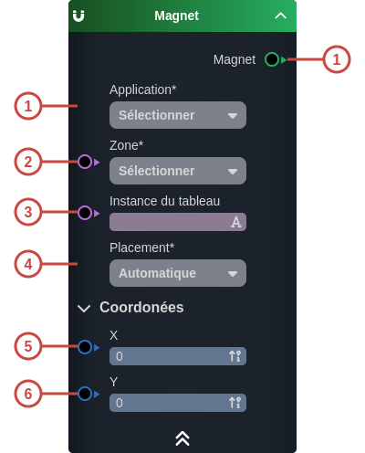

---
tags:
- smartflow
- workflow
---
   
# Magnet   
   
`{_obsidian_pattern_tag_smartflow}` `{_obsidian_pattern_tag_workflow}`   
   
## Description   
   
Le nœud **Magnet** permet de créer une aptitude [Magnet](../03%20-%20Mod%C3%A9liser%20vos%20donn%C3%A9es/1%20-%20Les%20Smart%20Models.md#les-aptitudes-du-modèle) à associer à un [Smart Object](../_glossaire/Glossaire.md).   
Elle est utilisée pour la conception des magnets dans le [widgets Board](../04%20-%20Cr%C3%A9er%20votre%20UI/La%20liste%20des%20widgets/Widget%20Board.md).   
   
   
   
## Fonctionnement   
   
   
   
### Entrées   
   
| ID | Nom | Type | Description |   
|:-|:-|:-|:-|   
| 1 | Application | string | Choix de l'application qui possède le board sur lequel le magnet est configuré |   
| 2 | Zone | string | La zone du board concernée |   
| 3 | Instance du tableau | string | Si le tableau possède plusieurs instances, l'instance concernée |   
| 4 | Placement | string | Le choix du placement du magnet, automatique ou manuel |   
| 5 |  | number | La coordonnée x du magnet |   
| 6 |  | number | La coordonnée y du magnet |   
   
### Sorties   
   
| ID | Nom | Type | Description |   
|:-|:-|:-|:-|   
| 1 | Magnet | sys:magnet | La configuration de magnet créée |   
   
## Utilisation   
   
### Studio   
   
