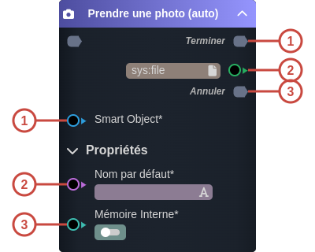
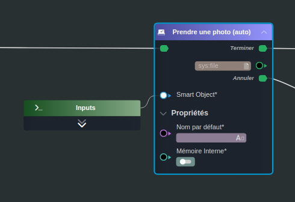

---
tags:
- workflow
---
   
# Prendre une photo (auto)   
   
`{_obsidian_pattern_tag_workflow}`   
   
## Description   
   
La tâche **Prendre une photo (auto)** lance automatiquement le dispositif photo de l'appareil (ordinateur avec la webcam, mobile avec l’appareil photo).   
   
   
Il est aussi possible d'utiliser une image provenant du stockage de l'appareil.   
   
## Fonctionnement   
   
   
   
### Entrées   
   
| ID | Nom | Type | Description |   
|:-|:-|:-|:-|   
| 1 | Smart Object | sk:atDocument | [Smart Object](../_glossaire/Glossaire.md) où la photo sera enregistrée |   
| 2 | Nom par défaut | string | Nom par défaut avec lequel où la photo sera enregistrée |   
| 3 | Mémoire Interne | boolean | Permet l’accès aux images dans la mémoire interne de l'appareil (galerie d'images) |   
   
### Sorties   
   
| ID | Nom | Type | Description |   
|:-|:-|:-|:-|   
| 1 | Terminer | flow | Flow utilisé lors de la réussite de capture d'image |   
| 2 |  | sys:file | Fichier incluant la photo créée |   
| 3 | Annuler | flow | Flow utilisé lors de l'annulation de la capture de l'image |   
   
## Utilisation   
   
### Studio   
   
